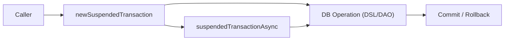
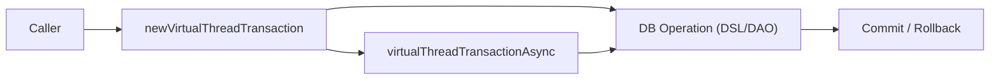

# 08 Coroutines

Exposed를 Kotlin 코루틴과 Virtual Thread 기반 동시성 모델에서 운영하는 패턴을 정리하며, 비동기 트랜잭션 설계 기준을 제공합니다.

## 챕터 목표

- `newSuspendedTransaction` 기반 비동기 접근 흐름을 이해한다.
- 코루틴 모델과 Virtual Thread 모델의 장단점을 비교하고 실무 선택 기준을 마련한다.
- 동시성 환경에서 안정적인 트랜잭션 경계를 설계한다.

## 선수 지식

- Kotlin Coroutines 기본 문법/Context 구조
- `05-exposed-dml/04-transactions`의 트랜잭션 패턴

## 포함 모듈

| 모듈                        | 설명                       |
|---------------------------|--------------------------|
| `01-coroutines-basic`     | 코루틴 기반 Exposed 기본 예제     |
| `02-virtualthreads-basic` | Virtual Thread 기반 동시성 예제 |

## 권장 학습 순서

1. `01-coroutines-basic`
2. `02-virtualthreads-basic`

## 실행 방법

```bash
./gradlew :01-coroutines-basic:test
./gradlew :02-virtualthreads-basic:test
```

## 테스트 포인트

- 취소(cancellation) 발생 시 자원 정리가 정상 동작하는지 확인한다.
- 병렬 처리 시 데이터 정합성이 유지되는지 검증한다.

## 성능·안정성 체크포인트

- 블로킹 호출이 Reactor/EventLoop를 점유하지 않도록 점검한다.
- 스레드/커넥션 풀 설정과 동시성 수준을 함께 튜닝한다.

## 예제 흐름 다이어그램

### Coroutines Transaction Flow



예제 코드: [
`01-coroutines-basic/src/test/kotlin/exposed/examples/coroutines/Ex01_Coroutines.kt`](01-coroutines-basic/src/test/kotlin/exposed/examples/coroutines/Ex01_Coroutines.kt)

### Virtual Thread Transaction Flow



예제 코드: [
`02-virtualthreads-basic/src/test/kotlin/exposed/examples/virtualthreads/Ex01_VritualThreads.kt`](02-virtualthreads-basic/src/test/kotlin/exposed/examples/virtualthreads/Ex01_VritualThreads.kt)

## 다음 챕터

- [09-spring](../09-spring/README.md): Spring 통합 환경에서 Exposed 통합 패턴을 이어서 학습합니다.
