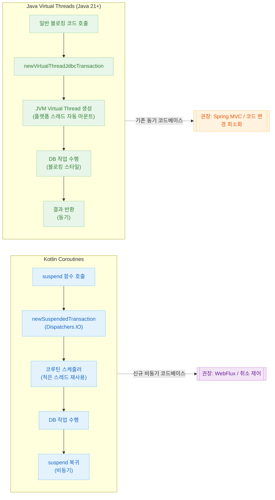
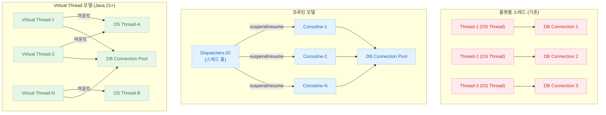
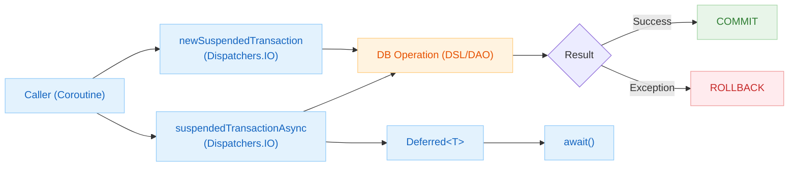
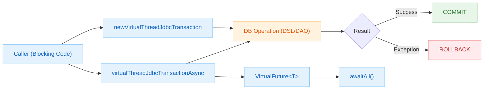

# 08 Coroutines

English | [한국어](./README.ko.md)

Covers patterns for running Exposed in Kotlin Coroutines and Java Virtual Thread concurrency models, and provides guidelines for designing asynchronous transaction boundaries.

## Chapter Goals

- Understand the asynchronous access flow based on `newSuspendedTransaction`.
- Compare the pros and cons of the coroutine model vs. Virtual Thread model and establish practical selection criteria.
- Design stable transaction boundaries in concurrent environments.

## Prerequisites

- Kotlin Coroutines basic syntax / Context structure
- Transaction patterns from `05-exposed-dml/04-transactions`

## Coroutines vs Virtual Threads Comparison

| Item               | Kotlin Coroutines                                      | Java Virtual Threads (Java 21+)                                        |
|------------------|--------------------------------------------------------|------------------------------------------------------------------------|
| API              | `newSuspendedTransaction`, `suspendedTransactionAsync` | `newVirtualThreadJdbcTransaction`, `virtualThreadJdbcTransactionAsync` |
| Code Style       | `suspend` functions, `await()`                         | Blocking style can be retained                                          |
| Thread Usage     | Few threads + Dispatcher scheduling                     | JVM automatically mounts/unmounts on platform threads                   |
| Cancellation     | `Job.cancel()` + structured concurrency                | `Future.cancel()` / `Thread.interrupt()`                               |
| DB Connection    | Dispatcher.IO pool + connection pool coordination       | Adjust Virtual Thread count together with connection pool               |
| Migration        | Requires adding `suspend` keyword                      | Blocking code can be used as-is                                         |
| Primary Use Case | New async codebase, Spring WebFlux integration          | Adding concurrency to existing synchronous codebase                     |
| Min Java Version | Any                                                     | Java 21+                                                               |

## Concurrency Model Comparison Diagrams

### Coroutines vs Virtual Thread Processing Flow



### Thread Model Structure Comparison



## Included Modules

| Module                    | Description                                        |
|---------------------------|--------------------------------------------------|
| `01-coroutines-basic`     | Basic Exposed examples using coroutines           |
| `02-virtualthreads-basic` | Concurrency examples using Virtual Threads        |

## Recommended Learning Order

1. `01-coroutines-basic`
2. `02-virtualthreads-basic`

## How to Run

```bash
# Run individual submodules
./gradlew :08-coroutines:01-coroutines-basic:test
./gradlew :08-coroutines:02-virtualthreads-basic:test

# Run full chapter
./gradlew :08-coroutines:test
```

## Transaction Flow Comparison

### Coroutines Transaction Flow



### Virtual Thread Transaction Flow



## Test Points

- Verify that resource cleanup works correctly when cancellation occurs.
- Validate that data consistency is maintained during parallel processing.

## Performance & Stability Checkpoints

- Ensure blocking calls do not occupy the Reactor/EventLoop.
- Tune thread/connection pool settings together with concurrency levels.

## Complex Scenario Guide

### Coroutine Transaction Patterns (`01-coroutines-basic/`)

| Scenario | Implementation File |
|---|---|
| Basic usage of `newSuspendedTransaction` | [`Ex01_Coroutines.kt`](01-coroutines-basic/src/test/kotlin/exposed/examples/coroutines/Ex01_Coroutines.kt) |
| Parallel execution with `suspendedTransactionAsync` | [`Ex01_Coroutines.kt`](01-coroutines-basic/src/test/kotlin/exposed/examples/coroutines/Ex01_Coroutines.kt) |

### Virtual Thread Transaction Patterns (`02-virtualthreads-basic/`)

| Scenario | Implementation File |
|---|---|
| Basic usage of `newVirtualThreadJdbcTransaction` | [`Ex01_VirtualThreads.kt`](02-virtualthreads-basic/src/test/kotlin/exposed/examples/virtualthreads/Ex01_VirtualThreads.kt) |
| Async parallel execution with `virtualThreadJdbcTransactionAsync` | [`Ex01_VirtualThreads.kt`](02-virtualthreads-basic/src/test/kotlin/exposed/examples/virtualthreads/Ex01_VirtualThreads.kt) |
| Mixing Virtual Thread with regular `transaction` | [`Ex01_VirtualThreads.kt`](02-virtualthreads-basic/src/test/kotlin/exposed/examples/virtualthreads/Ex01_VirtualThreads.kt) |
| Nested transaction exception handling | [`Ex01_VirtualThreads.kt`](02-virtualthreads-basic/src/test/kotlin/exposed/examples/virtualthreads/Ex01_VirtualThreads.kt) |

## Next Chapter

- [09-spring](../09-spring/README.md): Continue learning Exposed integration patterns in a Spring integration environment.
