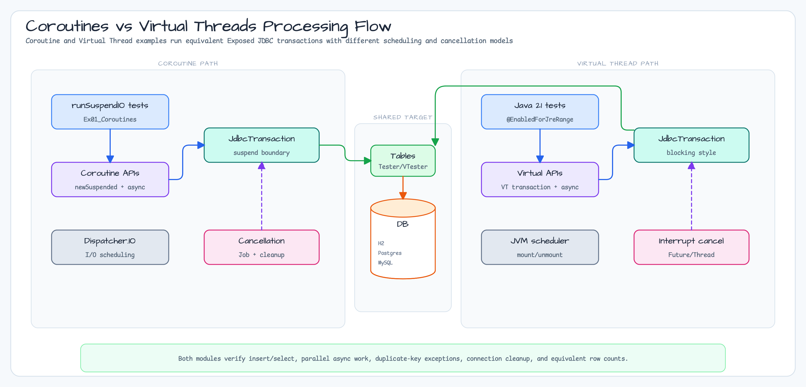
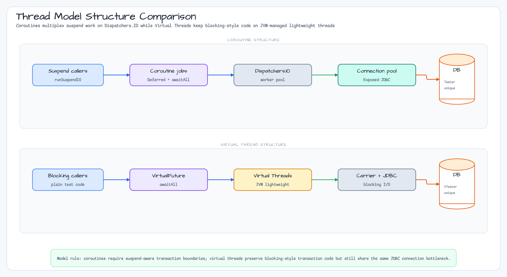
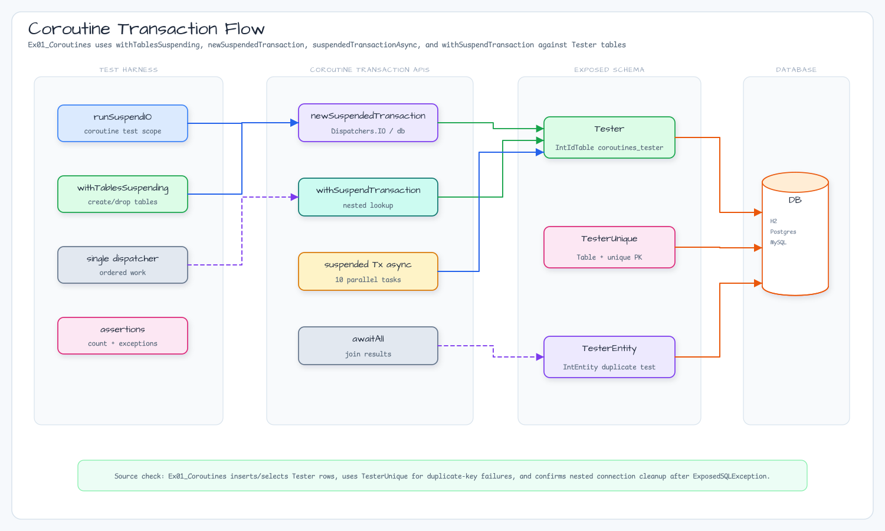
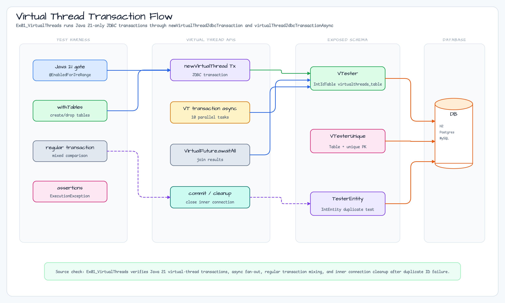

# 08 Coroutines

English | [한국어](./README.ko.md)

This chapter compares the two concurrency styles used by the source examples: Exposed's coroutine transaction APIs and bluetape4k's Java Virtual Thread JDBC helpers. The tests focus on concrete transaction behavior: nested lookups, async fan-out, insert/update races, regular `transaction { }` interop, and exception cleanup.

## Chapter Goals

- Follow the source-backed access flow around `newSuspendedTransaction`, `withSuspendTransaction`, and `suspendedTransactionAsync`.
- Compare coroutine transactions with `newVirtualThreadJdbcTransaction` and `virtualThreadJdbcTransactionAsync`.
- Design transaction boundaries that remain clear under parallel execution, retries, and exception propagation.

## Prerequisites

- Kotlin Coroutines basic syntax / Context structure
- Transaction patterns from `05-exposed-dml/04-transactions`

## Coroutines vs Virtual Threads Comparison

| Item               | Kotlin Coroutines                                      | Java Virtual Threads (Java 21+)                                        |
|------------------|--------------------------------------------------------|------------------------------------------------------------------------|
| API              | `newSuspendedTransaction`, `suspendedTransactionAsync` | `newVirtualThreadJdbcTransaction`, `virtualThreadJdbcTransactionAsync` |
| Code Style       | `suspend` functions, `await()`                         | Blocking style can be retained                                          |
| Thread Usage     | Few threads + Dispatcher scheduling                     | JVM automatically mounts/unmounts on platform threads                   |
| Cancellation     | `Job.cancel()` + structured concurrency                | `Future.cancel()` / `Thread.interrupt()`                               |
| DB Connection    | Dispatcher.IO pool + connection pool coordination       | Adjust Virtual Thread count together with connection pool               |
| Migration        | Requires adding `suspend` keyword                      | Blocking code can be used as-is                                         |
| Primary Use Case | New async codebase, Spring WebFlux integration          | Adding concurrency to existing synchronous codebase                     |
| Min Java Version | Any                                                     | Java 21+                                                               |

## Concurrency Model Comparison Diagrams

### Coroutines vs Virtual Thread Processing Flow



### Thread Model Structure Comparison



## Included Modules

| Module                    | Source Focus |
|---------------------------|---|
| `01-coroutines-basic`     | `Tester` and `TesterUnique` examples for suspended transactions, nested lookup, async insert/update, and exception cleanup |
| `02-virtualthreads-basic` | Java 21-gated `VTester` examples for Virtual Thread transactions, async fan-out, regular transaction interop, and wrapped SQL exceptions |

## Recommended Learning Order

1. `01-coroutines-basic`
2. `02-virtualthreads-basic`

## How to Run

```bash
# Run individual submodules
./gradlew :01-coroutines-basic:test
./gradlew :02-virtualthreads-basic:test

# Run full chapter
./gradlew :01-coroutines-basic:test :02-virtualthreads-basic:test --no-parallel
```

## Transaction Flow Comparison

### Coroutines Transaction Flow



### Virtual Thread Transaction Flow



## Test Points

- Verify that resource cleanup works correctly when cancellation occurs.
- Validate that data consistency is maintained during parallel processing.

## Performance & Stability Checkpoints

- Ensure blocking calls do not occupy the Reactor/EventLoop.
- Tune thread/connection pool settings together with concurrency levels.

## Complex Scenario Guide

### Coroutine Transaction Patterns (`01-coroutines-basic/`)

| Scenario | Implementation File |
|---|---|
| Basic usage of `newSuspendedTransaction` and `withSuspendTransaction` | [`Ex01_Coroutines.kt`](01-coroutines-basic/src/test/kotlin/exposed/examples/coroutines/Ex01_Coroutines.kt) |
| Parallel insert/update with `suspendedTransactionAsync`, `awaitAll`, and `maxAttempts` | [`Ex01_Coroutines.kt`](01-coroutines-basic/src/test/kotlin/exposed/examples/coroutines/Ex01_Coroutines.kt) |

### Virtual Thread Transaction Patterns (`02-virtualthreads-basic/`)

| Scenario | Implementation File |
|---|---|
| Java 21-gated `newVirtualThreadJdbcTransaction` usage | [`Ex01_VirtualThreads.kt`](02-virtualthreads-basic/src/test/kotlin/exposed/examples/virtualthreads/Ex01_VirtualThreads.kt) |
| Async fan-out with `virtualThreadJdbcTransactionAsync` and `VirtualFuture.awaitAll()` | [`Ex01_VirtualThreads.kt`](02-virtualthreads-basic/src/test/kotlin/exposed/examples/virtualthreads/Ex01_VirtualThreads.kt) |
| Mixing Virtual Thread transactions with regular `transaction { }` | [`Ex01_VirtualThreads.kt`](02-virtualthreads-basic/src/test/kotlin/exposed/examples/virtualthreads/Ex01_VirtualThreads.kt) |
| Duplicate entity ID exception wrapping and connection cleanup | [`Ex01_VirtualThreads.kt`](02-virtualthreads-basic/src/test/kotlin/exposed/examples/virtualthreads/Ex01_VirtualThreads.kt) |

## Next Chapter

- [09-spring](../09-spring/README.md): Continue learning Exposed integration patterns in a Spring integration environment.
