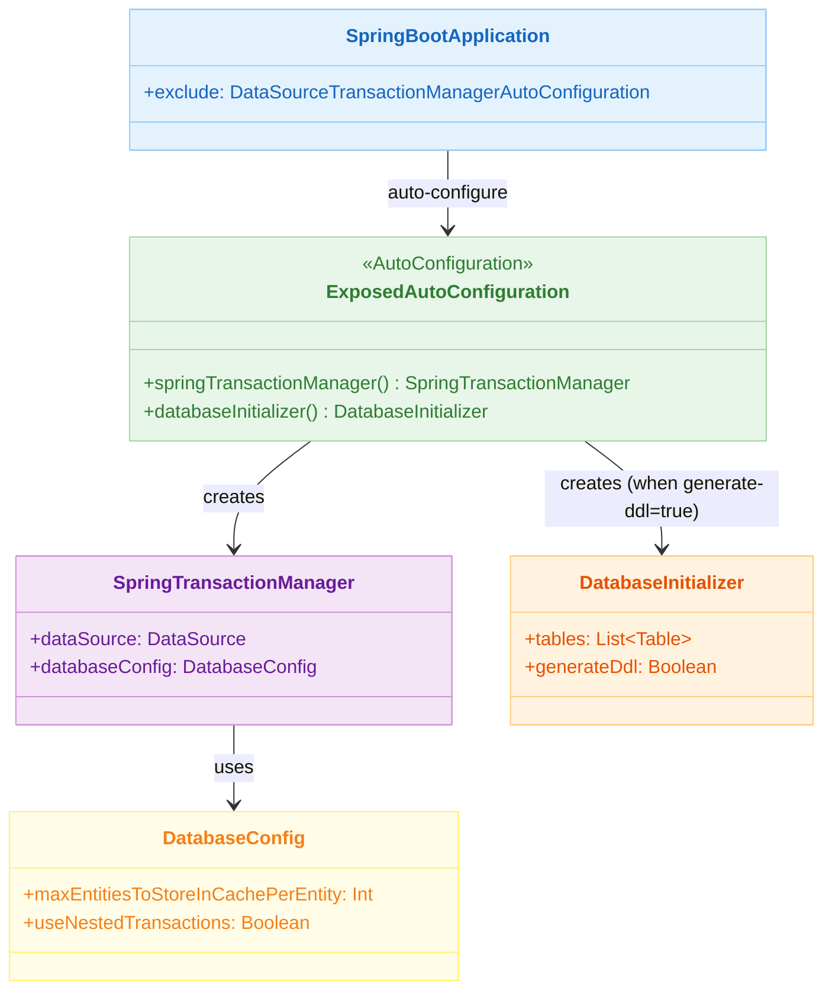
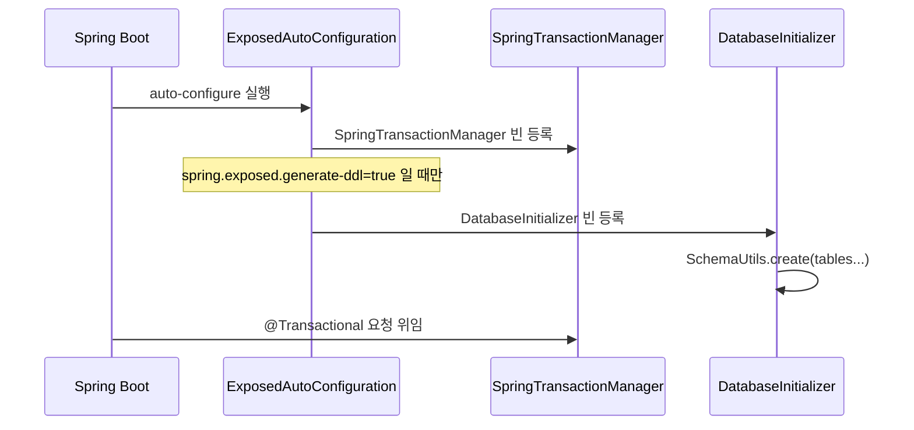

# 09 Spring: AutoConfiguration (01)

[English](./README.md) | 한국어

Spring Boot 자동 설정으로 Exposed를 최소 구성으로 통합하는 모듈입니다.
`spring-boot-autoconfigure` 가 제공하는 `SpringTransactionManager`, `DatabaseInitializer` 빈을 활용해
`application.yml` 한 파일로 DataSource와 트랜잭션을 연결하는 패턴을 학습합니다.

## 학습 목표

- Spring Boot 자동 구성이 Exposed용 `SpringTransactionManager`와 `DatabaseInitializer`를 어떻게 등록하는지 이해한다.
- `application.yml` 프로퍼티(`spring.exposed.*`)로 DDL 자동 생성과 SQL 로깅을 제어하는 방법을 익힌다.
- `DatabaseConfig` 빈을 재정의해 엔티티 캐시 크기 등 Exposed 동작을 커스터마이즈한다.
- `@SpringBootApplication(exclude = [...])` 로 충돌하는 Auto-Configuration을 제외하는 방법을 확인한다.

## 선수 지식

- Spring Boot 자동 구성 원리
- [`../04-exposed-ddl/01-connection/README.ko.md`](../../04-exposed-ddl/01-connection/README.ko.md)

## 아키텍처



## 핵심 개념

### application.yml 설정

```yaml
spring:
  datasource:
    url: jdbc:h2:mem:test
    driver-class-name: org.h2.Driver
  exposed:
    generate-ddl: false   # true 시 DatabaseInitializer가 SchemaUtils.create() 실행
    show-sql: true        # Exposed SQL 로그 출력
```

### DatabaseConfig 재정의

```kotlin
@TestConfiguration
class CustomDatabaseConfigConfiguration {

    @Bean
    fun customDatabaseConfig(): DatabaseConfig = DatabaseConfig {
        maxEntitiesToStoreInCachePerEntity = 100
        useNestedTransactions = true
    }
}
```

### Auto-Configuration 제외

```kotlin
@SpringBootApplication(
    exclude = [DataSourceTransactionManagerAutoConfiguration::class]
)
class Application
```

`DataSourceTransactionManagerAutoConfiguration`이 등록한 `DataSourceTransactionManager`는 Exposed의
`SpringTransactionManager`와 충돌하므로 반드시 제외해야 합니다.

## 자동 등록 빈 흐름



## 테이블 정의 예시

```kotlin
object TestTable: IntIdTable("test_table") {
    val name = varchar("name", 100)
    val createdAt = datetime("created_at").defaultExpression(CurrentDateTime)
}

class TestEntity(id: EntityID<Int>): IntEntity(id) {
    companion object: IntEntityClass<TestEntity>(TestTable)

    var name by TestTable.name
    var createdAt by TestTable.createdAt
}
```

`spring.exposed.generate-ddl=true`로 설정하면 `DatabaseInitializer`가 스캔한 `Table` 객체를 대상으로 `SchemaUtils.create()`를 자동 실행합니다.

## 실행 방법

```bash
# 전체 모듈 테스트
./gradlew :09-spring:01-springboot-autoconfigure:test

# 테스트 로그 요약
./bin/repo-test-summary -- ./gradlew :09-spring:01-springboot-autoconfigure:test
```

## 실습 체크리스트

- `spring.exposed.generate-ddl=true/false` 전환 시 `DatabaseInitializer` 빈 유무 차이 확인
- `DatabaseConfig` 빈을 재정의했을 때 `maxEntitiesToStoreInCachePerEntity` 값이 반영되는지 검증
- `DataSourceTransactionManagerAutoConfiguration` 제외 없이 기동 시 트랜잭션 충돌 오류 재현

## 성능·안정성 체크포인트

- 자동 구성 기본값(`show-sql=true`)은 운영 환경에서 반드시 `false`로 변경
- `generate-ddl=true`는 개발/테스트 전용, 운영에서는 마이그레이션 도구(Flyway/Liquibase) 사용

## 다음 모듈

- [`../02-transactiontemplate/README.ko.md`](../02-transactiontemplate/README.ko.md)
