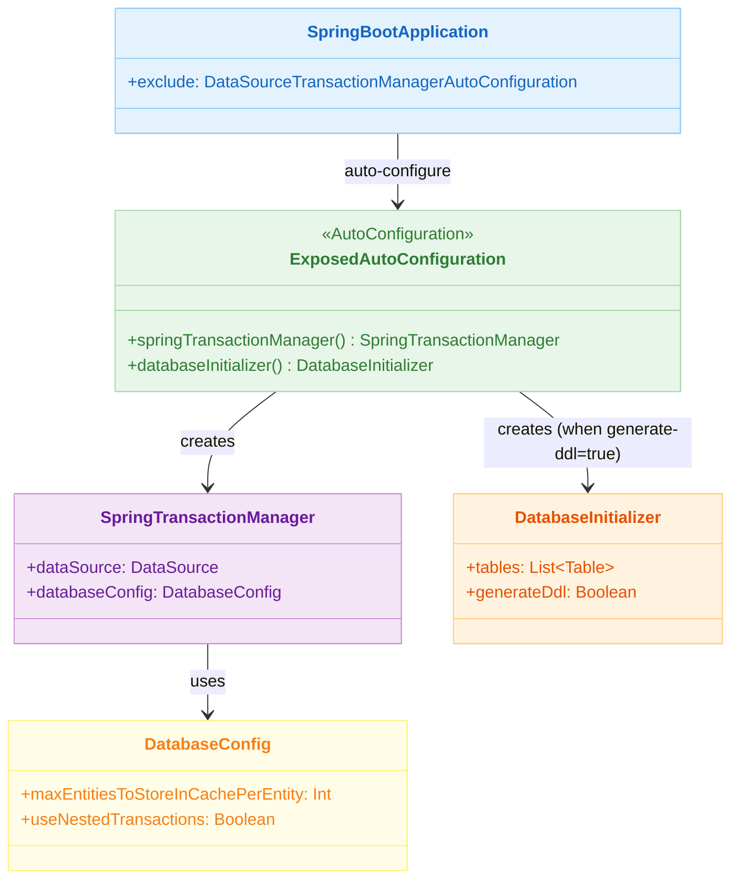
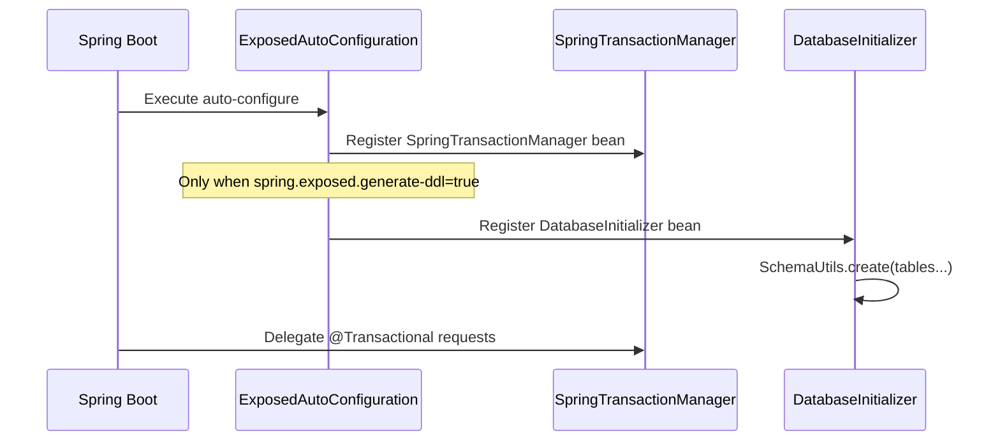

# 09 Spring: AutoConfiguration (01)

English | [한국어](./README.ko.md)

A module that integrates Exposed with minimal configuration using Spring Boot auto-configuration.
It uses the `SpringTransactionManager` and `DatabaseInitializer` beans provided by `spring-boot-autoconfigure`
to learn the pattern of connecting DataSource and transactions with a single `application.yml` file.

## Learning Goals

- Understand how Spring Boot auto-configuration registers `SpringTransactionManager` and `DatabaseInitializer` for Exposed.
- Learn to control DDL auto-generation and SQL logging via `application.yml` properties (`spring.exposed.*`).
- Customize Exposed behavior such as entity cache size by overriding the `DatabaseConfig` bean.
- Verify how to exclude conflicting Auto-Configurations using `@SpringBootApplication(exclude = [...])`.

## Prerequisites

- Spring Boot auto-configuration principles
- [`../04-exposed-ddl/01-connection/README.md`](../../04-exposed-ddl/01-connection/README.md)

## Architecture



## Key Concepts

### application.yml Configuration

```yaml
spring:
  datasource:
    url: jdbc:h2:mem:test
    driver-class-name: org.h2.Driver
  exposed:
    generate-ddl: false   # When true, DatabaseInitializer runs SchemaUtils.create()
    show-sql: true        # Exposed SQL log output
```

### Overriding DatabaseConfig

```kotlin
@TestConfiguration
class CustomDatabaseConfigConfiguration {

    @Bean
    fun customDatabaseConfig(): DatabaseConfig = DatabaseConfig {
        maxEntitiesToStoreInCachePerEntity = 100
        useNestedTransactions = true
    }
}
```

### Excluding Auto-Configuration

```kotlin
@SpringBootApplication(
    exclude = [DataSourceTransactionManagerAutoConfiguration::class]
)
class Application
```

The `DataSourceTransactionManager` registered by `DataSourceTransactionManagerAutoConfiguration` conflicts with Exposed's
`SpringTransactionManager`, so it must be excluded.

## Auto-Registered Bean Flow



## Table Definition Example

```kotlin
object TestTable: IntIdTable("test_table") {
    val name = varchar("name", 100)
    val createdAt = datetime("created_at").defaultExpression(CurrentDateTime)
}

class TestEntity(id: EntityID<Int>): IntEntity(id) {
    companion object: IntEntityClass<TestEntity>(TestTable)

    var name by TestTable.name
    var createdAt by TestTable.createdAt
}
```

When `spring.exposed.generate-ddl=true` is set, `DatabaseInitializer` automatically runs `SchemaUtils.create()` on the scanned `Table` objects.

## How to Run

```bash
# Full module test
./gradlew :09-spring:01-springboot-autoconfigure:test

# Test log summary
./bin/repo-test-summary -- ./gradlew :09-spring:01-springboot-autoconfigure:test
```

## Practice Checklist

- Verify the difference in `DatabaseInitializer` bean presence when toggling `spring.exposed.generate-ddl=true/false`
- Validate that `maxEntitiesToStoreInCachePerEntity` value is reflected when overriding the `DatabaseConfig` bean
- Reproduce the transaction conflict error when starting without excluding `DataSourceTransactionManagerAutoConfiguration`

## Performance & Stability Checkpoints

- The auto-configuration default (`show-sql=true`) must be changed to `false` in production environments
- `generate-ddl=true` is for development/testing only; use migration tools (Flyway/Liquibase) in production

## Next Module

- [`../02-transactiontemplate/README.md`](../02-transactiontemplate/README.md)
