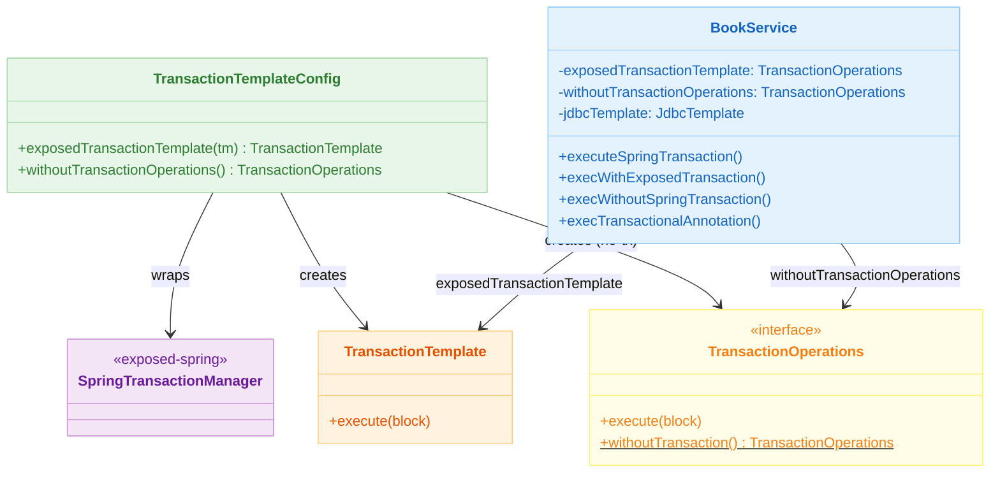
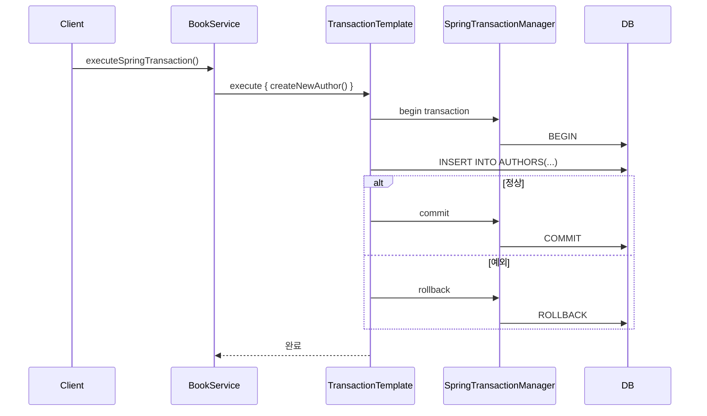

# 09 Spring: TransactionTemplate (02)

[English](./README.md) | 한국어

`TransactionTemplate` 기반 프로그래밍 트랜잭션 제어 모듈입니다. Exposed의 `SpringTransactionManager`를 `TransactionTemplate`에 주입해 선언적
`@Transactional` 없이 트랜잭션 경계를 코드 수준에서 제어하는 패턴을 학습합니다.

## 학습 목표

- `SpringTransactionManager` 기반 `TransactionTemplate` 구성 방법을 익힌다.
- `exposedTransactionTemplate.execute { }` 와 `transaction { }` 블록의 역할 차이를 이해한다.
- `TransactionOperations.withoutTransaction()` 을 이용한 트랜잭션 없는 실행 경로를 파악한다.
- `@Transactional` 경계 안에서 트랜잭션 미적용 `TransactionOperations`를 호출하면 어떻게 동작하는지 검증한다.

## 선수 지식

- [`../01-springboot-autoconfigure/README.ko.md`](../01-springboot-autoconfigure/README.ko.md)

## 아키텍처



## 핵심 개념

### TransactionTemplate 빈 구성

```kotlin
@Configuration
class TransactionTemplateConfig {

    // Exposed SpringTransactionManager를 감싼 Spring TransactionTemplate
    @Bean
    @Qualifier("exposedTransactionTemplate")
    fun exposedTransactionTemplate(tm: SpringTransactionManager): TransactionTemplate =
        TransactionTemplate(tm)

    // 트랜잭션 없이 실행하는 TransactionOperations
    @Bean
    @Qualifier("withoutTransactionOperations")
    fun withoutTransactionOperations(): TransactionOperations =
        TransactionOperations.withoutTransaction()
}
```

### 트랜잭션 경계 비교

```kotlin
@Component
class BookService(
    @Qualifier("exposedTransactionTemplate") private val exposedTransactionTemplate: TransactionOperations,
    @Qualifier("withoutTransactionOperations") private val withoutTransactionOperations: TransactionOperations,
    private val jdbcTemplate: JdbcTemplate,
) {
    // 1) Spring TransactionTemplate (Exposed SpringTransactionManager 기반)
    fun executeSpringTransaction() {
        exposedTransactionTemplate.execute {
            createNewAuthor()   // Spring 트랜잭션 안에서 실행
        }
    }

    // 2) Exposed 자체 transaction {} 블록
    fun execWithExposedTransaction() {
        transaction {
            Book.new { title = faker.book().title() }
        }
    }

    // 3) 트랜잭션 없는 실행 (auto-commit)
    fun execWithoutSpringTransaction() {
        withoutTransactionOperations.execute {
            createNewAuthor()   // 트랜잭션 보호 없음
        }
    }

    // 4) @Transactional 경계 안에서 no-tx 호출 → 외부 트랜잭션 전파
    @Transactional
    fun execTransactionalAnnotation() {
        withoutTransactionOperations.execute {
            createNewAuthor()   // 부모 @Transactional 트랜잭션 참여
        }
    }
}
```

## 트랜잭션 흐름



## 도메인 모델

```kotlin
object BookSchema {
    object AuthorTable: LongIdTable("authors") {
        val name: Column<String> = varchar("name", 50)
        val description: Column<String?> = text("description").nullable()
    }

    object BookTable: LongIdTable("books") {
        val title: Column<String> = varchar("title", 255)
        val description: Column<String?> = text("description").nullable()
    }

    // 다대다 관계 매핑 테이블
    object BookAuthorTable: Table("book_author_map") {
        val bookId = reference("book_id", BookTable)
        val authorId = reference("author_id", AuthorTable)
    }
}
```

## 실행 방법

```bash
./gradlew :09-spring:02-transactiontemplate:test

# 테스트 로그 요약
./bin/repo-test-summary -- ./gradlew :09-spring:02-transactiontemplate:test
```

## 실습 체크리스트

- `exposedTransactionTemplate.execute` 실행 중 예외 발생 시 롤백 여부 확인
- `withoutTransactionOperations`로 실행하면 예외 발생 시 부분 커밋이 남는지 확인
- `@Transactional` 내에서 `withoutTransactionOperations`를 호출할 때 외부 트랜잭션을 상속하는지 검증
- `transaction {}` 블록과 `TransactionTemplate.execute {}` 의 동시 사용 시 중첩 트랜잭션 동작 확인

## 성능·안정성 체크포인트

- 트랜잭션 범위를 과도하게 세분화하면 커넥션 재획득 오버헤드가 증가함
- 보상 트랜잭션(compensating transaction) 전략은 서비스 계층에서 별도 설계 필요

## 다음 모듈

- [`../03-spring-transaction/README.ko.md`](../03-spring-transaction/README.ko.md)
