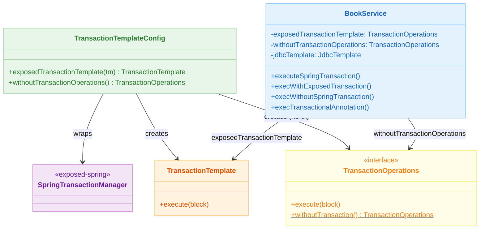
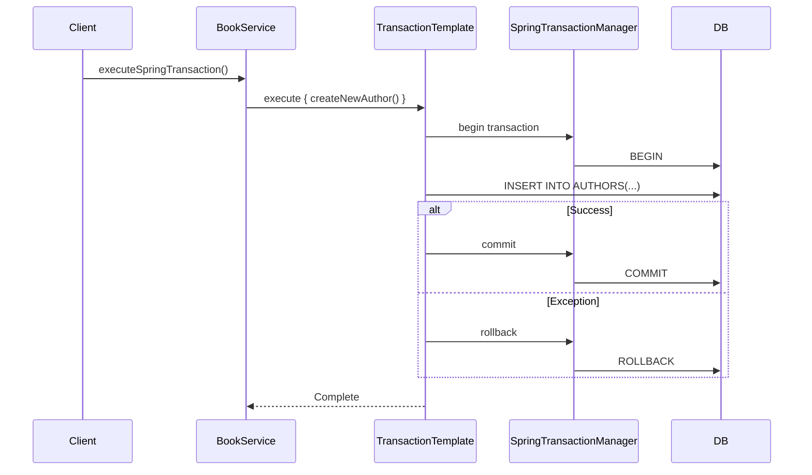

# 09 Spring: TransactionTemplate (02)

English | [한국어](./README.ko.md)

A module for programmatic transaction control based on `TransactionTemplate`. It injects Exposed's `SpringTransactionManager` into `TransactionTemplate` to learn the pattern of controlling transaction boundaries at the code level without declarative `@Transactional`.

## Learning Goals

- Learn how to configure `TransactionTemplate` based on `SpringTransactionManager`.
- Understand the difference between `exposedTransactionTemplate.execute { }` and `transaction { }` blocks.
- Explore the transaction-free execution path using `TransactionOperations.withoutTransaction()`.
- Verify how `TransactionOperations` without transaction behaves when called within a `@Transactional` boundary.

## Prerequisites

- [`../01-springboot-autoconfigure/README.md`](../01-springboot-autoconfigure/README.md)

## Architecture



## Key Concepts

### TransactionTemplate Bean Configuration

```kotlin
@Configuration
class TransactionTemplateConfig {

    // Spring TransactionTemplate wrapping Exposed SpringTransactionManager
    @Bean
    @Qualifier("exposedTransactionTemplate")
    fun exposedTransactionTemplate(tm: SpringTransactionManager): TransactionTemplate =
        TransactionTemplate(tm)

    // TransactionOperations that executes without a transaction
    @Bean
    @Qualifier("withoutTransactionOperations")
    fun withoutTransactionOperations(): TransactionOperations =
        TransactionOperations.withoutTransaction()
}
```

### Transaction Boundary Comparison

```kotlin
@Component
class BookService(
    @Qualifier("exposedTransactionTemplate") private val exposedTransactionTemplate: TransactionOperations,
    @Qualifier("withoutTransactionOperations") private val withoutTransactionOperations: TransactionOperations,
    private val jdbcTemplate: JdbcTemplate,
) {
    // 1) Spring TransactionTemplate (based on Exposed SpringTransactionManager)
    fun executeSpringTransaction() {
        exposedTransactionTemplate.execute {
            createNewAuthor()   // Executes within Spring transaction
        }
    }

    // 2) Exposed's own transaction {} block
    fun execWithExposedTransaction() {
        transaction {
            Book.new { title = faker.book().title() }
        }
    }

    // 3) Execution without transaction (auto-commit)
    fun execWithoutSpringTransaction() {
        withoutTransactionOperations.execute {
            createNewAuthor()   // No transaction protection
        }
    }

    // 4) Calling no-tx within @Transactional boundary → inherits outer transaction
    @Transactional
    fun execTransactionalAnnotation() {
        withoutTransactionOperations.execute {
            createNewAuthor()   // Participates in parent @Transactional transaction
        }
    }
}
```

## Transaction Flow



## Domain Model

```kotlin
object BookSchema {
    object AuthorTable: LongIdTable("authors") {
        val name: Column<String> = varchar("name", 50)
        val description: Column<String?> = text("description").nullable()
    }

    object BookTable: LongIdTable("books") {
        val title: Column<String> = varchar("title", 255)
        val description: Column<String?> = text("description").nullable()
    }

    // Many-to-many relationship mapping table
    object BookAuthorTable: Table("book_author_map") {
        val bookId = reference("book_id", BookTable)
        val authorId = reference("author_id", AuthorTable)
    }
}
```

## How to Run

```bash
./gradlew :09-spring:02-transactiontemplate:test

# Test log summary
./bin/repo-test-summary -- ./gradlew :09-spring:02-transactiontemplate:test
```

## Practice Checklist

- Verify rollback behavior when an exception occurs during `exposedTransactionTemplate.execute`
- Check if partial commits remain when an exception occurs with `withoutTransactionOperations`
- Verify that calling `withoutTransactionOperations` within `@Transactional` inherits the outer transaction
- Confirm nested transaction behavior when using `transaction {}` block and `TransactionTemplate.execute {}` simultaneously

## Performance & Stability Checkpoints

- Excessive transaction granularity increases connection reacquisition overhead
- Compensating transaction strategies require separate design at the service layer

## Next Module

- [`../03-spring-transaction/README.md`](../03-spring-transaction/README.md)
