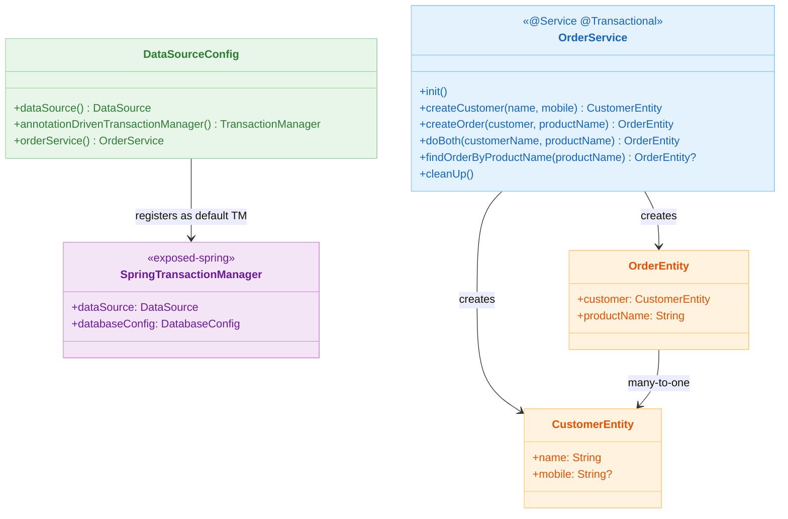
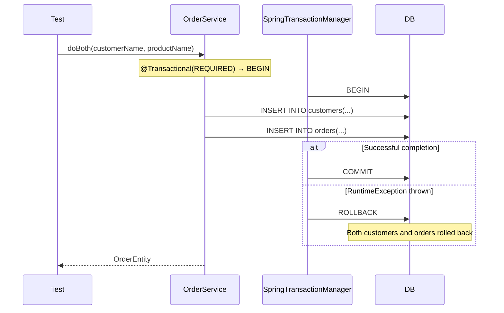

# 09 Spring: Declarative Transaction (03)

English | [한국어](./README.ko.md)

A declarative transaction integration module centered on `@Transactional`. It registers Exposed's `SpringTransactionManager` via `annotationDrivenTransactionManager()` to learn the structure where `@Transactional` annotations and Exposed DAO share the same connection.

## Learning Goals

- Implement `TransactionManagementConfigurer` to register Exposed `SpringTransactionManager` as the default transaction manager.
- Understand how `@Transactional` attributes (propagation, isolation, readOnly, timeout) apply to Exposed queries.
- Control programmatic transactions consistently using the `PlatformTransactionManager.execute()` extension function.
- Verify nested transaction behavior (`useNestedTransactions = true`).

## Prerequisites

- [`../02-transactiontemplate/README.md`](../02-transactiontemplate/README.md)

## Architecture



## Key Concepts

### SpringTransactionManager Registration

```kotlin
@Configuration
@EnableTransactionManagement
class DataSourceConfig: TransactionManagementConfigurer {

    @Bean
    fun dataSource(): DataSource = HikariDataSource(
        HikariConfig().apply {
            jdbcUrl = "jdbc:h2:mem:${Base58.randomString(8)};MODE=PostgreSQL"
            driverClassName = "org.h2.Driver"
        }
    )

    // Register Exposed SpringTransactionManager as the default transaction manager for @Transactional
    @Bean
    override fun annotationDrivenTransactionManager(): TransactionManager =
        SpringTransactionManager(dataSource(), DatabaseConfig {
            useNestedTransactions = true  // Allow SAVEPOINT-based nested transactions
        })
}
```

### Declarative Transaction Service

```kotlin
@Service
@Transactional          // Apply REQUIRED propagation to the entire class
class OrderService {

    @Transactional(readOnly = true)
    fun findOrderByProductName(productName: String): OrderEntity? =
        OrderEntity.find { OrderTable.productName eq productName }.firstOrNull()

    fun createCustomer(name: String, mobile: String? = null): CustomerEntity =
        CustomerEntity.new {
            this.name = name
            this.mobile = mobile
        }

    fun createOrder(customer: CustomerEntity, productName: String): OrderEntity =
        OrderEntity.new {
            this.customer = customer
            this.productName = productName
        }
}
```

### PlatformTransactionManager Extension Function

```kotlin
// Control propagation, isolation, readOnly, timeout via parameters
fun PlatformTransactionManager.execute(
    propagationBehavior: Int = TransactionDefinition.PROPAGATION_REQUIRED,
    isolationLevel: Int = TransactionDefinition.ISOLATION_DEFAULT,
    readOnly: Boolean = false,
    timeout: Int? = null,
    block: (TransactionStatus) -> Unit,
) {
    // For Exposed SpringTransactionManager
    val txTemplate = TransactionTemplate(this).also {
        it.propagationBehavior = propagationBehavior
        it.isolationLevel = isolationLevel
        if (readOnly) it.isReadOnly = true
        timeout?.run { it.timeout = timeout }
    }
    txTemplate.executeWithoutResult { block(it) }
}
```

## Domain Model

```kotlin
object OrderSchema {
    object CustomerTable: UUIDTable("customers") {
        val name: Column<String> = varchar("name", 255).uniqueIndex()
        val mobile: Column<String?> = varchar("mobile", 255).nullable()
    }

    object OrderTable: UUIDTable("orders") {
        val customerId = reference("customer_id", CustomerTable)
        val productName: Column<String> = varchar("product_name", 255)
    }

    class OrderEntity(id: EntityID<UUID>): UUIDEntity(id) {
        var customer: CustomerEntity by CustomerEntity referencedOn OrderTable.customerId
        var productName: String by OrderTable.productName
    }
}
```

## Transaction Propagation Flow



## How to Run

```bash
./gradlew :09-spring:03-spring-transaction:test

# Test log summary
./bin/repo-test-summary -- ./gradlew :09-spring:03-spring-transaction:test
```

## Practice Checklist

- Verify rollback scope when separating an inner method into a separate transaction with `@Transactional(propagation = REQUIRES_NEW)`
- Validate that SAVEPOINT rollback does not affect the outer transaction with `useNestedTransactions = true`
- Check whether an exception is thrown when attempting INSERT in a `readOnly = true` transaction
- Compare rollback rule differences between checked and unchecked exceptions

## Performance & Stability Checkpoints

- Optimize connections by specifying `@Transactional(readOnly = true)` for read-only query paths
- Design to avoid including external HTTP calls within long-running transactions
- Always exclude `DataSourceTransactionManagerAutoConfiguration` via `@SpringBootApplication(exclude = [...])`

## Next Module

- [`../04-exposed-repository/README.md`](../04-exposed-repository/README.md)
