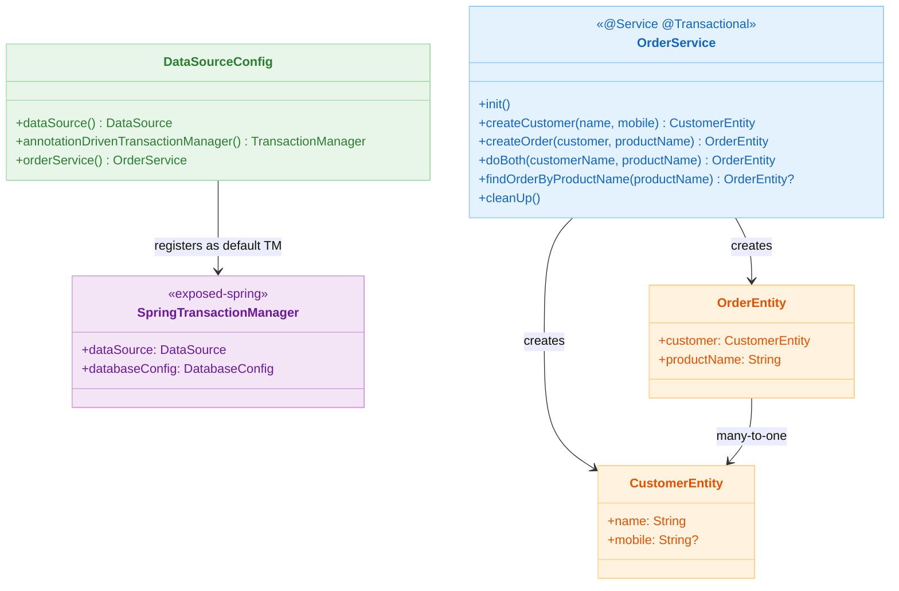
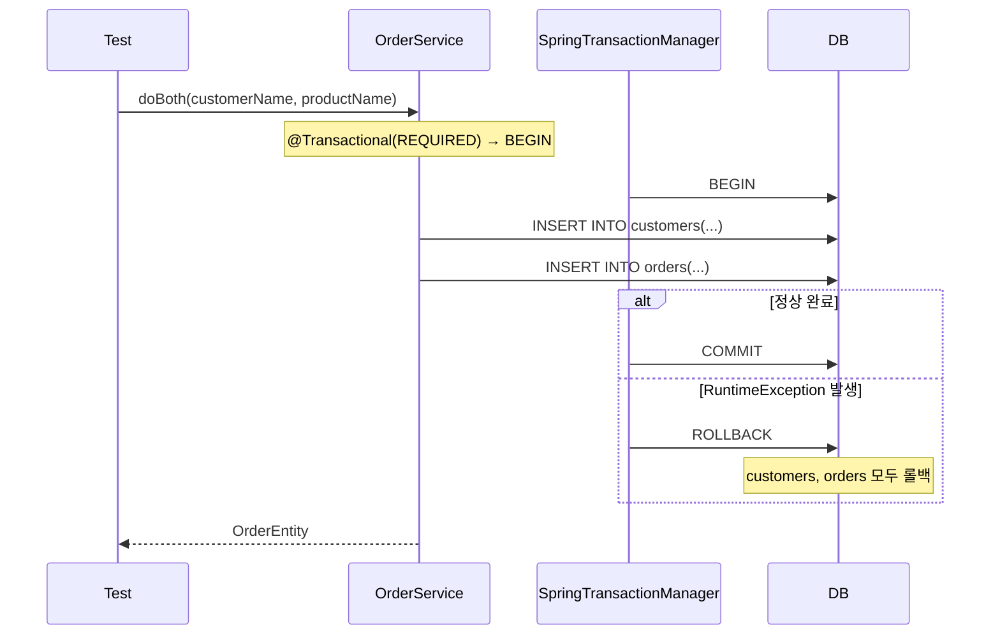

# 09 Spring: Declarative Transaction (03)

`@Transactional` 중심 선언적 트랜잭션 통합 모듈입니다. Exposed의 `SpringTransactionManager`를 `annotationDrivenTransactionManager()`로 등록해
`@Transactional` 어노테이션과 Exposed DAO가 같은 커넥션을 공유하는 구조를 학습합니다.

## 학습 목표

- `TransactionManagementConfigurer`를 구현해 Exposed `SpringTransactionManager`를 기본 트랜잭션 매니저로 등록한다.
- `@Transactional` 속성(propagation, isolation, readOnly, timeout)이 Exposed 쿼리에 어떻게 적용되는지 이해한다.
- `PlatformTransactionManager.execute()` 확장 함수로 프로그래밍 방식 트랜잭션을 일관되게 제어한다.
- 중첩 트랜잭션(`useNestedTransactions = true`) 동작을 검증한다.

## 선수 지식

- [`../02-transactiontemplate/README.md`](../02-transactiontemplate/README.md)

## 아키텍처



## 핵심 개념

### SpringTransactionManager 등록

```kotlin
@Configuration
@EnableTransactionManagement
class DataSourceConfig: TransactionManagementConfigurer {

    @Bean
    fun dataSource(): DataSource = HikariDataSource(
        HikariConfig().apply {
            jdbcUrl = "jdbc:h2:mem:${Base58.randomString(8)};MODE=PostgreSQL"
            driverClassName = "org.h2.Driver"
        }
    )

    // @Transactional 이 사용할 기본 트랜잭션 매니저로 Exposed SpringTransactionManager 지정
    @Bean
    override fun annotationDrivenTransactionManager(): TransactionManager =
        SpringTransactionManager(dataSource(), DatabaseConfig {
            useNestedTransactions = true  // SAVEPOINT 기반 중첩 트랜잭션 허용
        })
}
```

### 선언적 트랜잭션 서비스

```kotlin
@Service
@Transactional          // 클래스 전체에 REQUIRED 전파 적용
class OrderService {

    @Transactional(readOnly = true)
    fun findOrderByProductName(productName: String): OrderEntity? =
        OrderEntity.find { OrderTable.productName eq productName }.firstOrNull()

    fun createCustomer(name: String, mobile: String? = null): CustomerEntity =
        CustomerEntity.new {
            this.name = name
            this.mobile = mobile
        }

    fun createOrder(customer: CustomerEntity, productName: String): OrderEntity =
        OrderEntity.new {
            this.customer = customer
            this.productName = productName
        }
}
```

### PlatformTransactionManager 확장 함수

```kotlin
// propagation, isolation, readOnly, timeout을 파라미터로 제어
fun PlatformTransactionManager.execute(
    propagationBehavior: Int = TransactionDefinition.PROPAGATION_REQUIRED,
    isolationLevel: Int = TransactionDefinition.ISOLATION_DEFAULT,
    readOnly: Boolean = false,
    timeout: Int? = null,
    block: (TransactionStatus) -> Unit,
) {
    // Exposed SpringTransactionManager 전용
    val txTemplate = TransactionTemplate(this).also {
        it.propagationBehavior = propagationBehavior
        it.isolationLevel = isolationLevel
        if (readOnly) it.isReadOnly = true
        timeout?.run { it.timeout = timeout }
    }
    txTemplate.executeWithoutResult { block(it) }
}
```

## 도메인 모델

```kotlin
object OrderSchema {
    object CustomerTable: UUIDTable("customers") {
        val name: Column<String> = varchar("name", 255).uniqueIndex()
        val mobile: Column<String?> = varchar("mobile", 255).nullable()
    }

    object OrderTable: UUIDTable("orders") {
        val customerId = reference("customer_id", CustomerTable)
        val productName: Column<String> = varchar("product_name", 255)
    }

    class OrderEntity(id: EntityID<UUID>): UUIDEntity(id) {
        var customer: CustomerEntity by CustomerEntity referencedOn OrderTable.customerId
        var productName: String by OrderTable.productName
    }
}
```

## 트랜잭션 전파 흐름



## 실행 방법

```bash
./gradlew :09-spring:03-spring-transaction:test

# 테스트 로그 요약
./bin/repo-test-summary -- ./gradlew :09-spring:03-spring-transaction:test
```

## 실습 체크리스트

- `@Transactional(propagation = REQUIRES_NEW)` 로 내부 메서드를 별도 트랜잭션으로 분리했을 때 롤백 범위 확인
- `useNestedTransactions = true` 상태에서 SAVEPOINT 롤백이 외부 트랜잭션에 영향을 주지 않음을 검증
- `readOnly = true` 트랜잭션에서 INSERT 시도 시 예외 발생 여부 확인
- checked 예외와 unchecked 예외의 롤백 규칙 차이 비교

## 성능·안정성 체크포인트

- 읽기 전용 쿼리 경로에 `@Transactional(readOnly = true)` 명시로 커넥션 최적화
- 장시간 트랜잭션 내부에 외부 HTTP 호출을 포함하지 않도록 설계
- `DataSourceTransactionManagerAutoConfiguration`을 `@SpringBootApplication(exclude = [...])` 로 반드시 제외

## 다음 모듈

- [`../04-exposed-repository/README.md`](../04-exposed-repository/README.md)
