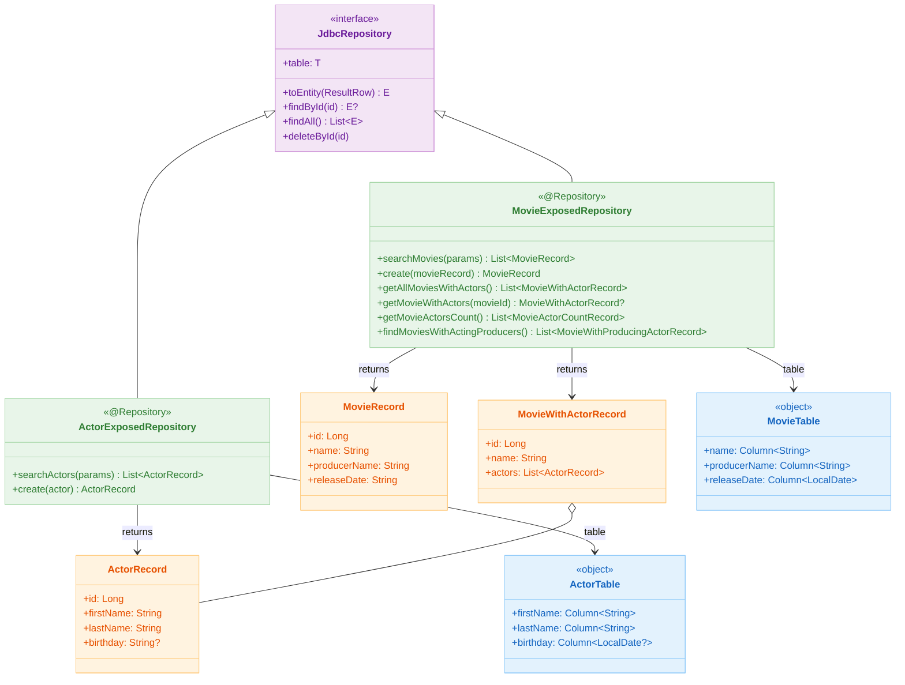
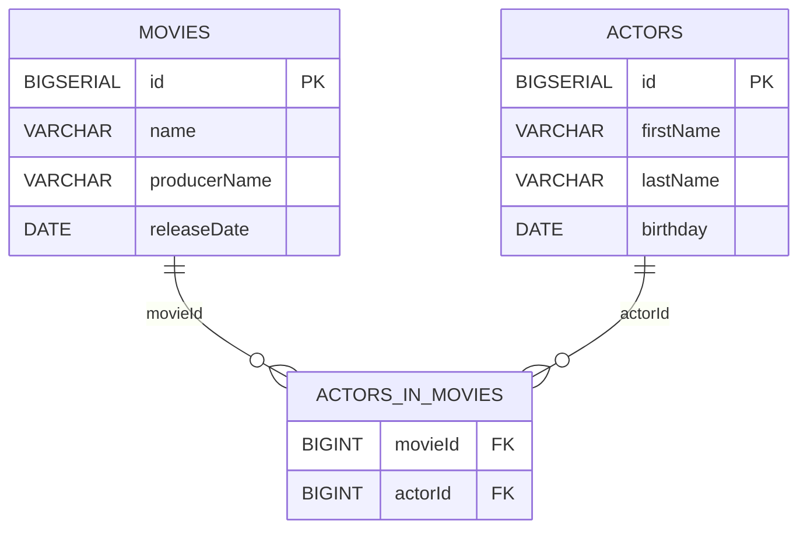
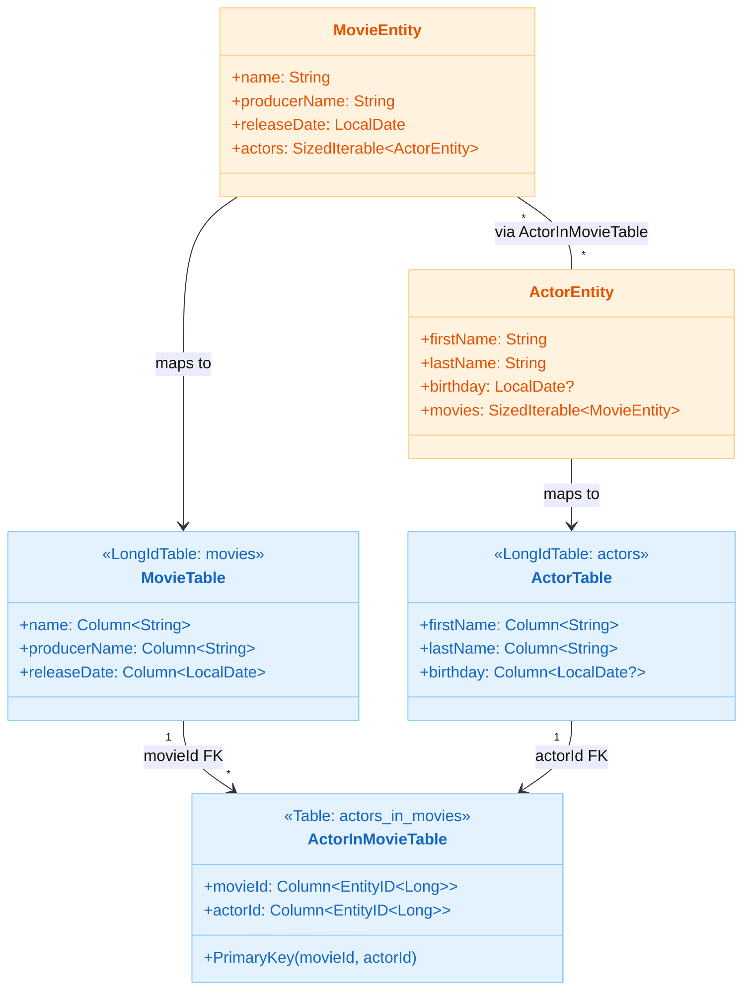

# 09 Spring: Exposed Repository (04)

[English](./README.md) | 한국어

동기식 Spring MVC 환경에서 Exposed DSL/DAO를 Repository 패턴으로 캡슐화하는 모듈입니다.
`JdbcRepository` 인터페이스를 구현해 서비스 계층이 Exposed에 직접 의존하지 않는 구조를 학습합니다.

## 학습 목표

- `JdbcRepository<ID, Record>` 인터페이스와 구현체 패턴을 익힌다.
- Exposed DSL(`selectAll`, `insertAndGetId`, `innerJoin`) 과 DAO(`findById`, `load`) 를 Repository 내부에서 혼용하는 방법을 이해한다.
- 도메인 엔티티(`MovieEntity`, `ActorEntity`)와 전송 레코드(`MovieRecord`, `ActorRecord`)를 분리하는 매퍼 구조를 확인한다.
- `@Transactional(readOnly = true)` 로 읽기 전용 경로를 최적화하는 방법을 적용한다.

## 선수 지식

- [`../03-spring-transaction/README.ko.md`](../03-spring-transaction/README.ko.md)

## 아키텍처



## 핵심 개념

### Repository 구현

```kotlin
@Repository
class MovieExposedRepository: JdbcRepository<Long, MovieRecord> {

    override val table = MovieTable
    override fun extractId(entity: MovieRecord): Long = entity.id
    override fun ResultRow.toEntity(): MovieRecord = toMovieRecord()

    @Transactional(readOnly = true)
    fun searchMovies(params: Map<String, String?>): List<MovieRecord> {
        val query = table.selectAll()
        params.forEach { (key, value) ->
            when (key) {
                MovieTable::name.name        -> value?.run { query.andWhere { MovieTable.name eq value } }
                MovieTable::producerName.name -> value?.run { query.andWhere { MovieTable.producerName eq value } }
                MovieTable::releaseDate.name -> value?.run {
                    val date = runCatching { LocalDate.parse(value) }.getOrNull() ?: return@forEach
                    query.andWhere { MovieTable.releaseDate eq date }
                }
            }
        }
        return query.map { it.toEntity() }
    }

    fun create(movieRecord: MovieRecord): MovieRecord {
        val id = MovieTable.insertAndGetId {
            it[name] = movieRecord.name
            it[producerName] = movieRecord.producerName
            it[releaseDate] = runCatching { LocalDate.parse(movieRecord.releaseDate) }.getOrElse { LocalDate.now() }
        }
        return movieRecord.copy(id = id.value)
    }
}
```

### DSL + DAO 혼용 조회

```kotlin
// DSL: INNER JOIN으로 영화-배우 한 번에 조회
fun getAllMoviesWithActors(): List<MovieWithActorRecord> {
    val join = table.innerJoin(ActorInMovieTable).innerJoin(ActorTable)
    return join
        .select(MovieTable.id, MovieTable.name, ..., ActorTable.id, ...)
        .groupBy { it[MovieTable.id] }
        .map { (_, rows) ->
            val movie = rows.first().toMovieRecord()
            val actors = rows.map { it.toActorRecord() }
            movie.toMovieWithActorRecord(actors)
        }
}

// DAO: eager loading으로 배우 목록 한 번에 로드
fun getMovieWithActors(movieId: Long): MovieWithActorRecord? =
    MovieEntity.findById(movieId)
        ?.load(MovieEntity::actors)
        ?.toMovieWithActorRecord()
```

### 제작자-배우 조건 JOIN

```kotlin
// 제작자 이름과 배우 first_name이 일치하는 영화 조회
fun findMoviesWithActingProducers(): List<MovieWithProducingActorRecord> {
    return table
        .innerJoin(ActorInMovieTable)
        .innerJoin(
            ActorTable,
            onColumn = { ActorTable.id },
            otherColumn = { ActorInMovieTable.actorId }
        ) {
            MovieTable.producerName eq ActorTable.firstName  // JOIN 조건 추가
        }
        .select(MovieTable.name, ActorTable.firstName, ActorTable.lastName)
        .map { it.toMovieWithProducingActorRecord() }
}
```

## 도메인 모델





## REST API 엔드포인트

| 메서드    | 경로                    | 설명            |
|--------|-----------------------|---------------|
| `GET`  | `/movies`             | 파라미터 기반 영화 검색 |
| `POST` | `/movies`             | 신규 영화 등록      |
| `GET`  | `/movies/with-actors` | 영화 + 배우 전체 조회 |
| `GET`  | `/movies/{id}/actors` | 특정 영화의 배우 조회  |
| `GET`  | `/actors`             | 파라미터 기반 배우 검색 |
| `POST` | `/actors`             | 신규 배우 등록      |

## 실행 방법

```bash
./gradlew :09-spring:04-exposed-repository:test

# 테스트 로그 요약
./bin/repo-test-summary -- ./gradlew :09-spring:04-exposed-repository:test
```

## 실습 체크리스트

- `searchMovies(params)` 에서 여러 파라미터를 동시에 전달했을 때 AND 조건이 올바르게 생성되는지 확인
- `getMovieWithActors` (DAO eager loading) 와 `getAllMoviesWithActors` (DSL JOIN) 결과가 동일한지 비교
- `findMoviesWithActingProducers` 에서 JOIN 조건(`producerName eq firstName`)이 SQL에 올바르게 반영되는지 로그 확인
- Repository를 Mock 처리했을 때 Controller 단위 테스트가 독립적으로 동작하는지 검증

## 성능·안정성 체크포인트

- 대용량 조회 시 `selectAll()` 대신 페이징(`limit/offset`) 추가 고려
- N+1 문제 방지를 위해 `load()` 또는 DSL JOIN 방식 중 쿼리 수를 측정해 선택
- 공통 조회 파라미터 패턴은 QueryBuilder로 추출해 Repository 간 중복 제거

## 다음 모듈

- [`../05-exposed-repository-coroutines/README.ko.md`](../05-exposed-repository-coroutines/README.ko.md)
