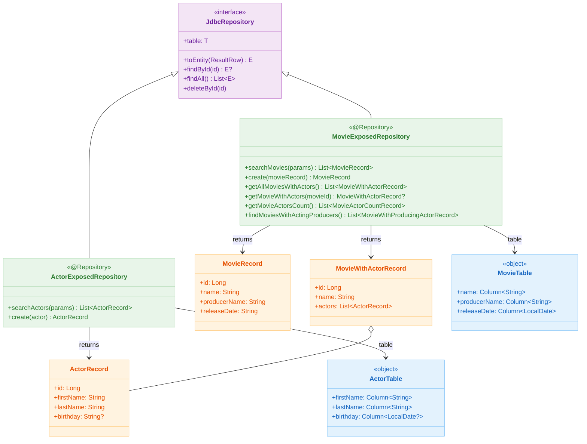
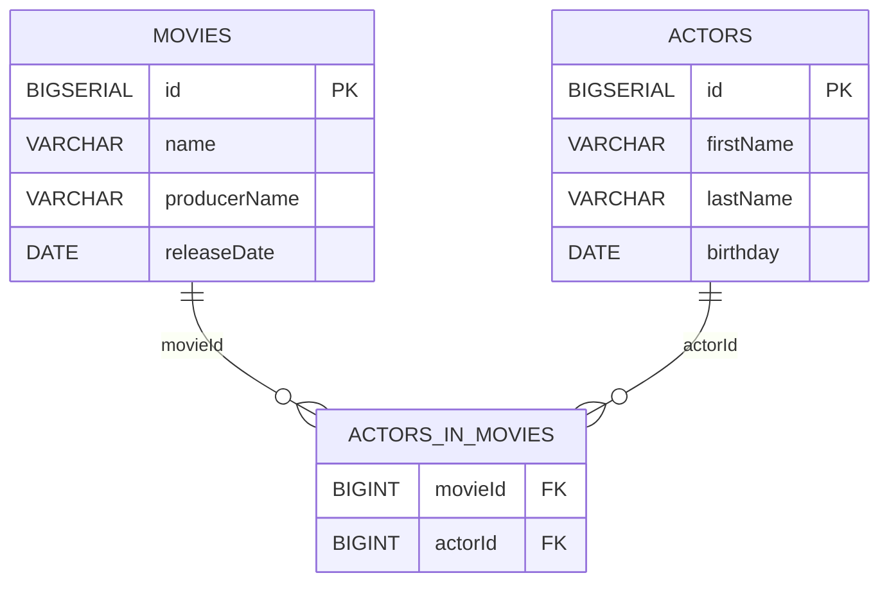
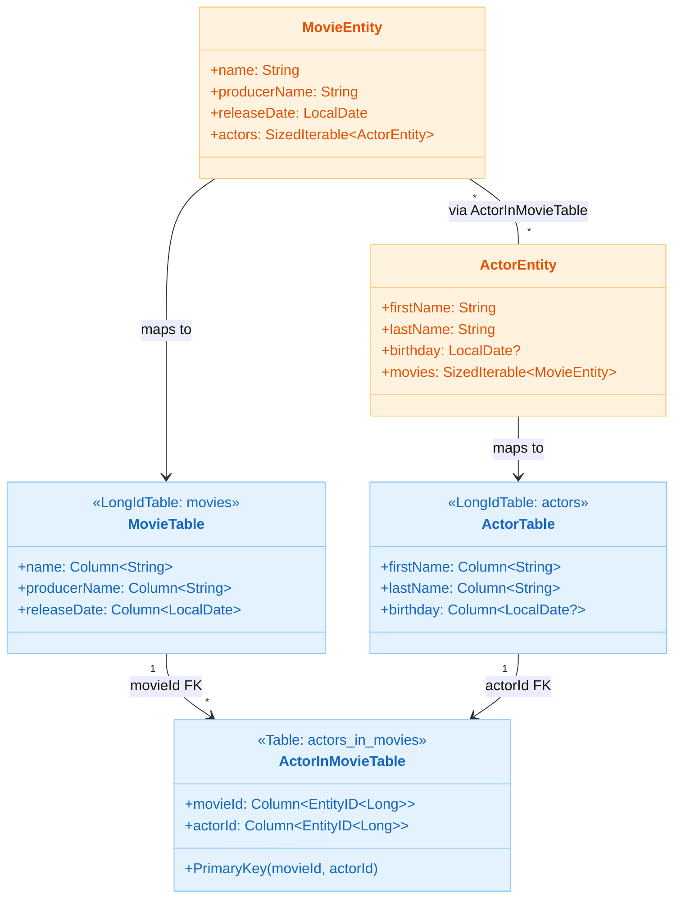

# 09 Spring: Exposed Repository (04)

English | [한국어](./README.ko.md)

A module that encapsulates Exposed DSL/DAO into a Repository pattern in a synchronous Spring MVC environment.
It implements the `JdbcRepository` interface to learn a structure where the service layer does not directly depend on Exposed.

## Learning Goals

- Learn the `JdbcRepository<ID, Table, Record>` interface and implementation patterns.
- Understand how to mix Exposed DSL (`selectAll`, `insertAndGetId`, `innerJoin`) and DAO (`findById`, `load`) within a Repository.
- Examine the mapper structure that separates domain entities (`MovieEntity`, `ActorEntity`) from transfer records (`MovieRecord`, `ActorRecord`).
- Apply read-only path optimization with `@Transactional(readOnly = true)`.

## Prerequisites

- [`../03-spring-transaction/README.md`](../03-spring-transaction/README.md)

## Architecture



## Key Concepts

### Repository Implementation

```kotlin
@Repository
class MovieExposedRepository: JdbcRepository<Long, MovieTable, MovieRecord> {

    override val table = MovieTable
    override fun ResultRow.toEntity(): MovieRecord = toMovieRecord()

    @Transactional(readOnly = true)
    fun searchMovies(params: Map<String, String?>): List<MovieRecord> {
        val query = table.selectAll()
        params.forEach { (key, value) ->
            when (key) {
                MovieTable::name.name        -> value?.run { query.andWhere { MovieTable.name eq value } }
                MovieTable::producerName.name -> value?.run { query.andWhere { MovieTable.producerName eq value } }
                MovieTable::releaseDate.name -> value?.run {
                    query.andWhere { MovieTable.releaseDate eq LocalDate.parse(value) }
                }
            }
        }
        return query.map { it.toEntity() }
    }

    fun create(movieRecord: MovieRecord): MovieRecord {
        val id = MovieTable.insertAndGetId {
            it[name] = movieRecord.name
            it[producerName] = movieRecord.producerName
            it[releaseDate] = LocalDate.parse(movieRecord.releaseDate)
        }
        return movieRecord.copy(id = id.value)
    }
}
```

### DSL + DAO Hybrid Queries

```kotlin
// DSL: Fetch movies with actors in one INNER JOIN query
fun getAllMoviesWithActors(): List<MovieWithActorRecord> {
    val join = table.innerJoin(ActorInMovieTable).innerJoin(ActorTable)
    return join
        .select(MovieTable.id, MovieTable.name, ..., ActorTable.id, ...)
        .groupBy { it[MovieTable.id] }
        .map { (_, rows) ->
            val movie = rows.first().toMovieRecord()
            val actors = rows.map { it.toActorRecord() }
            movie.toMovieWithActorRecord(actors)
        }
}

// DAO: Load actor list at once via eager loading
fun getMovieWithActors(movieId: Long): MovieWithActorRecord? =
    MovieEntity.findById(movieId)
        ?.load(MovieEntity::actors)
        ?.toMovieWithActorRecord()
```

### Producer-Actor Conditional JOIN

```kotlin
// Find movies where producer name matches actor first_name
fun findMoviesWithActingProducers(): List<MovieWithProducingActorRecord> {
    return table
        .innerJoin(ActorInMovieTable)
        .innerJoin(
            ActorTable,
            onColumn = { ActorTable.id },
            otherColumn = { ActorInMovieTable.actorId }
        ) {
            MovieTable.producerName eq ActorTable.firstName  // Additional JOIN condition
        }
        .select(MovieTable.name, ActorTable.firstName, ActorTable.lastName)
        .map { it.toMovieWithProducingActorRecord() }
}
```

## Domain Model





## REST API Endpoints

| Method | Path                  | Description                    |
|--------|-----------------------|-------------------------------|
| `GET`  | `/movies`             | Parameter-based movie search  |
| `POST` | `/movies`             | Create new movie              |
| `GET`  | `/movies/with-actors` | Fetch all movies with actors  |
| `GET`  | `/movies/{id}/actors` | Fetch actors for a specific movie |
| `GET`  | `/actors`             | Parameter-based actor search  |
| `POST` | `/actors`             | Create new actor              |

## How to Run

```bash
./gradlew :09-spring:04-exposed-repository:test

# Test log summary
./bin/repo-test-summary -- ./gradlew :09-spring:04-exposed-repository:test
```

## Practice Checklist

- Verify that AND conditions are correctly generated when passing multiple parameters to `searchMovies(params)`
- Compare results from `getMovieWithActors` (DAO eager loading) and `getAllMoviesWithActors` (DSL JOIN) for equality
- Check SQL logs to verify the JOIN condition (`producerName eq firstName`) in `findMoviesWithActingProducers` is correctly reflected
- Validate that Controller unit tests work independently when Repository is mocked

## Performance & Stability Checkpoints

- Consider adding pagination (`limit/offset`) instead of `selectAll()` for large-volume queries
- Measure query counts to choose between `load()` or DSL JOIN approaches to prevent N+1 problems
- Extract common query parameter patterns into QueryBuilder to eliminate duplication across Repositories

## Next Module

- [`../05-exposed-repository-coroutines/README.md`](../05-exposed-repository-coroutines/README.md)
