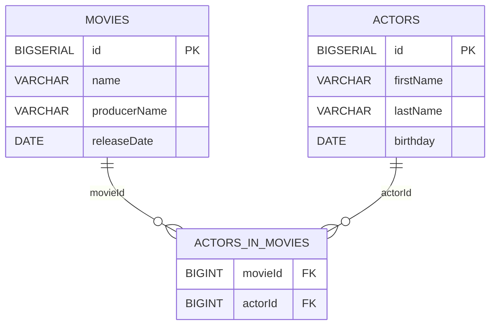
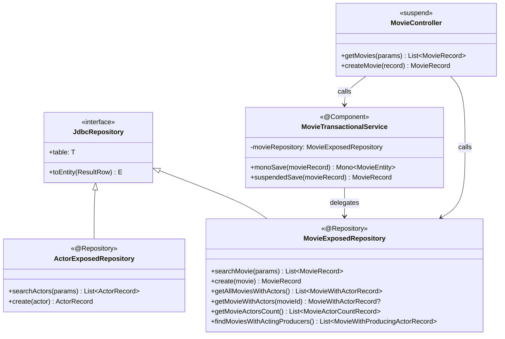
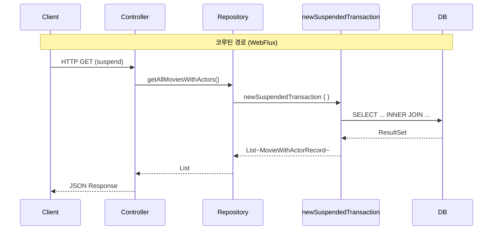

# 09 Spring: Exposed Repository Coroutines (05)

Spring WebFlux + 코루틴 환경에서 Exposed를 비동기 Repository 패턴으로 사용하는 모듈입니다.
`newSuspendedTransaction`으로 Exposed 쿼리를 suspend 함수 안에서 실행하고,
`@Transactional`이 코루틴 suspend 함수에 적용되지 않는 제약과 우회 방법을 학습합니다.

## 학습 목표

- `newSuspendedTransaction { }` 블록으로 Exposed 쿼리를 suspend 함수에서 실행하는 방법을 익힌다.
- `@Transactional`이 일반 Reactive/suspend 함수에는 적용되지 않음을 확인하고 대안을 이해한다.
- 동기 MVC(`04-exposed-repository`)와 비동기 WebFlux 구현체의 구조 차이를 비교한다.
- `Mono.fromCallable { }` 기반 `monoSave`와 순수 `suspend fun suspendedSave`의 트랜잭션 경계 차이를 파악한다.

## 선수 지식

- [`../04-exposed-repository/README.md`](../04-exposed-repository/README.md)
- Kotlin 코루틴 기초 (`08-coroutines/01-coroutines-basic`)

## 도메인 모델



## 아키텍처



## 핵심 개념

### suspend Repository 메서드

```kotlin
@Repository
class MovieExposedRepository: JdbcRepository<Long, MovieTable, MovieRecord> {

    override val table = MovieTable
    override fun ResultRow.toEntity() = toMovieRecord()

    // suspend fun: newSuspendedTransaction 안에서 Exposed DSL 실행
    suspend fun create(movie: MovieRecord): MovieRecord {
        val id = MovieTable.insertAndGetId {
            it[name] = movie.name
            it[producerName] = movie.producerName
            it[releaseDate] = LocalDate.parse(movie.releaseDate)
        }
        return movie.copy(id = id.value)
    }

    suspend fun getAllMoviesWithActors(): List<MovieWithActorRecord> {
        val join = table.innerJoin(ActorInMovieTable).innerJoin(ActorTable)
        return join.select(...).groupBy { it[MovieTable.id] }.map { ... }
    }

    suspend fun getMovieWithActors(movieId: Long): MovieWithActorRecord? =
        MovieEntity.findById(movieId)?.load(MovieEntity::actors)?.toMovieWithActorRecord()
}
```

### @Transactional vs suspend 함수 제약

```kotlin
@Component
class MovieTransactionalService(
    private val movieRepository: MovieExposedRepository,
) {
    // @Transactional은 Reactive/Mono 반환 함수에는 적용 가능
    @Transactional
    fun monoSave(movieRecord: MovieRecord): Mono<MovieEntity> =
        Mono.fromCallable {
            MovieEntity.new {
                name = movieRecord.name
                producerName = movieRecord.producerName
            }
        }

    // suspend 함수에는 @Transactional이 적용되지 않음
    // → newSuspendedTransaction으로 트랜잭션 경계를 직접 제어
    suspend fun suspendedSave(movieRecord: MovieRecord): MovieRecord =
        movieRepository.create(movieRecord)
}
```

> `@Transactional`은 Spring AOP 프록시를 통해 동작하므로 `suspend fun`에는 적용되지 않습니다.
> 코루틴 경로에서는 `newSuspendedTransaction { }` 블록으로 트랜잭션을 명시적으로 감싸야 합니다.

## 동기 vs 코루틴 Repository 비교



## 조인 최적화 패턴

```kotlin
@Repository
class MovieExposedRepository: JdbcRepository<Long, MovieTable, MovieRecord> {

    companion object: KLoggingChannel() {
        // 자주 사용하는 JOIN을 companion object에 lazy로 캐싱
        private val MovieActorJoin by lazy {
            MovieTable.innerJoin(ActorInMovieTable).innerJoin(ActorTable)
        }

        private val moviesWithActingProducersJoin: Join by lazy {
            MovieTable
                .innerJoin(ActorInMovieTable)
                .innerJoin(ActorTable, onColumn = { ActorTable.id }, otherColumn = { ActorInMovieTable.actorId }) {
                    MovieTable.producerName eq ActorTable.firstName
                }
        }
    }

    suspend fun getMovieActorsCount(): List<MovieActorCountRecord> =
        MovieActorJoin
            .select(MovieTable.id, MovieTable.name, ActorTable.id.count())
            .groupBy(MovieTable.id)
            .map {
                MovieActorCountRecord(
                    movieName = it[MovieTable.name],
                    actorCount = it[ActorTable.id.count()].toInt()
                )
            }
}
```

## WebFlux 설정

```kotlin
@Configuration
class ExposedDbConfig {
    // Exposed JDBC는 블로킹 드라이버를 사용하므로
    // WebFlux 이벤트 루프 스레드 오염을 막기 위해
    // newSuspendedTransaction의 dispatcher를 IO로 지정
    @Bean
    fun exposedDatabase(dataSource: DataSource): Database =
        Database.connect(dataSource)
}
```

## 실행 방법

```bash
./gradlew :09-spring:05-exposed-repository-coroutines:test

# 테스트 로그 요약
./bin/repo-test-summary -- ./gradlew :09-spring:05-exposed-repository-coroutines:test
```

## 실습 체크리스트

- `suspendedSave` 실행 중 예외 발생 시 트랜잭션이 롤백되는지 확인
- `monoSave` (@Transactional + Mono)와 `suspendedSave` (newSuspendedTransaction) 중 실제 트랜잭션이 적용되는 경로 비교
- 동기 `04-exposed-repository`의 `getAllMoviesWithActors` 결과와 코루틴 버전 결과 동등성 검증
- 코루틴 취소(cancellation) 시 진행 중인 DB 쿼리가 정리되는지 확인

## 성능·안정성 체크포인트

- Exposed JDBC는 블로킹 드라이버이므로 `newSuspendedTransaction`의 Dispatcher를 IO 전용으로 지정
- 이벤트 루프 스레드에서 JDBC 직접 호출 금지 — 반드시 `newSuspendedTransaction` 감싸기
- 코루틴 예외(`CancellationException`)를 잡아서 삼키지 않도록 주의

## 다음 모듈

- [`../06-spring-cache/README.md`](../06-spring-cache/README.md)
