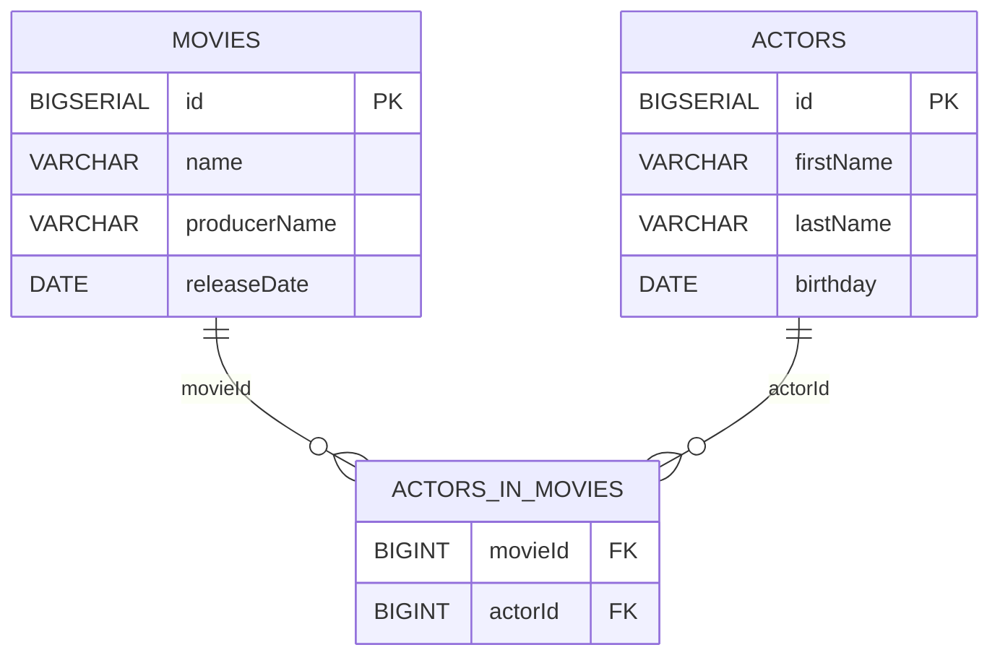
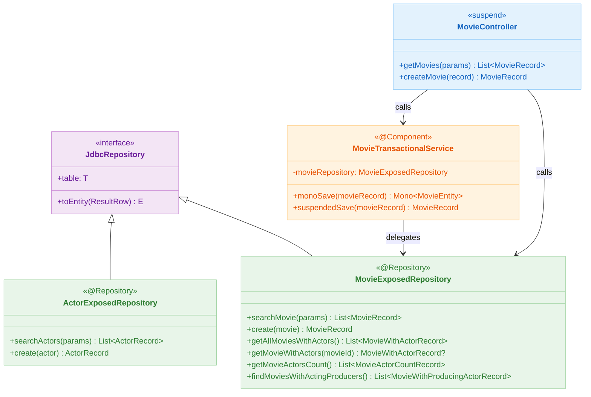
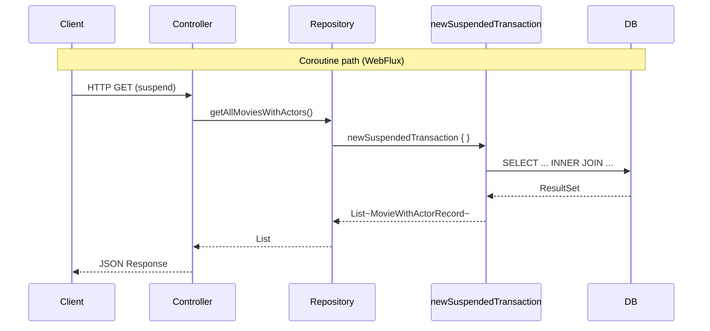

# 09 Spring: Exposed Repository Coroutines (05)

English | [한국어](./README.ko.md)

A module that uses Exposed as an asynchronous Repository pattern in a Spring WebFlux + Coroutines environment.
It executes Exposed queries within suspend functions using `newSuspendedTransaction`, and learns about the limitation where `@Transactional` does not apply to coroutine suspend functions and how to work around it.

## Learning Goals

- Learn how to execute Exposed queries in suspend functions using `newSuspendedTransaction { }` blocks.
- Confirm that `@Transactional` does not apply to Reactive/suspend functions and understand alternatives.
- Compare the structural differences between synchronous MVC (`04-exposed-repository`) and asynchronous WebFlux implementations.
- Understand the transaction boundary differences between `Mono.fromCallable { }`-based `monoSave` and pure `suspend fun suspendedSave`.

## Prerequisites

- [`../04-exposed-repository/README.md`](../04-exposed-repository/README.md)
- Kotlin Coroutines basics (`08-coroutines/01-coroutines-basic`)

## Domain Model



## Architecture



## Key Concepts

### Suspend Repository Methods

```kotlin
@Repository
class MovieExposedRepository: JdbcRepository<Long, MovieTable, MovieRecord> {

    override val table = MovieTable
    override fun ResultRow.toEntity() = toMovieRecord()

    // suspend fun: Execute Exposed DSL inside newSuspendedTransaction
    suspend fun create(movie: MovieRecord): MovieRecord {
        val id = MovieTable.insertAndGetId {
            it[name] = movie.name
            it[producerName] = movie.producerName
            it[releaseDate] = LocalDate.parse(movie.releaseDate)
        }
        return movie.copy(id = id.value)
    }

    suspend fun getAllMoviesWithActors(): List<MovieWithActorRecord> {
        val join = table.innerJoin(ActorInMovieTable).innerJoin(ActorTable)
        return join.select(...).groupBy { it[MovieTable.id] }.map { ... }
    }

    suspend fun getMovieWithActors(movieId: Long): MovieWithActorRecord? =
        MovieEntity.findById(movieId)?.load(MovieEntity::actors)?.toMovieWithActorRecord()
}
```

### @Transactional vs Suspend Function Limitation

```kotlin
@Component
class MovieTransactionalService(
    private val movieRepository: MovieExposedRepository,
) {
    // @Transactional works with Reactive/Mono return functions
    @Transactional
    fun monoSave(movieRecord: MovieRecord): Mono<MovieEntity> =
        Mono.fromCallable {
            MovieEntity.new {
                name = movieRecord.name
                producerName = movieRecord.producerName
            }
        }

    // @Transactional does not apply to suspend functions
    // → Control transaction boundaries directly with newSuspendedTransaction
    suspend fun suspendedSave(movieRecord: MovieRecord): MovieRecord =
        movieRepository.create(movieRecord)
}
```

> `@Transactional` works through Spring AOP proxies and therefore does not apply to `suspend fun`.
> In the coroutine path, transactions must be explicitly wrapped with `newSuspendedTransaction { }` blocks.

## Synchronous vs Coroutine Repository Comparison



## Join Optimization Pattern

```kotlin
@Repository
class MovieExposedRepository: JdbcRepository<Long, MovieTable, MovieRecord> {

    companion object: KLoggingChannel() {
        // Cache frequently used JOINs lazily in companion object
        private val MovieActorJoin by lazy {
            MovieTable.innerJoin(ActorInMovieTable).innerJoin(ActorTable)
        }

        private val moviesWithActingProducersJoin: Join by lazy {
            MovieTable
                .innerJoin(ActorInMovieTable)
                .innerJoin(ActorTable, onColumn = { ActorTable.id }, otherColumn = { ActorInMovieTable.actorId }) {
                    MovieTable.producerName eq ActorTable.firstName
                }
        }
    }

    suspend fun getMovieActorsCount(): List<MovieActorCountRecord> =
        MovieActorJoin
            .select(MovieTable.id, MovieTable.name, ActorTable.id.count())
            .groupBy(MovieTable.id)
            .map {
                MovieActorCountRecord(
                    movieName = it[MovieTable.name],
                    actorCount = it[ActorTable.id.count()].toInt()
                )
            }
}
```

## WebFlux Configuration

```kotlin
@Configuration
class ExposedDbConfig {
    // Since Exposed JDBC uses blocking drivers,
    // set newSuspendedTransaction's dispatcher to IO
    // to prevent polluting WebFlux event loop threads
    @Bean
    fun exposedDatabase(dataSource: DataSource): Database =
        Database.connect(dataSource)
}
```

## How to Run

```bash
./gradlew :09-spring:05-exposed-repository-coroutines:test

# Test log summary
./bin/repo-test-summary -- ./gradlew :09-spring:05-exposed-repository-coroutines:test
```

## Practice Checklist

- Verify transaction rollback when an exception occurs during `suspendedSave`
- Compare which path actually applies transactions between `monoSave` (@Transactional + Mono) and `suspendedSave` (newSuspendedTransaction)
- Verify result equality between synchronous `04-exposed-repository`'s `getAllMoviesWithActors` and the coroutine version
- Check that in-progress DB queries are cleaned up on coroutine cancellation

## Performance & Stability Checkpoints

- Exposed JDBC uses blocking drivers, so set `newSuspendedTransaction`'s Dispatcher to IO-dedicated
- Never call JDBC directly on event loop threads -- always wrap with `newSuspendedTransaction`
- Be careful not to catch and swallow coroutine exceptions (`CancellationException`)

## Next Module

- [`../06-spring-cache/README.md`](../06-spring-cache/README.md)
