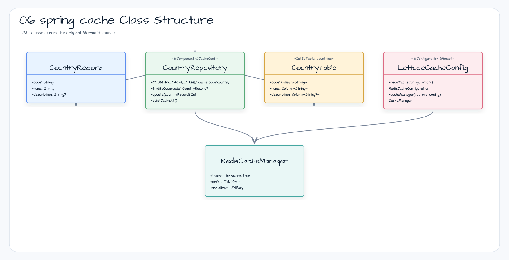
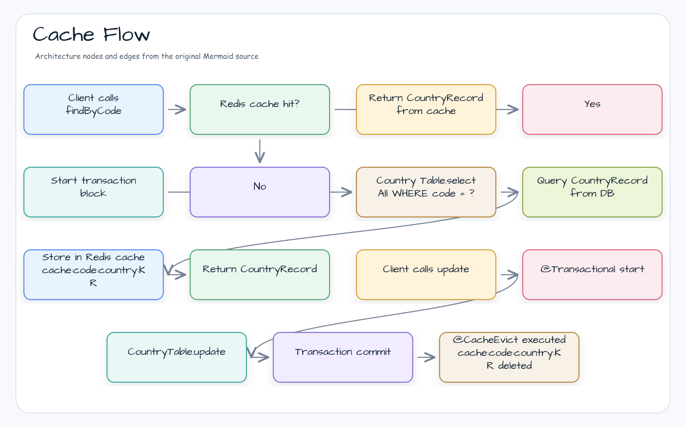
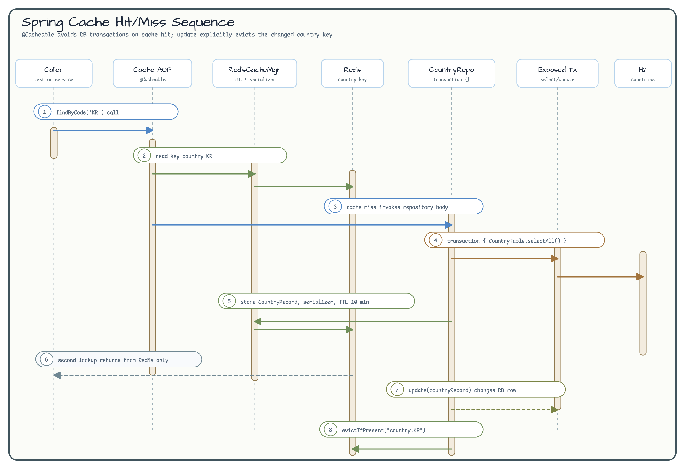

# 09 Spring: Spring Cache (06)

[English](./README.md) | 한국어

Spring Cache 추상화와 Exposed를 통합하는 모듈입니다.
`@Cacheable`, `@CacheEvict` 어노테이션으로 Redis 기반 캐시를 선언적으로 적용하고, 캐시 히트/미스/무효화 흐름과 DB 정합성 관리 전략을 학습합니다.

## 학습 목표

- `@EnableCaching` + `RedisCacheManager` 구성으로 Spring Cache를 Redis에 연결한다.
- `@Cacheable(key = "'country:' + #code")` 로 캐시 키를 명시적으로 설계한다.
- `@CacheEvict` 로 변경 시 캐시를 즉시 무효화해 stale 데이터를 방지한다.
- `transaction { }` 블록과 `@Cacheable` 을 조합할 때 캐시 히트 시 트랜잭션을 열지 않는 이점을 이해한다.

## 선수 지식

- [`../04-exposed-repository/README.ko.md`](../04-exposed-repository/README.ko.md)
- Spring Cache 추상화 기본 개념

## 아키텍처



## 핵심 개념

### Cache 설정 (LZ4+Fory 직렬화, TTL 10분)

```kotlin
@Configuration
@EnableCaching
class LettuceCacheConfig {

    @Bean
    fun redisCacheConfiguration(): RedisCacheConfiguration =
        RedisCacheConfiguration.defaultCacheConfig()
            .serializeValuesWith(
                RedisSerializationContext.SerializationPair
                    .fromSerializer(RedisBinarySerializers.LZ4Fory)  // 압축 직렬화
            )
            .entryTtl(Duration.ofMinutes(10))  // 기본 TTL

    @Bean
    fun cacheManager(
        connectionFactory: RedisConnectionFactory,
        cacheConfiguration: RedisCacheConfiguration,
    ): CacheManager = RedisCacheManager.builder(connectionFactory)
        .transactionAware()      // 트랜잭션 커밋 후 캐시 반영
        .cacheDefaults(cacheConfiguration)
        .build()
}
```

### Repository 캐시 선언

```kotlin
@Component
@CacheConfig(cacheNames = [COUNTRY_CACHE_NAME])   // 캐시 이름 공통 설정
class CountryRepository(private val cacheManager: CacheManager) {

    companion object {
        const val COUNTRY_CACHE_NAME = "cache:code:country"
    }

    // 캐시 미스 시만 transaction {} 열어 DB 조회
    @Cacheable(key = "'country:' + #code")
    fun findByCode(code: String): CountryRecord? {
        return transaction {
            CountryTable.selectAll()
                .where { CountryTable.code eq code }
                .singleOrNull()
                ?.let { CountryRecord(code = it[CountryTable.code], name = it[CountryTable.name]) }
        }
    }

    // DB 갱신 후 해당 캐시 엔트리 즉시 무효화
    @Transactional
    @CacheEvict(key = "'country:' + #countryRecord.code")
    fun update(countryRecord: CountryRecord): Int =
        CountryTable.update({ CountryTable.code eq countryRecord.code }) {
            it[name] = countryRecord.name
            it[description] = countryRecord.description
        }

    // 전체 캐시 비우기
    @CacheEvict(cacheNames = [COUNTRY_CACHE_NAME], allEntries = true)
    fun evictCacheAll() { /* Spring AOP가 처리 */ }
}
```

## 캐시 흐름



## 도메인 모델

```kotlin
object CountryTable: IntIdTable("countries") {
    val code = char("code", 2).uniqueIndex()   // ISO 2자리 국가 코드
    val name = varchar("name", 50)
    val description = text("description").nullable()
}

data class CountryRecord(
    val code: String,
    val name: String,
    val description: String? = null,
): Serializable   // Redis 직렬화를 위해 Serializable 구현
```

## 캐시 히트/미스 시퀀스



## 캐시 키 설계 원칙

| 상황    | 키 패턴             | 예시                                  |
|-------|------------------|-------------------------------------|
| 단건 조회 | `'캐시명:' + #파라미터` | `'country:' + #code` → `country:KR` |
| 전체 조회 | `'캐시명:all'`      | `'country:all'`                     |
| 복합 키  | `#a + ':' + #b`  | `#userId + ':' + #orderId`          |

## 실행 방법

```bash
# Redis Testcontainer를 자동으로 기동합니다
./gradlew :09-spring:06-spring-cache:test

# 테스트 로그 요약
./bin/repo-test-summary -- ./gradlew :09-spring:06-spring-cache:test
```

## 실습 체크리스트

- `findByCode("KR")` 두 번 연속 호출 시 두 번째 호출에서 DB 쿼리 로그가 없는지 확인
- `update()` 후 `findByCode()` 재호출 시 갱신된 데이터가 반환되는지 검증
- `evictCacheAll()` 후 모든 키가 Redis에서 삭제되는지 확인
- `RedisCacheManager.transactionAware()` 설정 시 롤백된 트랜잭션의 캐시가 반영되지 않음을 검증

## 성능·안정성 체크포인트

- TTL을 데이터 신선도 요구(SLA)에 맞게 조정 — 기본 10분이 모든 도메인에 적합하지 않음
- Redis 장애 시 `@Cacheable`이 예외를 던지지 않도록 `CacheErrorHandler` 구현 고려
- `transactionAware()` 미적용 시 롤백 후에도 캐시에 데이터가 남을 수 있음

## 다음 모듈

- [`../07-spring-suspended-cache/README.ko.md`](../07-spring-suspended-cache/README.ko.md)
