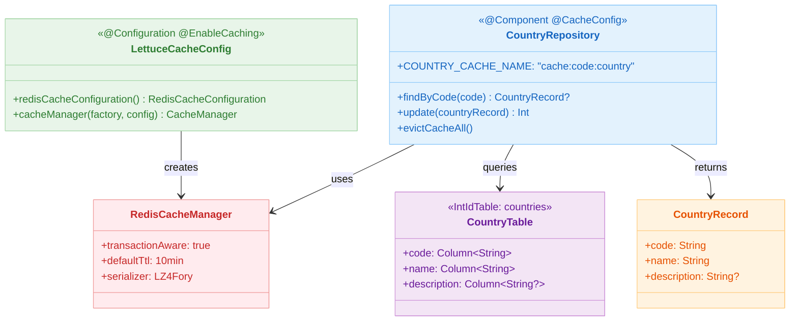
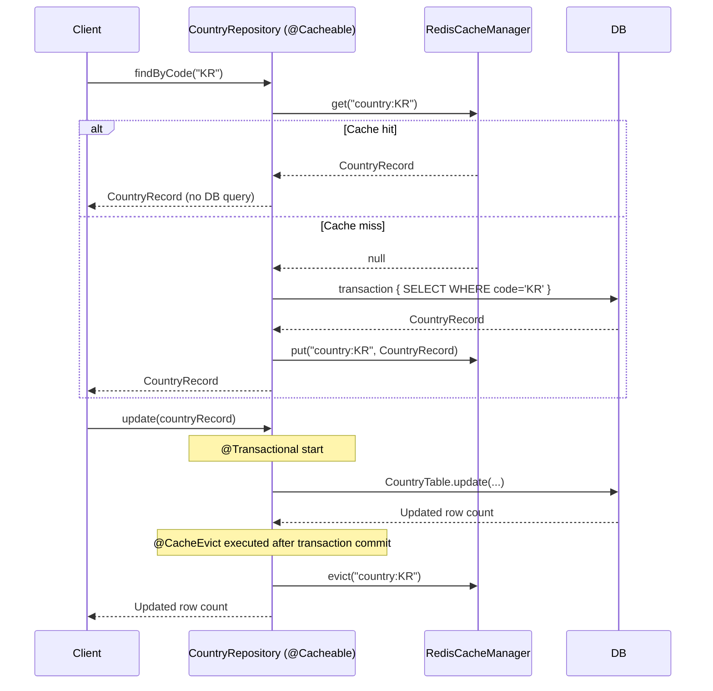

# 09 Spring: Spring Cache (06)

English | [한국어](./README.ko.md)

A module that integrates Spring Cache abstraction with Exposed.
It applies Redis-based caching declaratively using `@Cacheable` and `@CacheEvict` annotations, and learns cache hit/miss/invalidation flows and DB consistency management strategies.

## Learning Goals

- Connect Spring Cache to Redis with `@EnableCaching` + `RedisCacheManager` configuration.
- Design cache keys explicitly with `@Cacheable(key = "'country:' + #code")`.
- Prevent stale data by immediately invalidating cache on changes with `@CacheEvict`.
- Understand the benefit of not opening a transaction on cache hits when combining `transaction { }` blocks with `@Cacheable`.

## Prerequisites

- [`../04-exposed-repository/README.md`](../04-exposed-repository/README.md)
- Spring Cache abstraction basics

## Architecture



## Key Concepts

### Cache Configuration (LZ4+Fory Serialization, TTL 10min)

```kotlin
@Configuration
@EnableCaching
class LettuceCacheConfig {

    @Bean
    fun redisCacheConfiguration(): RedisCacheConfiguration =
        RedisCacheConfiguration.defaultCacheConfig()
            .serializeValuesWith(
                RedisSerializationContext.SerializationPair
                    .fromSerializer(RedisBinarySerializers.LZ4Fory)  // Compressed serialization
            )
            .entryTtl(Duration.ofMinutes(10))  // Default TTL

    @Bean
    fun cacheManager(
        connectionFactory: RedisConnectionFactory,
        cacheConfiguration: RedisCacheConfiguration,
    ): CacheManager = RedisCacheManager.builder(connectionFactory)
        .transactionAware()      // Reflect cache after transaction commit
        .cacheDefaults(cacheConfiguration)
        .build()
}
```

### Repository Cache Declaration

```kotlin
@Component
@CacheConfig(cacheNames = [COUNTRY_CACHE_NAME])   // Common cache name configuration
class CountryRepository(private val cacheManager: CacheManager) {

    companion object {
        const val COUNTRY_CACHE_NAME = "cache:code:country"
    }

    // Only opens transaction {} for DB query on cache miss
    @Cacheable(key = "'country:' + #code")
    fun findByCode(code: String): CountryRecord? {
        return transaction {
            CountryTable.selectAll()
                .where { CountryTable.code eq code }
                .singleOrNull()
                ?.let { CountryRecord(code = it[CountryTable.code], name = it[CountryTable.name]) }
        }
    }

    // Immediately invalidate cache entry after DB update
    @Transactional
    @CacheEvict(key = "'country:' + #countryRecord.code")
    fun update(countryRecord: CountryRecord): Int =
        CountryTable.update({ CountryTable.code eq countryRecord.code }) {
            it[name] = countryRecord.name
            it[description] = countryRecord.description
        }

    // Clear all cache entries
    @CacheEvict(cacheNames = [COUNTRY_CACHE_NAME], allEntries = true)
    fun evictCacheAll() { /* Handled by Spring AOP */ }
}
```

## Cache Flow

```mermaid
%%{init: {"theme": "neutral", "themeVariables": {"fontFamily": "'Comic Mono', 'goorm sans code', 'JetBrains Mono', 'goorm sans'"}}}%%
flowchart TD
    A[Client calls findByCode] --> B{Redis cache hit?}
    B -- Yes --> C[Return CountryRecord from cache]
    B -- No --> D[Start transaction block]
    D --> E[CountryTable.selectAll WHERE code = ?]
    E --> F[Query CountryRecord from DB]
    F --> G[Store in Redis cache\ncache:code:country:KR]
    G --> H[Return CountryRecord]

    I[Client calls update] --> J[@Transactional start]
    J --> K[CountryTable.update]
    K --> L[Transaction commit]
    L --> M[@CacheEvict executed\ncache:code:country:KR deleted]

    classDef blue fill:#E3F2FD,stroke:#90CAF9,color:#1565C0
    classDef green fill:#E8F5E9,stroke:#A5D6A7,color:#2E7D32
    classDef orange fill:#FFF3E0,stroke:#FFCC80,color:#E65100
    classDef pink fill:#FCE4EC,stroke:#F48FB1,color:#AD1457
    classDef yellow fill:#FFFDE7,stroke:#FFF176,color:#F57F17
    classDef teal fill:#E0F2F1,stroke:#80CBC4,color:#00695C

    class A,I blue
    class B,D yellow
    class C,H green
    class E,F orange
    class G,M pink
    class J,K,L teal
```

## Domain Model

```kotlin
object CountryTable: IntIdTable("countries") {
    val code = char("code", 2).uniqueIndex()   // ISO 2-letter country code
    val name = varchar("name", 50)
    val description = text("description").nullable()
}

data class CountryRecord(
    val code: String,
    val name: String,
    val description: String? = null,
): Serializable   // Implements Serializable for Redis serialization
```

## Cache Hit/Miss Sequence



## Cache Key Design Principles

| Scenario     | Key Pattern              | Example                              |
|-------------|--------------------------|--------------------------------------|
| Single lookup | `'cacheName:' + #param` | `'country:' + #code` → `country:KR` |
| Full lookup   | `'cacheName:all'`       | `'country:all'`                      |
| Composite key | `#a + ':' + #b`         | `#userId + ':' + #orderId`           |

## How to Run

```bash
# Redis Testcontainer starts automatically
./gradlew :09-spring:06-spring-cache:test

# Test log summary
./bin/repo-test-summary -- ./gradlew :09-spring:06-spring-cache:test
```

## Practice Checklist

- Verify no DB query logs on the second consecutive `findByCode("KR")` call
- Validate that updated data is returned when calling `findByCode()` after `update()`
- Confirm all keys are deleted from Redis after `evictCacheAll()`
- Verify that rolled-back transaction cache is not reflected when `RedisCacheManager.transactionAware()` is configured

## Performance & Stability Checkpoints

- Adjust TTL to match data freshness requirements (SLA) -- the default 10 minutes may not suit all domains
- Consider implementing `CacheErrorHandler` so `@Cacheable` does not throw exceptions on Redis failures
- Without `transactionAware()`, data may remain in cache even after rollback

## Next Module

- [`../07-spring-suspended-cache/README.md`](../07-spring-suspended-cache/README.md)
