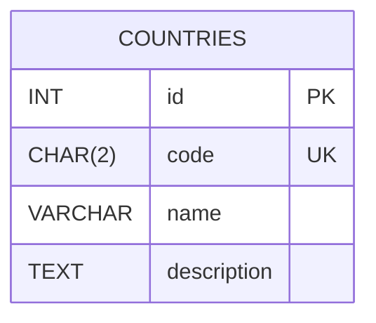
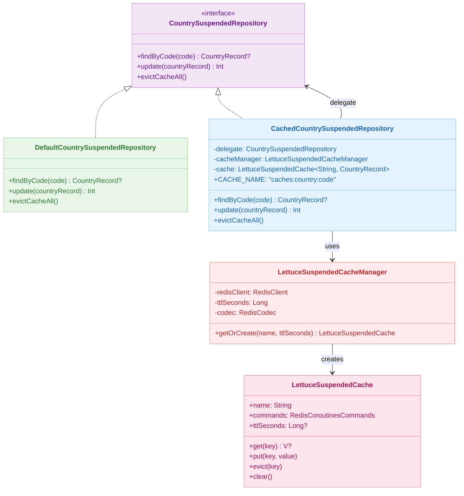
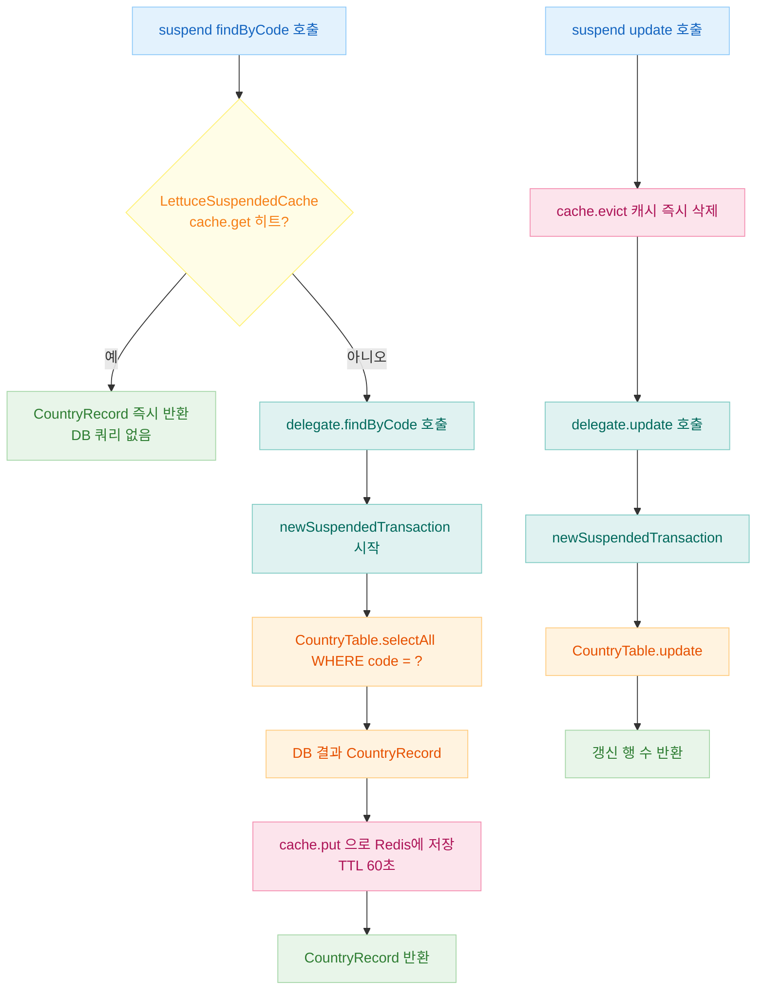
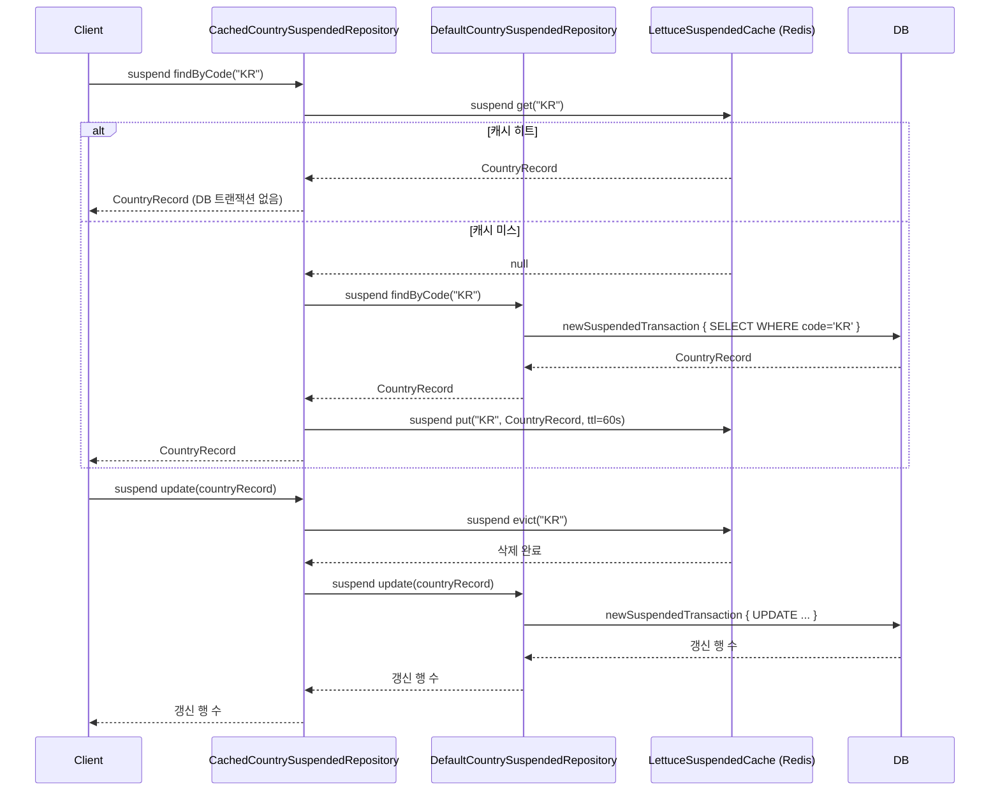

# 09 Spring: Suspended Cache (07)

[English](./README.md) | 한국어

코루틴 suspend 함수에서 Redis 캐시를 논블로킹으로 적용하는 모듈입니다. Spring Cache 어노테이션(
`@Cacheable`)이 suspend 함수에 직접 적용되지 않는 제약을 해결하기 위해 Lettuce 코루틴 API(`RedisCoroutinesCommands`)로 직접 캐시를 제어하는
`LettuceSuspendedCache` / `LettuceSuspendedCacheManager`를 구현하고, 데코레이터 패턴으로 Repository에 캐시 계층을 추가하는 방법을 학습합니다.

## 학습 목표

- `@Cacheable`이 suspend 함수에 적용되지 않는 이유를 이해하고 Lettuce 코루틴 API로 대안을 구현한다.
- `LettuceSuspendedCache<K, V>` 로 TTL 기반 캐시 get/put/evict/clear를 suspend 함수로 처리한다.
- 데코레이터 패턴(`CachedCountrySuspendedRepository`)으로 캐시 로직과 DB 접근 로직을 분리한다.
- `newSuspendedTransaction`과 Lettuce 코루틴 캐시를 조합해 캐시 히트 시 DB 트랜잭션을 열지 않는 구조를 만든다.

## 선수 지식

- [`../05-exposed-repository-coroutines/README.md`](../05-exposed-repository-coroutines/README.md)
- [`../06-spring-cache/README.md`](../06-spring-cache/README.md)

## 도메인 모델



## 아키텍처



## 핵심 개념

### LettuceSuspendedCache (논블로킹 캐시 구현체)

```kotlin
class LettuceSuspendedCache<K: Any, V: Any>(
    val name: String,
    val commands: RedisCoroutinesCommands<String, V>,  // Lettuce 코루틴 커맨드
    private val ttlSeconds: Long? = null,
) {
    private fun keyStr(key: K): String = "$name:$key"

    suspend fun get(key: K): V? = commands.get(keyStr(key))

    suspend fun put(key: K, value: V) {
        if (ttlSeconds != null) {
            commands.setex(keyStr(key), ttlSeconds, value)   // TTL 적용
        } else {
            commands.set(keyStr(key), value)
        }
    }

    suspend fun evict(key: K) = commands.del(keyStr(key))

    suspend fun clear() {
        commands.keys("$name:*")
            .chunked(100)
            .collect { keys -> commands.del(*keys.toTypedArray()) }
    }
}
```

### 데코레이터: CachedCountrySuspendedRepository

```kotlin
class CachedCountrySuspendedRepository(
    private val delegate: CountrySuspendedRepository,       // DB 접근 구현체
    private val cacheManager: LettuceSuspendedCacheManager,
): CountrySuspendedRepository {

    companion object {
        const val CACHE_NAME = "caches:country:code"
    }

    private val cache: LettuceSuspendedCache<String, CountryRecord> by lazy {
        cacheManager.getOrCreate(name = CACHE_NAME, ttlSeconds = 60)
    }

    // Cache-Aside 패턴: 캐시 미스 시 delegate 조회 후 캐시 저장
    override suspend fun findByCode(code: String): CountryRecord? =
        cache.get(code) ?: delegate.findByCode(code)?.apply { cache.put(code, this) }

    // Write-Invalidate 패턴: 갱신 전 캐시 무효화
    override suspend fun update(countryRecord: CountryRecord): Int {
        cache.evict(countryRecord.code)
        return delegate.update(countryRecord)
    }

    override suspend fun evictCacheAll() = cache.clear()
}
```

### DefaultCountrySuspendedRepository (DB 직접 접근)

```kotlin
class DefaultCountrySuspendedRepository: CountrySuspendedRepository {

    override suspend fun findByCode(code: String): CountryRecord? =
        newSuspendedTransaction {
            CountryTable.selectAll()
                .where { CountryTable.code eq code }
                .singleOrNull()
                ?.let { CountryRecord(code = it[CountryTable.code], name = it[CountryTable.name]) }
        }

    override suspend fun update(countryRecord: CountryRecord): Int =
        newSuspendedTransaction {
            CountryTable.update({ CountryTable.code eq countryRecord.code }) {
                it[name] = countryRecord.name
                it[description] = countryRecord.description
            }
        }

    override suspend fun evictCacheAll() { /* 캐시 없음, no-op */ }
}
```

## 캐시 흐름



## LettuceSuspendedCacheManager 설정

```kotlin
@Configuration
class LettuceSuspendedCacheConfig(
    private val redisClient: RedisClient,
) {
    @Bean
    fun lettuceSuspendedCacheManager(): LettuceSuspendedCacheManager =
        LettuceSuspendedCacheManager(
            redisClient = redisClient,
            ttlSeconds = 60L,
            codec = LettuceBinaryCodecs.lz4Fory(),  // LZ4 압축 + Fory 직렬화
        )
}

@Configuration
class SuspendedRepositoryConfig {
    @Bean
    fun countrySuspendedRepository(
        cacheManager: LettuceSuspendedCacheManager,
    ): CountrySuspendedRepository =
        CachedCountrySuspendedRepository(
            delegate = DefaultCountrySuspendedRepository(),
            cacheManager = cacheManager,
        )
}
```

## Coroutine + Cache 통합 시퀀스



## Spring Cache vs LettuceSuspendedCache 비교

| 항목            | Spring Cache (`@Cacheable`)        | LettuceSuspendedCache |
|---------------|------------------------------------|-----------------------|
| suspend 함수 지원 | 미지원 (AOP 프록시 제약)                   | 지원 (코루틴 네이티브)         |
| 캐시 제어 방식      | 선언적 어노테이션                          | 명시적 코드                |
| TTL 설정        | `RedisCacheConfiguration.entryTtl` | 생성자 파라미터              |
| 직렬화           | `RedisSerializationContext`        | Lettuce `RedisCodec`  |
| 트랜잭션 연동       | `transactionAware()`               | 수동 조합                 |

## 실행 방법

```bash
# Redis Testcontainer를 자동으로 기동합니다
./gradlew :09-spring:07-spring-suspended-cache:test

# 테스트 로그 요약
./bin/repo-test-summary -- ./gradlew :09-spring:07-spring-suspended-cache:test
```

## 실습 체크리스트

- `findByCode("KR")` 두 번 연속 호출 시 두 번째에서 `newSuspendedTransaction`이 실행되지 않음을 로그로 확인
- `update()` 후 `findByCode()` 재호출 시 `cache.get`이 null을 반환해 DB 재조회가 일어나는지 검증
- `evictCacheAll()` 후 `CACHE_NAME:*` 패턴 키가 Redis에서 모두 삭제되는지 확인
- TTL 60초 만료 후 자동으로 캐시 미스가 발생해 DB 재조회가 이루어지는지 테스트
- 코루틴 취소(cancellation) 발생 시 `cache.put`이 중단되어도 DB 상태에 영향 없음을 검증

## 성능·안정성 체크포인트

- `LettuceSuspendedCache.clear()`는 `keys` 커맨드를 사용하므로 프로덕션 대용량 환경에서는 `SCAN` 기반으로 교체 고려
- Lettuce 코루틴 커맨드는 이벤트 루프에서 실행되므로 블로킹 코드 혼용 금지
- `cache.evict` 와 `delegate.update` 사이에 장애 발생 시 캐시만 삭제된 불일치 상태 처리 전략 수립 필요

## 다음 챕터

- [`../../10-multi-tenant/README.md`](../../10-multi-tenant/README.md)
