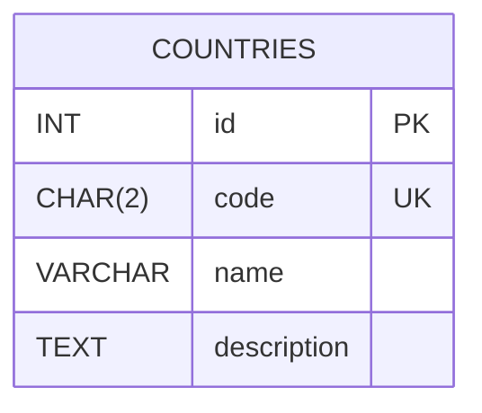
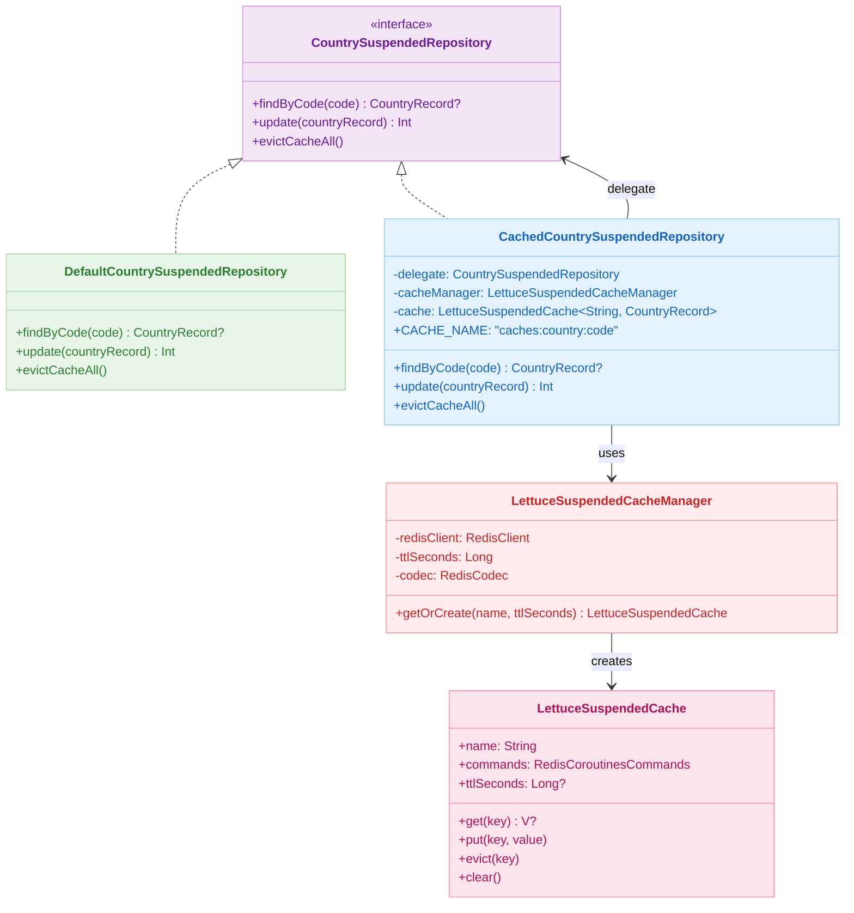
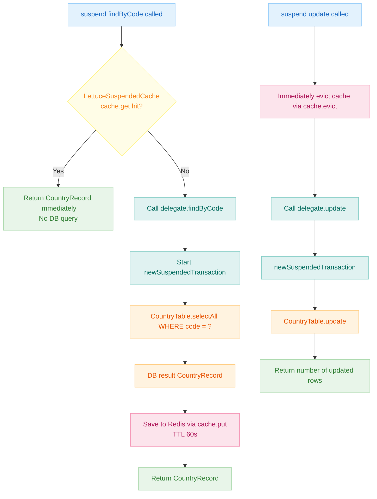
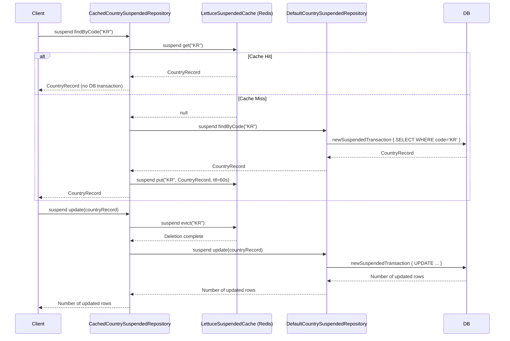

# 09 Spring: Suspended Cache (07)

English | [한국어](./README.ko.md)

A module for applying Redis caching in a non-blocking manner from coroutine `suspend` functions. To work around the limitation that Spring Cache annotations (`@Cacheable`) cannot be applied directly to `suspend` functions, this module implements `LettuceSuspendedCache` / `LettuceSuspendedCacheManager` that control the cache directly through the Lettuce coroutine API (`RedisCoroutinesCommands`), and demonstrates how to add a cache layer to a Repository using the decorator pattern.

## Learning Goals

- Understand why `@Cacheable` cannot be applied to `suspend` functions and implement an alternative using the Lettuce coroutine API.
- Handle TTL-based cache get/put/evict/clear as `suspend` functions using `LettuceSuspendedCache<K, V>`.
- Separate cache logic from DB access logic using the decorator pattern (`CachedCountrySuspendedRepository`).
- Combine `newSuspendedTransaction` with Lettuce coroutine cache so that no DB transaction is opened on a cache hit.

## Prerequisites

- [`../05-exposed-repository-coroutines/README.md`](../05-exposed-repository-coroutines/README.md)
- [`../06-spring-cache/README.md`](../06-spring-cache/README.md)

## Domain Model



## Architecture



## Key Concepts

### LettuceSuspendedCache (Non-blocking Cache Implementation)

```kotlin
class LettuceSuspendedCache<K: Any, V: Any>(
    val name: String,
    val commands: RedisCoroutinesCommands<String, V>,  // Lettuce coroutine commands
    private val ttlSeconds: Long? = null,
) {
    private fun keyStr(key: K): String = "$name:$key"

    suspend fun get(key: K): V? = commands.get(keyStr(key))

    suspend fun put(key: K, value: V) {
        if (ttlSeconds != null) {
            commands.setex(keyStr(key), ttlSeconds, value)   // Apply TTL
        } else {
            commands.set(keyStr(key), value)
        }
    }

    suspend fun evict(key: K) = commands.del(keyStr(key))

    suspend fun clear() {
        commands.keys("$name:*")
            .chunked(100)
            .collect { keys -> commands.del(*keys.toTypedArray()) }
    }
}
```

### Decorator: CachedCountrySuspendedRepository

```kotlin
class CachedCountrySuspendedRepository(
    private val delegate: CountrySuspendedRepository,       // DB access implementation
    private val cacheManager: LettuceSuspendedCacheManager,
): CountrySuspendedRepository {

    companion object {
        const val CACHE_NAME = "caches:country:code"
    }

    private val cache: LettuceSuspendedCache<String, CountryRecord> by lazy {
        cacheManager.getOrCreate(name = CACHE_NAME, ttlSeconds = 60)
    }

    // Cache-Aside pattern: query delegate on cache miss, then store in cache
    override suspend fun findByCode(code: String): CountryRecord? =
        cache.get(code) ?: delegate.findByCode(code)?.apply { cache.put(code, this) }

    // Write-Invalidate pattern: evict cache before updating
    override suspend fun update(countryRecord: CountryRecord): Int {
        cache.evict(countryRecord.code)
        return delegate.update(countryRecord)
    }

    override suspend fun evictCacheAll() = cache.clear()
}
```

### DefaultCountrySuspendedRepository (Direct DB Access)

```kotlin
class DefaultCountrySuspendedRepository: CountrySuspendedRepository {

    override suspend fun findByCode(code: String): CountryRecord? =
        newSuspendedTransaction {
            CountryTable.selectAll()
                .where { CountryTable.code eq code }
                .singleOrNull()
                ?.let { CountryRecord(code = it[CountryTable.code], name = it[CountryTable.name]) }
        }

    override suspend fun update(countryRecord: CountryRecord): Int =
        newSuspendedTransaction {
            CountryTable.update({ CountryTable.code eq countryRecord.code }) {
                it[name] = countryRecord.name
                it[description] = countryRecord.description
            }
        }

    override suspend fun evictCacheAll() { /* No cache, no-op */ }
}
```

## Cache Flow



## LettuceSuspendedCacheManager Configuration

```kotlin
@Configuration
class LettuceSuspendedCacheConfig(
    private val redisClient: RedisClient,
) {
    @Bean
    fun lettuceSuspendedCacheManager(): LettuceSuspendedCacheManager =
        LettuceSuspendedCacheManager(
            redisClient = redisClient,
            ttlSeconds = 60L,
            codec = LettuceBinaryCodecs.lz4Fory(),  // LZ4 compression + Fory serialization
        )
}

@Configuration
class SuspendedRepositoryConfig {
    @Bean
    fun countrySuspendedRepository(
        cacheManager: LettuceSuspendedCacheManager,
    ): CountrySuspendedRepository =
        CachedCountrySuspendedRepository(
            delegate = DefaultCountrySuspendedRepository(),
            cacheManager = cacheManager,
        )
}
```

## Coroutine + Cache Integration Sequence



## Spring Cache vs LettuceSuspendedCache Comparison

| Item            | Spring Cache (`@Cacheable`)        | LettuceSuspendedCache |
|---------------|------------------------------------|-----------------------|
| `suspend` function support | Not supported (AOP proxy limitation) | Supported (coroutine-native) |
| Cache control method | Declarative annotations             | Explicit code         |
| TTL configuration | `RedisCacheConfiguration.entryTtl` | Constructor parameter |
| Serialization  | `RedisSerializationContext`        | Lettuce `RedisCodec`  |
| Transaction integration | `transactionAware()`          | Manual combination    |

## How to Run

```bash
# Redis Testcontainer starts automatically
./gradlew :09-spring:07-spring-suspended-cache:test

# Test log summary
./bin/repo-test-summary -- ./gradlew :09-spring:07-spring-suspended-cache:test
```

## Practice Checklist

- Confirm via logs that `newSuspendedTransaction` does not run on the second consecutive call to `findByCode("KR")`
- Verify that `cache.get` returns null after `update()`, triggering a DB re-query on `findByCode()`
- After `evictCacheAll()`, confirm all `CACHE_NAME:*` pattern keys are deleted from Redis
- Test that a cache miss automatically occurs after the 60-second TTL expires, triggering a DB re-query
- Verify that even if `cache.put` is interrupted by coroutine cancellation, DB state is unaffected

## Performance & Stability Checkpoints

- `LettuceSuspendedCache.clear()` uses the `keys` command — consider replacing with a `SCAN`-based approach for large production environments
- Lettuce coroutine commands run on the event loop, so never mix in blocking code
- Plan a strategy for handling the inconsistent state (cache-only deletion) if a failure occurs between `cache.evict` and `delegate.update`

## Next Chapter

- [`../../10-multi-tenant/README.md`](../../10-multi-tenant/README.md)
