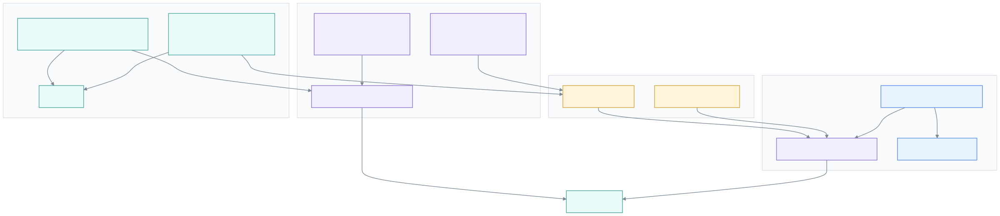

# 09 Spring Integration

English | [한국어](./README.ko.md)

This chapter covers integration patterns for running Exposed reliably in a Spring Boot environment. It provides step-by-step examples from auto-configuration-based connections to declarative transactions, Repository patterns (synchronous/coroutines), and Spring Cache integration.

## Chapter Goals

- Align Spring transaction and Exposed transaction boundaries to design consistent data flows.
- Establish standard patterns for synchronous (`Spring MVC`) and asynchronous (`Spring WebFlux + Coroutines`) Repository layers.
- Explore strategies for balancing consistency and performance when integrating caches.

## Prerequisites

- Spring Boot basics (`DataSource`, `@Transactional`, `@Cacheable`)
- `05-exposed-dml` chapter content (DSL/DAO fundamentals)
- `08-coroutines` chapter content (for coroutine module study)

## Included Modules

| Module                                                                           | Description                              | Key Technologies                                  |
|----------------------------------------------------------------------------------|-----------------------------------------|---------------------------------------------------|
| [`01-springboot-autoconfigure`](01-springboot-autoconfigure/README.md)           | Exposed integration via Spring Boot auto-configuration | `ExposedAutoConfiguration`, `DatabaseInitializer` |
| [`02-transactiontemplate`](02-transactiontemplate/README.md)                     | Programmatic transactions with `TransactionTemplate` | `TransactionTemplate`, `TransactionOperations`    |
| [`03-spring-transaction`](03-spring-transaction/README.md)                       | Declarative transactions with `@Transactional` | `SpringTransactionManager`, `@Transactional`      |
| [`04-exposed-repository`](04-exposed-repository/README.md)                       | Synchronous Repository pattern (Spring MVC) | `JdbcRepository`, DSL/DAO hybrid                  |
| [`05-exposed-repository-coroutines`](05-exposed-repository-coroutines/README.md) | Coroutine Repository pattern (Spring WebFlux) | `newSuspendedTransaction`, suspend fun            |
| [`06-spring-cache`](06-spring-cache/README.md)                                   | Spring Cache + Redis synchronous cache   | `@Cacheable`, `@CacheEvict`, `RedisCacheManager`  |
| [`07-spring-suspended-cache`](07-spring-suspended-cache/README.md)               | Coroutine-based Redis cache              | `LettuceSuspendedCache`, Decorator pattern        |

## Overall Architecture Flow



## Key Pattern Summary

### SpringTransactionManager Registration

```kotlin
@Configuration
@EnableTransactionManagement
class DataSourceConfig: TransactionManagementConfigurer {

    @Bean
    override fun annotationDrivenTransactionManager(): TransactionManager =
        SpringTransactionManager(dataSource(), DatabaseConfig {
            useNestedTransactions = true
        })
}
```

### Repository Pattern (Synchronous)

```kotlin
@Repository
class MovieExposedRepository: JdbcRepository<Long, MovieRecord> {
    override val table = MovieTable
    override fun ResultRow.toEntity() = toMovieRecord()

    @Transactional(readOnly = true)
    fun searchMovies(params: Map<String, String?>): List<MovieRecord> { ... }
}
```

### Repository Pattern (Coroutines)

```kotlin
@Repository
class MovieExposedRepository: JdbcRepository<Long, MovieRecord> {

    suspend fun create(movie: MovieRecord): MovieRecord = /* inside newSuspendedTransaction */
        MovieTable.insertAndGetId { ... }.let { movie.copy(id = it.value) }
}
```

### Cache Layer Decorator (Coroutines)

```kotlin
class CachedCountrySuspendedRepository(
    private val delegate: CountrySuspendedRepository,
    private val cacheManager: LettuceSuspendedCacheManager,
): CountrySuspendedRepository {

    override suspend fun findByCode(code: String): CountryRecord? =
        cache.get(code) ?: delegate.findByCode(code)?.apply { cache.put(code, this) }

    override suspend fun update(countryRecord: CountryRecord): Int {
        cache.evict(countryRecord.code)
        return delegate.update(countryRecord)
    }
}
```

## Recommended Learning Order

```
01-springboot-autoconfigure
        ↓
02-transactiontemplate
        ↓
03-spring-transaction
        ↓
04-exposed-repository ──────────────→ 05-exposed-repository-coroutines
        ↓                                          ↓
06-spring-cache ──────────────────→ 07-spring-suspended-cache
```

## How to Run

```bash
# Full chapter tests
./gradlew :09-spring:01-springboot-autoconfigure:test \
          :09-spring:02-transactiontemplate:test \
          :09-spring:03-spring-transaction:test \
          :09-spring:04-exposed-repository:test \
          :09-spring:05-exposed-repository-coroutines:test \
          :09-spring:06-spring-cache:test \
          :09-spring:07-spring-suspended-cache:test

# Individual module test
./gradlew :09-spring:04-exposed-repository:test

# Test log summary
./bin/repo-test-summary -- ./gradlew :09-spring:04-exposed-repository:test
```

## Test Points

- Verify that transaction propagation/rollback rules work as intended.
- Validate cache hit/miss/invalidation scenarios individually.
- Compare result consistency between coroutine and synchronous paths.
- Confirm that `@Transactional` does not apply to suspend functions and verify that alternatives work correctly.

## Key Trade-offs

| Choice                      | Pros                         | Cons                           |
|---------------------------|------------------------------|--------------------------------|
| `@Transactional`          | Declarative, concise         | Does not support suspend functions |
| `TransactionTemplate`     | Fine-grained boundary control | Increased code complexity      |
| `newSuspendedTransaction` | Coroutine-native             | Requires explicit wrapping     |
| Spring Cache `@Cacheable` | Declarative, concise         | Does not support suspend functions |
| `LettuceSuspendedCache`   | Supports suspend, non-blocking | Manual cache logic required    |

## Performance & Stability Checkpoints

- Always exclude `DataSourceTransactionManagerAutoConfiguration` to prevent transaction manager conflicts
- Exposed JDBC uses blocking drivers, so never call directly from the WebFlux event loop -- `newSuspendedTransaction` is required
- Apply `@CacheEvict` or `cache.evict()` on updates/deletes to prevent stale data from cache invalidation misses
- Adjust connection pool (`HikariCP`) size to match the number of concurrent transactions

## Complex Scenarios

### Aligning Spring Transaction and Exposed Transaction Boundaries

When executing Exposed DSL queries within a Spring transaction wrapped with `@Transactional`,
`SpringTransactionManager` unifies both transaction boundaries on the same connection.
The `useNestedTransactions = true` setting also supports SAVEPOINT-based nested transactions.

- Related module: [`03-spring-transaction`](03-spring-transaction/)

### Coroutine-Based Suspended Cache Decorator

`CachedCountrySuspendedRepository` is a decorator wrapping `DefaultCountrySuspendedRepository`, combining Redis `LettuceSuspendedCache` with
`newSuspendedTransaction` DB access to provide an optimized structure that avoids opening DB transactions on cache hits.

- Related module: [`07-spring-suspended-cache`](07-spring-suspended-cache/)

## Next Chapter

- [`../10-multi-tenant/README.md`](../10-multi-tenant/README.md): Extends to tenant isolation architecture in a production-ready form.
