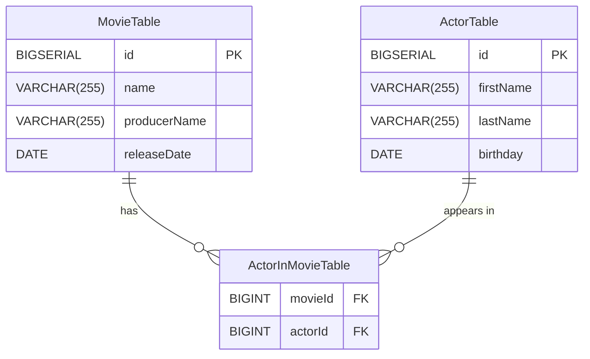
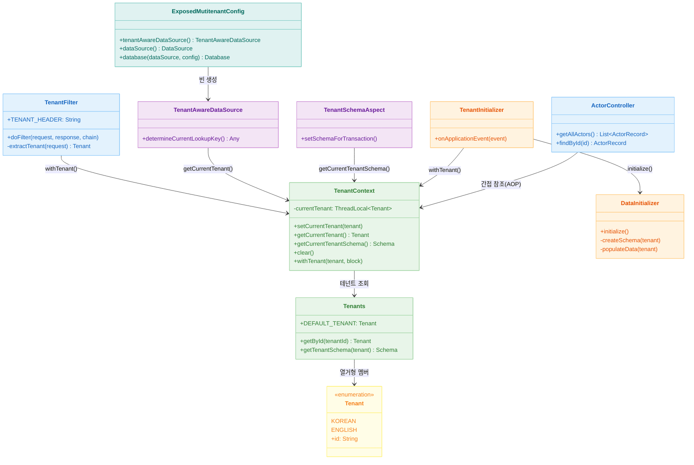
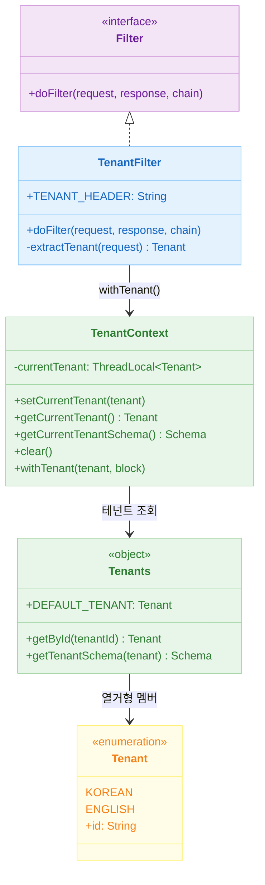
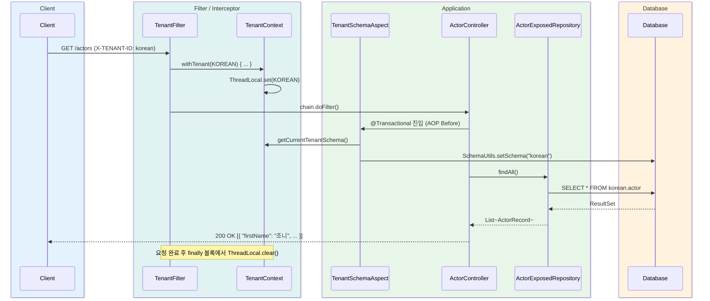

# Exposed + Spring Web + Multi-Tenant (01)

[English](./README.md) | 한국어

Spring MVC 환경에서 Exposed 기반 Schema 멀티테넌시를 구현하는 실전 예제입니다. 요청 헤더(
`X-Tenant-Id`)를 기준으로 테넌트 컨텍스트를 전파하고, 스키마를 분리해 데이터 격리를 보장합니다.

## 학습 목표

- 멀티테넌트 요청 흐름(식별 → 컨텍스트 → 스키마 선택)을 이해한다.
- `ThreadLocal` 기반 컨텍스트 관리 패턴을 익힌다.
- AOP를 이용한 투명한 스키마 전환 방식을 학습한다.
- 테넌트 격리 실패를 테스트로 방지한다.

## 선수 지식

- [`../09-spring/README.md`](../09-spring/README.md)
- Spring MVC 필터/AOP 기초

---

## 도메인 모델



---

## 아키텍처



### TenantResolver 클래스 계층



### 멀티테넌시 전략: Shared Database / Separate Schema

이 모듈은 **하나의 DB 인스턴스**에 테넌트별 **별도 스키마**를 사용하는 방식을 구현합니다.

| 전략                          | DataSource                | 특징                 |
|-----------------------------|---------------------------|--------------------|
| Shared DB / Separate Schema | `dataSource()` (Primary)  | 스키마 전환으로 격리, 운영 단순 |
| Database per Tenant         | `tenantAwareDataSource()` | 완전 격리, 운영 복잡       |

현재 예제는 `dataSource()` + `TenantSchemaAspect`를 조합한 **Shared DB / Separate Schema** 방식을 기본으로 사용합니다.

---

## 요청 흐름



---

## 핵심 구현

### TenantFilter

`jakarta.servlet.Filter`를 구현한 서블릿 필터입니다. `X-TENANT-ID` 헤더에서 테넌트를 읽어 `TenantContext.withTenant()` 블록 안에서 요청을 처리합니다.
`withTenant`는 `finally`에서 반드시 `ThreadLocal`을 정리해 누수를 방지합니다.

```kotlin
override fun doFilter(request: ServletRequest, response: ServletResponse, chain: FilterChain) {
    val tenant = extractTenant(request as HttpServletRequest)
    TenantContext.withTenant(tenant) {
        chain.doFilter(request, response)
    }
}
```

### TenantContext

`ThreadLocal<Tenants.Tenant>`로 요청 스레드에 테넌트를 바인딩합니다. `withTenant` 인라인 함수가 설정과 정리를 보장합니다.

```kotlin
inline fun withTenant(tenant: Tenants.Tenant = getCurrentTenant(), block: () -> Unit) {
    setCurrentTenant(tenant)
    try {
        block()
    } finally {
        clear()
    }
}
```

### Tenants

지원 테넌트 목록(`KOREAN`, `ENGLISH`)과 각 테넌트의 스키마 매핑을 관리하는 싱글턴 객체입니다. `getById()`는 알 수 없는 테넌트 ID를 받으면 예외를 발생시켜 조기 실패를 보장합니다.

### TenantSchemaAspect

`@Transactional`이 선언된 클래스나 메서드 진입 전에 AOP `@Before` 어드바이스로 스키마를 전환합니다. 서비스 코드를 수정하지 않고 투명하게 스키마를 적용합니다.

```kotlin
@Before("@within(...Transactional) || @annotation(...Transactional)")
fun setSchemaForTransaction() {
    transaction {
        val schema = TenantContext.getCurrentTenantSchema()
        SchemaUtils.setSchema(schema)
        commit()
    }
}
```

### TenantAwareDataSource

`AbstractRoutingDataSource`를 상속해 `determineCurrentLookupKey()`에서 `TenantContext.getCurrentTenant()`를 반환합니다.
`Database per Tenant` 방식으로 전환할 때 이 빈을 Primary로 교체하면 됩니다.

### TenantInitializer / DataInitializer

`ApplicationReadyEvent` 수신 시 모든 테넌트 목록을 순회하며 스키마 생성(
`SchemaUtils.createSchema`)과 샘플 데이터 삽입을 수행합니다. 테넌트별로 배우 이름이 한국어/영어로 분리돼 격리를 직접 확인할 수 있습니다.

---

## 주요 구성 요소 요약

| 파일                                  | 역할                              |
|-------------------------------------|---------------------------------|
| `tenant/TenantFilter.kt`            | 헤더에서 테넌트 추출, ThreadLocal 바인딩/해제 |
| `tenant/TenantContext.kt`           | ThreadLocal 기반 테넌트 저장소          |
| `tenant/Tenants.kt`                 | 테넌트 열거형 + 스키마 매핑                |
| `tenant/SchemaSupport.kt`           | `Schema` 객체 생성 헬퍼               |
| `tenant/TenantSchemaAspect.kt`      | AOP로 트랜잭션 전 스키마 전환              |
| `tenant/TenantAwareDataSource.kt`   | 테넌트 기반 DataSource 라우팅           |
| `tenant/TenantInitializer.kt`       | 앱 기동 시 스키마/데이터 초기화              |
| `tenant/DataInitializer.kt`         | 스키마 생성 + 샘플 데이터 삽입              |
| `config/ExposedMutitenantConfig.kt` | DataSource/Database 빈 설정        |
| `controller/ActorController.kt`     | 배우 조회 REST API                  |

---

## 테스트 방법

```bash
# 모듈 테스트 실행
./gradlew :10-multi-tenant:01-multitenant-spring-web:test

# 애플리케이션 기동 (H2 프로파일 기본)
./gradlew :10-multi-tenant:01-multitenant-spring-web:bootRun
```

### API 실습

```bash
# 한국어 테넌트 배우 목록
curl -H 'X-TENANT-ID: korean' http://localhost:8080/actors

# 영어 테넌트 배우 목록
curl -H 'X-TENANT-ID: english' http://localhost:8080/actors

# 특정 배우 조회
curl -H 'X-TENANT-ID: korean' http://localhost:8080/actors/1
```

---

## 실습 체크리스트

- `X-TENANT-ID: korean` 과 `X-TENANT-ID: english` 호출 결과가 다른지 확인
- 헤더 누락 시 기본 테넌트(`korean`)로 동작하는지 확인
- 헤더에 존재하지 않는 테넌트 ID를 전달했을 때 에러 응답 확인
- 요청 종료 후 `ThreadLocal`이 정리되는지 확인 (`TenantContext.clear()`)

## 운영 체크포인트

- `ThreadLocal` 누수 방지를 위해 `withTenant` 블록 외부에서 직접 `setCurrentTenant` 호출 금지
- 로그/트레이스에 tenant 식별자 포함 (`TenantSchemaAspect` 로그 활용)
- 신규 테넌트 온보딩 시 `Tenants.Tenant` 열거형 확장 + 스키마 초기화 자동화 절차 확보

---

## 다음 모듈

- [
  `../02-multitenant-spring-web-virtualthread/README.md`](../02-multitenant-spring-web-virtualthread/README.md): Virtual Thread 환경으로 확장
