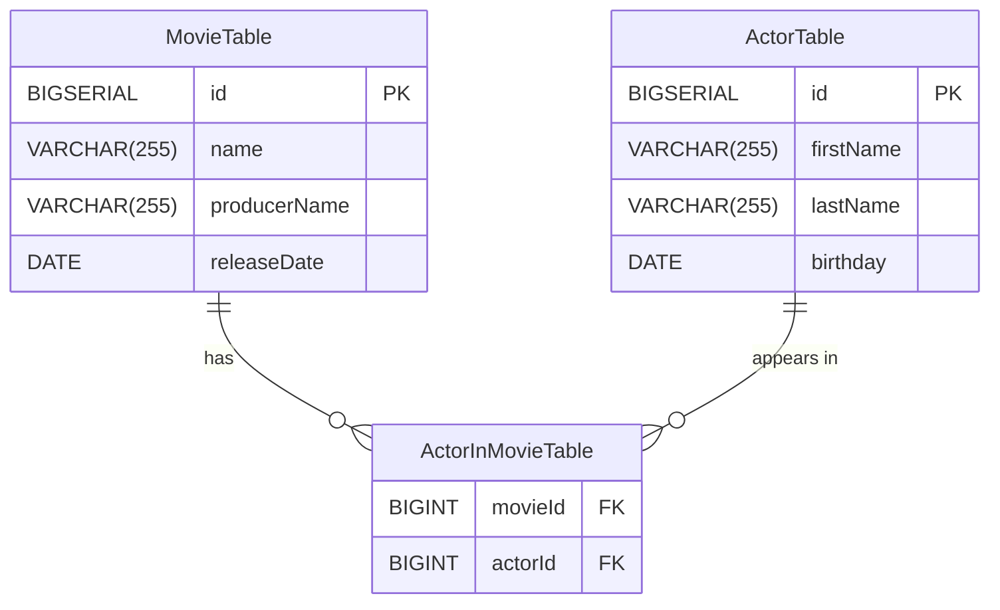
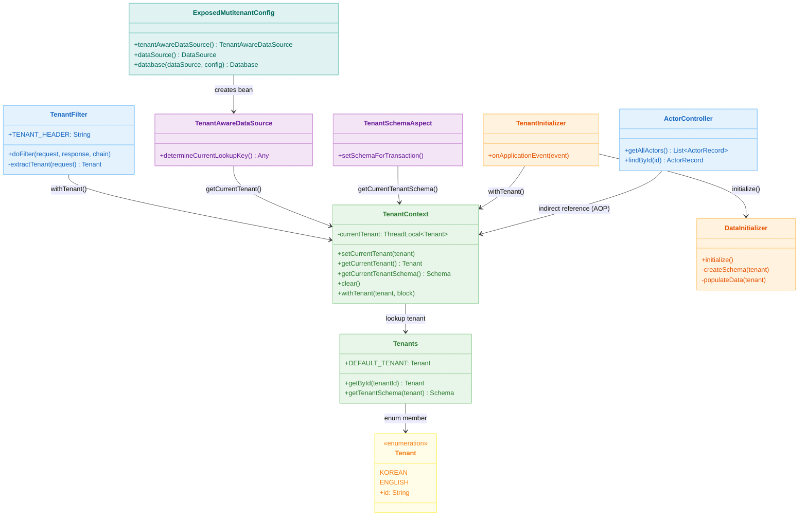
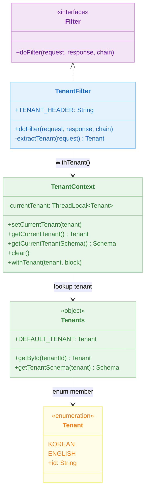
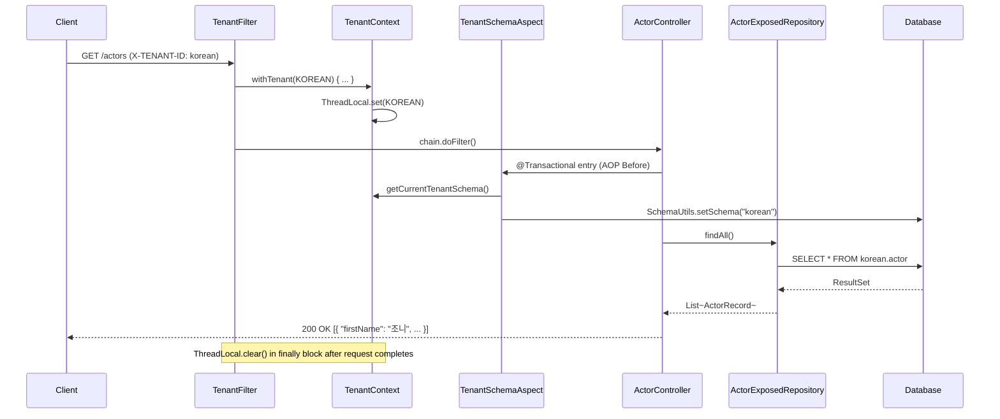

# Exposed + Spring Web + Multi-Tenant (01)

English | [한국어](./README.ko.md)

A production example implementing Exposed-based schema multi-tenancy in a Spring MVC environment. Propagates tenant context based on the request header (`X-Tenant-Id`) and guarantees data isolation via schema separation.

## Learning Goals

- Understand the multi-tenant request flow (identification → context → schema selection).
- Learn `ThreadLocal`-based context management patterns.
- Study transparent schema switching using AOP.
- Prevent tenant isolation failures through tests.

## Prerequisites

- [`../09-spring/README.md`](../09-spring/README.md)
- Spring MVC filter/AOP basics

---

## Domain Model



---

## Architecture



### TenantResolver Class Hierarchy



### Multi-Tenancy Strategy: Shared Database / Separate Schema

This module implements the approach of using a **separate schema per tenant** within a **single DB instance**.

| Strategy                    | DataSource                | Characteristics                      |
|-----------------------------|---------------------------|------------------------------------|
| Shared DB / Separate Schema | `dataSource()` (Primary)  | Isolated by schema switch, operationally simple |
| Database per Tenant         | `tenantAwareDataSource()` | Fully isolated, operationally complex |

This example uses the **Shared DB / Separate Schema** approach combining `dataSource()` + `TenantSchemaAspect`.

---

## Request Flow



---

## Key Implementation

### TenantFilter

A servlet filter implementing `jakarta.servlet.Filter`. Reads the tenant from the `X-TENANT-ID` header and processes the request inside a `TenantContext.withTenant()` block. `withTenant` guarantees `ThreadLocal` cleanup in `finally` to prevent leaks.

```kotlin
override fun doFilter(request: ServletRequest, response: ServletResponse, chain: FilterChain) {
    val tenant = extractTenant(request as HttpServletRequest)
    TenantContext.withTenant(tenant) {
        chain.doFilter(request, response)
    }
}
```

### TenantContext

Binds the tenant to the request thread via `ThreadLocal<Tenants.Tenant>`. The `withTenant` inline function guarantees setup and cleanup.

```kotlin
inline fun withTenant(tenant: Tenants.Tenant = getCurrentTenant(), block: () -> Unit) {
    setCurrentTenant(tenant)
    try {
        block()
    } finally {
        clear()
    }
}
```

### Tenants

A singleton object managing the list of supported tenants (`KOREAN`, `ENGLISH`) and each tenant's schema mapping. `getById()` throws an exception for unknown tenant IDs, guaranteeing fail-fast behavior.

### TenantSchemaAspect

Switches the schema via an AOP `@Before` advice before entering a class or method annotated with `@Transactional`. Transparently applies the schema without modifying service code.

```kotlin
@Before("@within(...Transactional) || @annotation(...Transactional)")
fun setSchemaForTransaction() {
    transaction {
        val schema = TenantContext.getCurrentTenantSchema()
        SchemaUtils.setSchema(schema)
        commit()
    }
}
```

### TenantAwareDataSource

Extends `AbstractRoutingDataSource` and returns `TenantContext.getCurrentTenant()` from `determineCurrentLookupKey()`. To switch to **Database per Tenant** mode, replace this bean as Primary.

### TenantInitializer / DataInitializer

On receiving `ApplicationReadyEvent`, iterates over all tenants to create schemas (`SchemaUtils.createSchema`) and insert sample data. Actor names are separated as Korean/English per tenant for hands-on isolation verification.

---

## Key Components Summary

| File                                  | Role                                           |
|-------------------------------------|-------------------------------------------------|
| `tenant/TenantFilter.kt`            | Extract tenant from header, bind/release ThreadLocal |
| `tenant/TenantContext.kt`           | ThreadLocal-based tenant store                  |
| `tenant/Tenants.kt`                 | Tenant enum + schema mapping                    |
| `tenant/SchemaSupport.kt`           | Helper for creating `Schema` objects            |
| `tenant/TenantSchemaAspect.kt`      | Schema switch before transaction via AOP        |
| `tenant/TenantAwareDataSource.kt`   | Tenant-based DataSource routing                 |
| `tenant/TenantInitializer.kt`       | Schema/data initialization on app startup       |
| `tenant/DataInitializer.kt`         | Schema creation + sample data insertion         |
| `config/ExposedMutitenantConfig.kt` | DataSource/Database bean configuration          |
| `controller/ActorController.kt`     | Actor query REST API                            |

---

## How to Test

```bash
# Run module tests
./gradlew :10-multi-tenant:01-multitenant-spring-web:test

# Start application (H2 profile by default)
./gradlew :10-multi-tenant:01-multitenant-spring-web:bootRun
```

### API Practice

```bash
# Korean tenant actor list
curl -H 'X-TENANT-ID: korean' http://localhost:8080/actors

# English tenant actor list
curl -H 'X-TENANT-ID: english' http://localhost:8080/actors

# Query specific actor
curl -H 'X-TENANT-ID: korean' http://localhost:8080/actors/1
```

---

## Practice Checklist

- Verify that results differ between `X-TENANT-ID: korean` and `X-TENANT-ID: english` calls
- Confirm default tenant (`korean`) is used when header is missing
- Verify error response when a non-existent tenant ID is sent in the header
- Confirm `ThreadLocal` is cleaned up after request ends (`TenantContext.clear()`)

## Operations Checkpoints

- Never call `setCurrentTenant` directly outside a `withTenant` block to prevent `ThreadLocal` leaks
- Include tenant identifier in logs/traces (leverage `TenantSchemaAspect` logs)
- Have an automated procedure for extending `Tenants.Tenant` enum + schema initialization when onboarding new tenants

---

## Next Module

- [`../02-multitenant-spring-web-virtualthread/README.md`](../02-multitenant-spring-web-virtualthread/README.md): Extend to Virtual Thread environment
