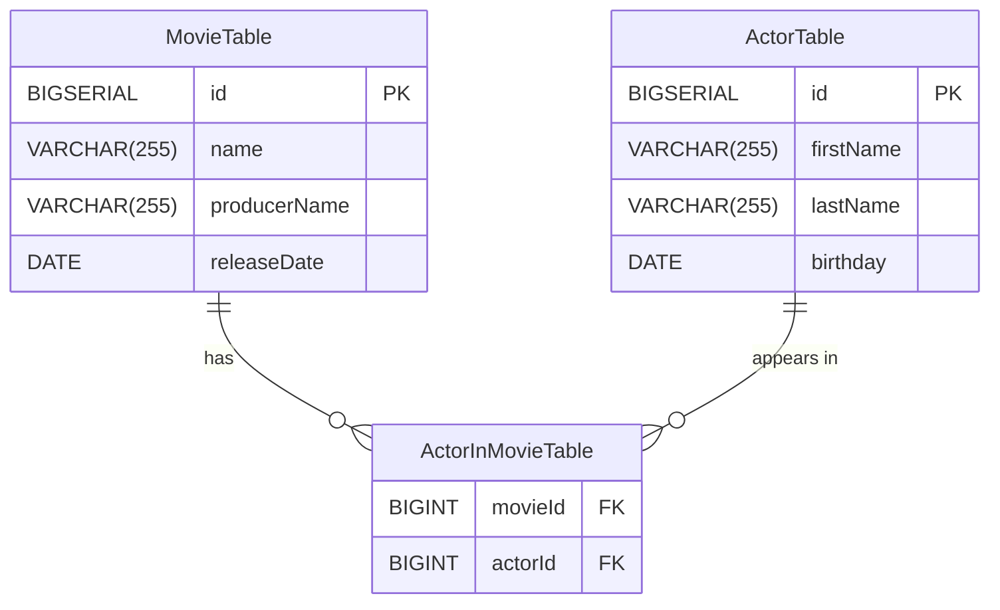
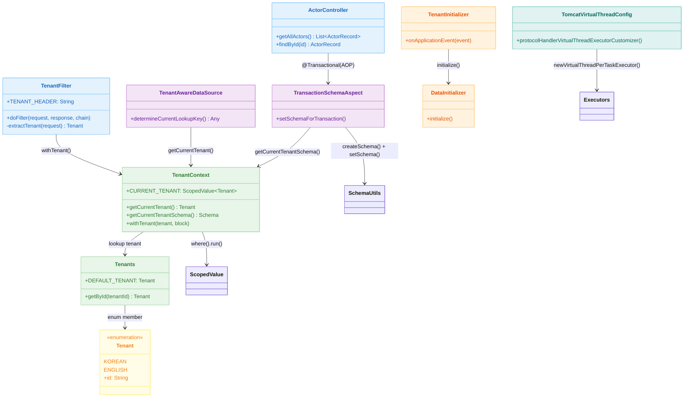
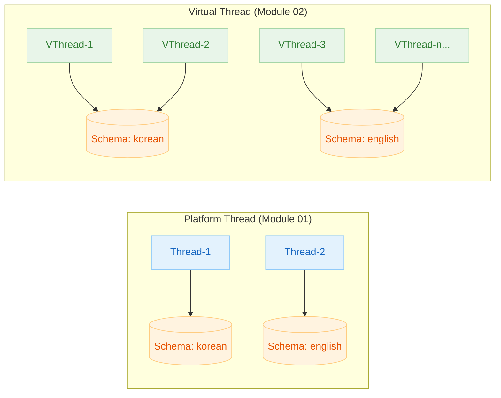
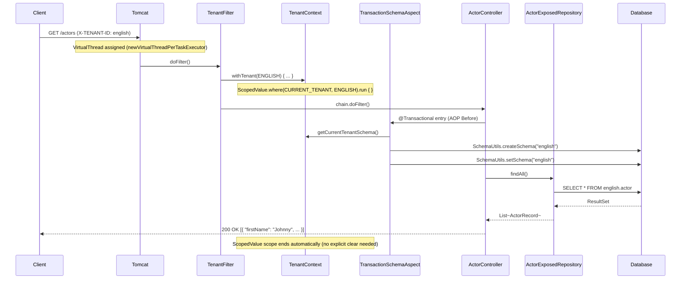

# Exposed + Spring Web + Virtual Threads + Multi-Tenant (02)

English | [한국어](./README.ko.md)

An example that extends the multi-tenancy structure from module `01` to a Java 21 Virtual Threads environment. Focuses on a configuration that increases concurrent throughput while retaining blocking I/O style. Uses `ScopedValue` instead of `ThreadLocal` for Virtual Thread-friendly context propagation.

## Learning Goals

- Understand the Virtual Thread-based request processing model.
- Compare context propagation differences between `ThreadLocal` and `ScopedValue`.
- Learn how `TransactionSchemaAspect` handles schema creation and switching simultaneously.
- Verify isolation/stability under increased concurrency.

## Prerequisites

- [`../01-multitenant-spring-web/README.md`](../01-multitenant-spring-web/README.md)
- Java 21 Virtual Threads basics

---

## Domain Model



---

## Key Differences from Module 01

| Item         | 01 (Spring MVC)                   | 02 (Virtual Threads)                                 |
|------------|-----------------------------------|------------------------------------------------------|
| Thread Model | OS thread pool (Tomcat default)  | Virtual Thread per request                           |
| Context Storage | `ThreadLocal`                 | `ScopedValue`                                        |
| Schema Aspect | `TenantSchemaAspect` (setSchema only) | `TransactionSchemaAspect` (createSchema + setSchema) |
| Tomcat Config | Default                        | `TomcatVirtualThreadConfig`                          |

---

## Architecture



### ScopedValue-Based Context Propagation

Virtual Threads can be created in the millions concurrently, making `ThreadLocal`'s memory overhead problematic. Java 21's `ScopedValue` operates as an immutable binding, making it well-suited for Virtual Thread environments.

```
ThreadLocal  → Mutable, requires manual clear()
ScopedValue  → Immutable binding, automatically destroyed when scope exits
```

### Platform Thread vs Virtual Thread Comparison



---

## Request Flow



---

## Key Implementation

### TomcatVirtualThreadConfig

Replaces Tomcat's `ProtocolHandler` executor with `Executors.newVirtualThreadPerTaskExecutor()` when `spring.threads.virtual.enabled=true` (the default). Minimal configuration to activate Virtual Threads without changing existing code.

```kotlin
@Bean
fun protocolHandlerVirtualThreadExecutorCustomizer(): TomcatProtocolHandlerCustomizer<*> {
    return TomcatProtocolHandlerCustomizer<ProtocolHandler> { protocolHandler ->
        protocolHandler.executor = Executors.newVirtualThreadPerTaskExecutor()
    }
}
```

### TenantContext (ScopedValue Version)

A version of the `ThreadLocal` approach from module `01` replaced with `ScopedValue`. Values are only valid inside the `ScopedValue.where().run { }` block and automatically disappear when the block ends.

```kotlin
object TenantContext {
    val CURRENT_TENANT: ScopedValue<Tenant> = ScopedValue.newInstance()

    inline fun withTenant(tenant: Tenants.Tenant = getCurrentTenant(), crossinline block: () -> Unit) {
        ScopedValue.where(CURRENT_TENANT, tenant).run {
            block()
        }
    }
}
```

### TransactionSchemaAspect

Performs the same role as `TenantSchemaAspect` from module `01`, but additionally calls `SchemaUtils.createSchema()` to automatically create schemas if they don't exist. Prevents schema initialization races when concurrent requests flood in under Virtual Thread environments.

```kotlin
@Before("@within(...Transactional) || @annotation(...Transactional)")
fun setSchemaForTransaction() {
    transaction {
        val schema = TenantContext.getCurrentTenantSchema()
        SchemaUtils.createSchema(schema)  // Additional compared to module 01
        SchemaUtils.setSchema(schema)
        commit()
    }
}
```

### TenantFilter

Uses the same servlet filter interface as module `01`, but internally `TenantContext.withTenant()` operates on a `ScopedValue` basis.

---

## Key Components Summary

| File                                    | Role                                          |
|---------------------------------------|-----------------------------------------------|
| `config/TomcatVirtualThreadConfig.kt` | Replace Tomcat executor with Virtual Thread   |
| `tenant/TenantFilter.kt`              | Extract tenant from header, bind ScopedValue  |
| `tenant/TenantContext.kt`             | ScopedValue-based tenant store                |
| `tenant/Tenants.kt`                   | Tenant enum + schema mapping                  |
| `tenant/SchemaSupport.kt`             | Helper for creating `Schema` objects          |
| `tenant/TransactionSchemaAspect.kt`   | Schema creation/switching before transaction via AOP |
| `tenant/TenantAwareDataSource.kt`     | Tenant-based DataSource routing               |
| `tenant/TenantInitializer.kt`         | Schema/data initialization on app startup     |
| `tenant/DataInitializer.kt`           | Schema creation + sample data insertion       |
| `config/ExposedMultitenantConfig.kt`  | DataSource/Database bean configuration        |
| `controller/ActorController.kt`       | Actor query REST API                          |

---

## How to Test

```bash
# Run module tests
./gradlew :10-multi-tenant:02-multitenant-spring-web-virtualthread:test

# Start application
./gradlew :10-multi-tenant:02-multitenant-spring-web-virtualthread:bootRun
```

### API Practice

```bash
# Korean tenant actor list
curl -H 'X-TENANT-ID: korean' http://localhost:8080/actors

# English tenant actor list
curl -H 'X-TENANT-ID: english' http://localhost:8080/actors

# Query specific actor
curl -H 'X-TENANT-ID: english' http://localhost:8080/actors/1
```

---

## Practice Checklist

- Verify response data differs between `X-TENANT-ID: korean` and `X-TENANT-ID: english`
- Verify that tenant data does not cross over even as concurrent request count increases
- Confirm default value returned when `getCurrentTenant()` is called outside `ScopedValue` scope
- Measure latency changes when thread pool/connection pool settings are modified

## Operations Checkpoints

- Increasing Virtual Threads alone does not resolve DB bottlenecks — tune HikariCP `maximumPoolSize` together
- `ScopedValue` is immutable so tenant cannot be changed after binding — finalize flow design upfront
- Ensure no long-running blocking tasks are placed in the request path
- Fix integration tests for tenant leak detection in CI

---

## Next Module

- [`../03-multitenant-spring-webflux/README.md`](../03-multitenant-spring-webflux/README.md): Non-blocking multi-tenant with WebFlux + Coroutines
