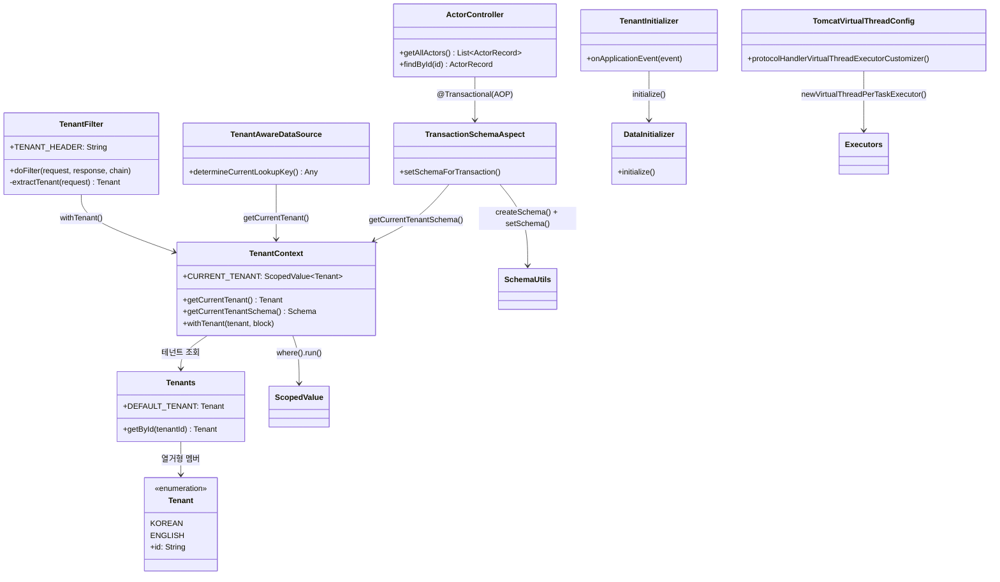
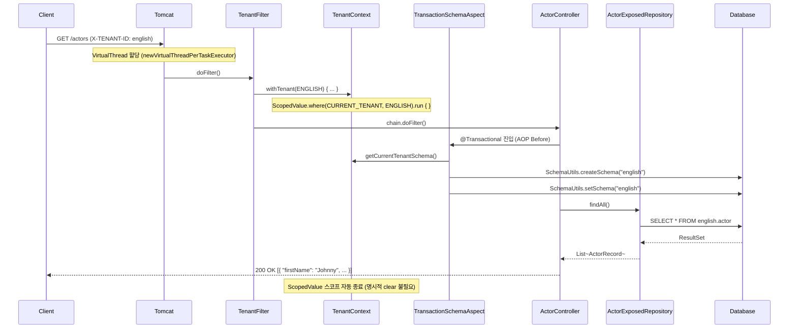

# Exposed + Spring Web + Virtual Threads + Multi-Tenant (02)

`01` 모듈의 멀티테넌시 구조를 Java 21 Virtual Threads 환경으로 확장한 예제입니다. 블로킹 I/O 스타일을 유지하면서 동시 처리량을 높이는 구성에 초점을 맞춥니다. `ThreadLocal` 대신
`ScopedValue`를 사용해 Virtual Thread 친화적인 컨텍스트 전파를 구현합니다.

## 학습 목표

- Virtual Thread 기반 요청 처리 모델을 이해한다.
- `ThreadLocal` vs `ScopedValue` 컨텍스트 전파 방식의 차이를 비교한다.
- `TransactionSchemaAspect`로 스키마 생성과 전환을 동시에 처리하는 방식을 익힌다.
- 동시성 증가 상황에서 격리/안정성을 검증한다.

## 선수 지식

- [`../01-multitenant-spring-web/README.md`](../01-multitenant-spring-web/README.md)
- Java 21 Virtual Threads 기초

---

## 01 모듈과의 핵심 차이

| 항목         | 01 (Spring MVC)                   | 02 (Virtual Threads)                                 |
|------------|-----------------------------------|------------------------------------------------------|
| 스레드 모델     | OS 스레드 풀 (Tomcat 기본)              | Virtual Thread per request                           |
| 컨텍스트 저장    | `ThreadLocal`                     | `ScopedValue`                                        |
| 스키마 Aspect | `TenantSchemaAspect` (setSchema만) | `TransactionSchemaAspect` (createSchema + setSchema) |
| Tomcat 설정  | 기본                                | `TomcatVirtualThreadConfig`                          |

---

## 아키텍처



### ScopedValue 기반 컨텍스트 전파

Virtual Thread는 수백만 개가 동시에 생성될 수 있어 `ThreadLocal`의 메모리 오버헤드가 문제가 됩니다. Java 21의
`ScopedValue`는 불변 바인딩으로 동작해 Virtual Thread 환경에 적합합니다.

```
ThreadLocal  → 변경 가능, 반드시 수동 clear() 필요
ScopedValue  → 불변 바인딩, 스코프 벗어나면 자동 소멸
```

---

## 요청 흐름



---

## 핵심 구현

### TomcatVirtualThreadConfig

`spring.threads.virtual.enabled=true`(기본값) 조건에서 Tomcat의 `ProtocolHandler` executor를
`Executors.newVirtualThreadPerTaskExecutor()`로 교체합니다. 기존 코드 변경 없이 Virtual Thread를 활성화하는 최소 설정입니다.

```kotlin
@Bean
fun protocolHandlerVirtualThreadExecutorCustomizer(): TomcatProtocolHandlerCustomizer<*> {
    return TomcatProtocolHandlerCustomizer<ProtocolHandler> { protocolHandler ->
        protocolHandler.executor = Executors.newVirtualThreadPerTaskExecutor()
    }
}
```

### TenantContext (ScopedValue 버전)

`01` 모듈의 `ThreadLocal` 방식을 `ScopedValue`로 교체한 버전입니다. `ScopedValue.where().run { }` 블록 안에서만 값이 유효하며, 블록 종료 시 자동으로 소멸됩니다.

```kotlin
object TenantContext {
    val CURRENT_TENANT: ScopedValue<Tenant> = ScopedValue.newInstance()

    inline fun withTenant(tenant: Tenants.Tenant = getCurrentTenant(), crossinline block: () -> Unit) {
        ScopedValue.where(CURRENT_TENANT, tenant).run {
            block()
        }
    }
}
```

### TransactionSchemaAspect

`01` 모듈의 `TenantSchemaAspect`와 동일한 역할을 하지만,
`SchemaUtils.createSchema()`를 추가로 호출해 스키마가 없을 경우 자동 생성합니다. Virtual Thread 환경에서 동시 요청이 몰릴 때 스키마 초기화 경합을 방지합니다.

```kotlin
@Before("@within(...Transactional) || @annotation(...Transactional)")
fun setSchemaForTransaction() {
    transaction {
        val schema = TenantContext.getCurrentTenantSchema()
        SchemaUtils.createSchema(schema)  // 01 모듈 대비 추가
        SchemaUtils.setSchema(schema)
        commit()
    }
}
```

### TenantFilter

`01` 모듈과 동일한 서블릿 필터 인터페이스를 사용하지만, 내부적으로 `TenantContext.withTenant()`가 `ScopedValue` 기반으로 동작합니다.

---

## 주요 구성 요소 요약

| 파일                                    | 역할                                  |
|---------------------------------------|-------------------------------------|
| `config/TomcatVirtualThreadConfig.kt` | Tomcat executor를 Virtual Thread로 교체 |
| `tenant/TenantFilter.kt`              | 헤더에서 테넌트 추출, ScopedValue 바인딩        |
| `tenant/TenantContext.kt`             | ScopedValue 기반 테넌트 저장소              |
| `tenant/Tenants.kt`                   | 테넌트 열거형 + 스키마 매핑                    |
| `tenant/SchemaSupport.kt`             | `Schema` 객체 생성 헬퍼                   |
| `tenant/TransactionSchemaAspect.kt`   | AOP로 트랜잭션 전 스키마 생성/전환               |
| `tenant/TenantAwareDataSource.kt`     | 테넌트 기반 DataSource 라우팅               |
| `tenant/TenantInitializer.kt`         | 앱 기동 시 스키마/데이터 초기화                  |
| `tenant/DataInitializer.kt`           | 스키마 생성 + 샘플 데이터 삽입                  |
| `config/ExposedMultitenantConfig.kt`  | DataSource/Database 빈 설정            |
| `controller/ActorController.kt`       | 배우 조회 REST API                      |

---

## 테스트 방법

```bash
# 모듈 테스트 실행
./gradlew :10-multi-tenant:02-multitenant-spring-web-virtualthread:test

# 애플리케이션 기동
./gradlew :10-multi-tenant:02-multitenant-spring-web-virtualthread:bootRun
```

### API 실습

```bash
# 한국어 테넌트 배우 목록
curl -H 'X-TENANT-ID: korean' http://localhost:8080/actors

# 영어 테넌트 배우 목록
curl -H 'X-TENANT-ID: english' http://localhost:8080/actors

# 특정 배우 조회
curl -H 'X-TENANT-ID: english' http://localhost:8080/actors/1
```

---

## 실습 체크리스트

- `X-TENANT-ID: korean`과 `X-TENANT-ID: english` 응답 데이터가 다른지 확인
- 동시 요청 수를 늘려도 테넌트 데이터가 교차되지 않는지 검증
- `ScopedValue` 스코프 밖에서 `getCurrentTenant()` 호출 시 기본값 반환 확인
- 스레드 풀/커넥션 풀 설정값 변경 시 지연시간 변화 측정

## 운영 체크포인트

- Virtual Thread 증가만으로 DB 병목이 해결되지 않으므로 HikariCP `maximumPoolSize` 함께 튜닝
- `ScopedValue`는 불변이므로 바인딩 후 테넌트 변경이 불가 — 설계 단계에서 흐름 확정 필요
- 장시간 블로킹 작업을 요청 경로에 두지 않도록 점검
- tenant 누수 탐지를 위한 통합 테스트를 CI에 고정

---

## 다음 모듈

- [
  `../03-multitenant-spring-webflux/README.md`](../03-multitenant-spring-webflux/README.md): WebFlux + Coroutines 기반 논블로킹 멀티테넌트
