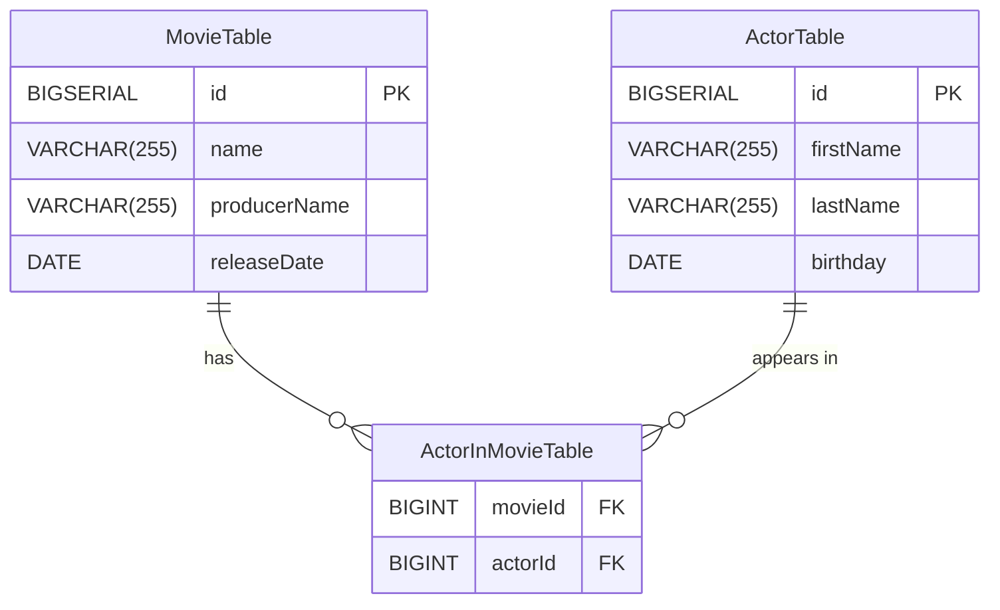
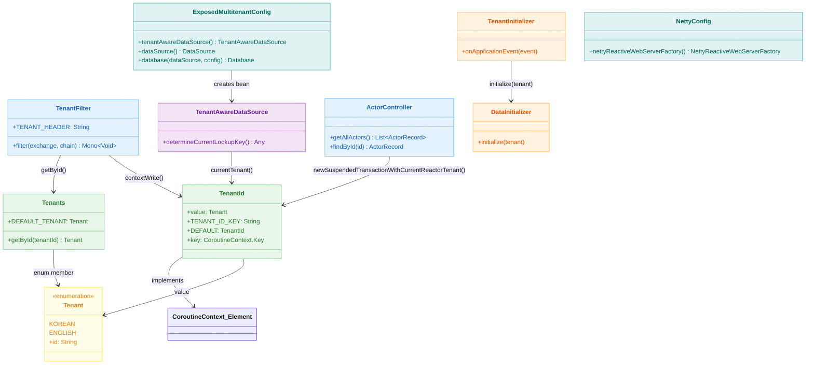

# Exposed + Spring WebFlux + Coroutines + Multi-Tenant (03)

English | [한국어](./README.ko.md)

A non-blocking multi-tenant example based on WebFlux + Coroutines. Propagates tenant information via Reactor `Context`, and integrates with coroutine transactions (`newSuspendedTransactionWithTenant`) to separate schemas. Covers an approach that guarantees tenant isolation without blocking the event loop.

## Learning Goals

- Understand the Reactor `Context` and Kotlin coroutine context bridge (`ReactorContext`).
- Learn how to implement `TenantId` as a `CoroutineContext.Element` and propagate it through a coroutine chain.
- Handle per-tenant schema switching inside coroutines using `newSuspendedTransactionWithTenant`.
- Verify isolation and performance together on the non-blocking path.

## Prerequisites

- [`../08-coroutines/README.md`](../08-coroutines/README.md)
- [`../01-multitenant-spring-web/README.md`](../01-multitenant-spring-web/README.md)
- Reactor Context / Kotlin Coroutines basics

---

## Domain Model



---

## Key Differences from Modules 01/02

| Item          | 01 (Spring MVC)          | 02 (Virtual Threads)     | 03 (WebFlux)                           |
|---------|--------------------------|--------------------------|----------------------------------------|
| Server  | Tomcat (servlet)         | Tomcat (Virtual Thread)  | Netty (non-blocking)                   |
| Context Storage | `ThreadLocal`        | `ScopedValue`            | Reactor `Context` + `CoroutineContext` |
| Schema Switch | AOP `@Before`          | AOP `@Before`            | `newSuspendedTransactionWithTenant`    |
| Transaction | `@Transactional`       | `@Transactional`         | `newSuspendedTransaction`              |
| Filter Type | `jakarta.servlet.Filter` | `jakarta.servlet.Filter` | `WebFilter` (Reactor)                  |

---

## Architecture



### Context Propagation System

In WebFlux, threads are not pinned to requests, so `ThreadLocal`/`ScopedValue` cannot be used. Instead, tenant information is propagated via the Reactor `Context` → `ReactorContext` → `CoroutineContext` path.

```
HTTP Request
  └── TenantFilter (WebFilter)
        └── chain.filter(exchange).contextWrite { it.put("TenantId", TenantId(tenant)) }
              └── Reactor Context (propagated through async chain)
                    └── coroutineContext[ReactorContext]?.context?.get("TenantId")
                          └── newSuspendedTransactionWithTenant { SchemaUtils.setSchema(...) }
```

### Tenant Propagation Flow via Reactor Context

```mermaid
%%{init: {'theme': 'base', 'backgroundColor': '#FAFAFA', 'themeVariables': {'background': '#FAFAFA', 'fontFamily': '"Comic Mono", "goorm sans code", "JetBrains Mono", "goorm sans"'}}}%%
flowchart LR
    Request[WebFlux Request] --> |Mono/Flux| WebFilter[WebFilter\nTenant extracted]
    WebFilter --> |contextWrite| ReactorCtx[Reactor Context\nTenantId stored]
    ReactorCtx --> |coroutineContext| CoroutineScope[CoroutineScope\n+ ReactorContext]
    CoroutineScope --> |newSuspendedTransactionWithTenant| ExposedDB[Exposed\nnewSuspendedTransaction]
    ExposedDB --> |useSchema| TenantDB[(Tenant Schema)]

    classDef blue fill:#E3F2FD,stroke:#90CAF9,color:#1565C0
    classDef green fill:#E8F5E9,stroke:#A5D6A7,color:#2E7D32
    classDef purple fill:#F3E5F5,stroke:#CE93D8,color:#6A1B9A
    classDef orange fill:#FFF3E0,stroke:#FFCC80,color:#E65100

    class Request blue
    class WebFilter green
    class ReactorCtx purple
    class CoroutineScope purple
    class ExposedDB green
    class TenantDB orange
```



---

## Request Flow


---

## Key Implementation

### TenantFilter (WebFilter)

Implements Reactor `WebFilter` instead of servlet `Filter`. Reads the header inside a `mono { }` block and injects `TenantId` into the Reactor Context via `contextWrite`. Bridges coroutines and Reactor using `awaitSingleOrNull()`.

```kotlin
override fun filter(exchange: ServerWebExchange, chain: WebFilterChain): Mono<Void> = mono {
    val tenantId = exchange.request.headers.getFirst(TENANT_HEADER)
    val tenant = Tenants.getById(tenantId ?: Tenants.DEFAULT_TENANT.id)

    chain
        .filter(exchange)
        .contextWrite { it.put(TenantId.TENANT_ID_KEY, TenantId(tenant)) }
        .awaitSingleOrNull()
}
```

### TenantId

A tenant identifier implementing `CoroutineContext.Element` that can be directly queried from the coroutine context. Provides two access approaches: `currentReactorTenant()` reads from Reactor Context, and `currentTenant()` reads from coroutine context.

```kotlin
data class TenantId(val value: Tenants.Tenant): CoroutineContext.Element {
    companion object Key: CoroutineContext.Key<TenantId> {
        val DEFAULT = TenantId(Tenants.DEFAULT_TENANT)
        const val TENANT_ID_KEY = "TenantId"
    }
    override val key: CoroutineContext.Key<*> = Key
}

// Read tenant from Reactor Context
suspend fun currentReactorTenant(): Tenants.Tenant =
    coroutineContext[ReactorContext]?.context?.getOrDefault(TenantId.TENANT_ID_KEY, TenantId.DEFAULT)?.value
        ?: Tenants.DEFAULT_TENANT

// Read tenant from CoroutineContext
suspend fun currentTenant(): Tenants.Tenant =
    coroutineContext[TenantId]?.value ?: Tenants.DEFAULT_TENANT
```

### newSuspendedTransactionWithTenant

An extension function that wraps `newSuspendedTransaction` to automatically handle per-tenant schema switching. Combines `Dispatchers.IO + TenantId(currentTenant)` into the coroutine context to maintain tenant information inside the transaction.

```kotlin
suspend fun <T> newSuspendedTransactionWithTenant(
    tenant: Tenant? = null,
    db: Database? = null,
    statement: suspend JdbcTransaction.() -> T,
): T {
    val currentTenant = tenant ?: currentTenant()
    val context = Dispatchers.IO + TenantId(currentTenant)

    return newSuspendedTransaction(context, db) {
        SchemaUtils.setSchema(getSchemaDefinition(currentTenant))
        statement()
    }
}
```

### ActorController

Controls transactions directly with a `newSuspendedTransactionWithCurrentReactorTenant` block instead of `@Transactional` AOP. Declared as a `suspend` function to avoid blocking the event loop.

```kotlin
@GetMapping
suspend fun getAllActors(): List<ActorRecord> = newSuspendedTransactionWithCurrentReactorTenant {
    actorRepository.findAll()
}
```

### TenantAwareDataSource

Queries the coroutine context tenant via `runBlocking { currentTenant() }` from `determineCurrentLookupKey()`. An optional bean used when switching to **Database per Tenant** mode.

---

## Key Components Summary

| File                                   | Role                                                          |
|--------------------------------------|-----------------------------------------------------------------|
| `tenant/TenantFilter.kt`             | Read header via WebFilter + inject TenantId into Reactor Context |
| `tenant/TenantId.kt`                 | `CoroutineContext.Element` implementation, Reactor↔Coroutine bridge functions |
| `tenant/Tenants.kt`                  | Tenant enum + schema mapping                                   |
| `tenant/SchemaSupport.kt`            | Helper for creating `Schema` objects                           |
| `tenant/TenantAwareDataSource.kt`    | Coroutine context-based DataSource routing                     |
| `tenant/TenantInitializer.kt`        | Schema/data initialization on app startup                      |
| `tenant/DataInitializer.kt`          | Schema creation + sample data insertion                        |
| `config/ExposedMultitenantConfig.kt` | DataSource/Database bean configuration                         |
| `config/NettyConfig.kt`              | Netty server tuning                                            |
| `controller/ActorController.kt`      | WebFlux actor query REST API (suspend)                         |

---

## How to Test

```bash
# Run module tests
./gradlew :10-multi-tenant:03-multitenant-spring-webflux:test

# Start application
./gradlew :10-multi-tenant:03-multitenant-spring-webflux:bootRun
```

### API Practice

```bash
# Korean tenant actor list
curl -H 'X-TENANT-ID: korean' http://localhost:8080/actors

# English tenant actor list
curl -H 'X-TENANT-ID: english' http://localhost:8080/actors

# Query specific actor
curl -H 'X-TENANT-ID: english' http://localhost:8080/actors/1
```

---

## Practice Checklist

- Verify data isolation by calling the same endpoint repeatedly per tenant
- Confirm default tenant (`korean`) is used when `X-TENANT-ID` header is missing
- Create reproduction tests for context propagation gaps to prevent regressions
- Measure throughput changes based on Netty/DB pool tuning

## Operations Checkpoints

- Never allow blocking code (`Thread.sleep`, direct JDBC calls) on event loop threads
- If `contextWrite` is missing, fallback to `TenantId.DEFAULT` — confirm filter registration order
- Collect operational metrics (per-tenant QPS, error rate, latency) separately
- Strengthen filter/adapter tests as missing context propagation causes cross-tenant contamination

---

## Next Chapter

- [`../11-high-performance/README.md`](../../11-high-performance/README.md): Extend to high-performance cache/routing strategies

## Reference

- [Multi-tenant App with Spring Webflux and Coroutines](https://debop.notion.site/Multi-tenant-App-with-Spring-Webflux-and-Coroutines-1dc2744526b0802e926de76e268bd2a8)
