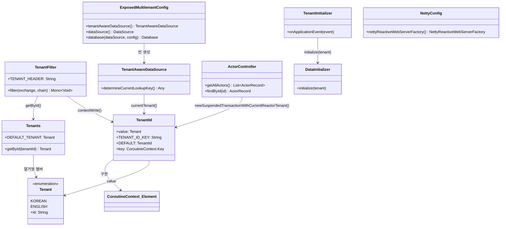
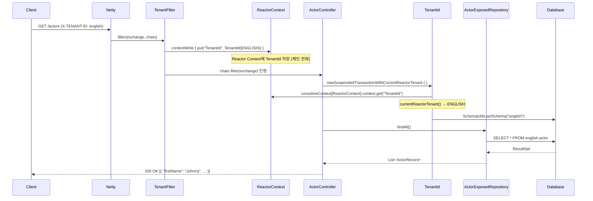

# Exposed + Spring WebFlux + Coroutines + Multi-Tenant (03)

WebFlux + Coroutines 기반의 논블로킹 멀티테넌트 예제입니다. Reactor `Context`를 통해 테넌트 정보를 전파하고, 코루틴 트랜잭션(
`newSuspendedTransactionWithTenant`)과 연계해 스키마를 분리합니다. 이벤트 루프를 차단하지 않으면서 테넌트 격리를 보장하는 방식을 다룹니다.

## 학습 목표

- Reactor `Context`와 Kotlin 코루틴 컨텍스트 브릿지(`ReactorContext`)를 이해한다.
- `TenantId`를 `CoroutineContext.Element`로 구현해 코루틴 체인에 전파하는 방법을 익힌다.
- `newSuspendedTransactionWithTenant`로 테넌트별 스키마 전환을 코루틴 안에서 처리한다.
- 논블로킹 경로에서 격리와 성능을 함께 검증한다.

## 선수 지식

- [`../08-coroutines/README.md`](../08-coroutines/README.md)
- [`../01-multitenant-spring-web/README.md`](../01-multitenant-spring-web/README.md)
- Reactor Context / Kotlin Coroutines 기초

---

## 01/02 모듈과의 핵심 차이

| 항목      | 01 (Spring MVC)          | 02 (Virtual Threads)     | 03 (WebFlux)                           |
|---------|--------------------------|--------------------------|----------------------------------------|
| 서버      | Tomcat (서블릿)             | Tomcat (Virtual Thread)  | Netty (논블로킹)                           |
| 컨텍스트 저장 | `ThreadLocal`            | `ScopedValue`            | Reactor `Context` + `CoroutineContext` |
| 스키마 전환  | AOP `@Before`            | AOP `@Before`            | `newSuspendedTransactionWithTenant`    |
| 트랜잭션    | `@Transactional`         | `@Transactional`         | `newSuspendedTransaction`              |
| 필터 타입   | `jakarta.servlet.Filter` | `jakarta.servlet.Filter` | `WebFilter` (Reactor)                  |

---

## 아키텍처



### 컨텍스트 전파 체계

WebFlux에서는 스레드가 요청에 고정되지 않아 `ThreadLocal`/`ScopedValue`를 사용할 수 없습니다. 대신 Reactor `Context` → `ReactorContext` →
`CoroutineContext` 경로로 테넌트를 전파합니다.

```
HTTP 요청
  └── TenantFilter (WebFilter)
        └── chain.filter(exchange).contextWrite { it.put("TenantId", TenantId(tenant)) }
              └── Reactor Context (비동기 체인 전파)
                    └── coroutineContext[ReactorContext]?.context?.get("TenantId")
                          └── newSuspendedTransactionWithTenant { SchemaUtils.setSchema(...) }
```

---

## 요청 흐름



---

## 핵심 구현

### TenantFilter (WebFilter)

서블릿 `Filter` 대신 Reactor `WebFilter`를 구현합니다. `mono { }` 블록 안에서 헤더를 읽고, `contextWrite`로 Reactor Context에
`TenantId`를 주입합니다. `awaitSingleOrNull()`로 코루틴과 Reactor를 브릿지합니다.

```kotlin
override fun filter(exchange: ServerWebExchange, chain: WebFilterChain): Mono<Void> = mono {
    val tenantId = exchange.request.headers.getFirst(TENANT_HEADER)
    val tenant = Tenants.getById(tenantId ?: Tenants.DEFAULT_TENANT.id)

    chain
        .filter(exchange)
        .contextWrite { it.put(TenantId.TENANT_ID_KEY, TenantId(tenant)) }
        .awaitSingleOrNull()
}
```

### TenantId

`CoroutineContext.Element`를 구현해 코루틴 컨텍스트에서 직접 조회할 수 있는 테넌트 식별자입니다. Reactor Context에서 읽어오는
`currentReactorTenant()`와 코루틴 컨텍스트에서 읽어오는 `currentTenant()` 두 가지 접근 방식을 제공합니다.

```kotlin
data class TenantId(val value: Tenants.Tenant): CoroutineContext.Element {
    companion object Key: CoroutineContext.Key<TenantId> {
        val DEFAULT = TenantId(Tenants.DEFAULT_TENANT)
        const val TENANT_ID_KEY = "TenantId"
    }
    override val key: CoroutineContext.Key<*> = Key
}

// Reactor Context에서 테넌트 읽기
suspend fun currentReactorTenant(): Tenants.Tenant =
    coroutineContext[ReactorContext]?.context?.getOrDefault(TenantId.TENANT_ID_KEY, TenantId.DEFAULT)?.value
        ?: Tenants.DEFAULT_TENANT

// CoroutineContext에서 테넌트 읽기
suspend fun currentTenant(): Tenants.Tenant =
    coroutineContext[TenantId]?.value ?: Tenants.DEFAULT_TENANT
```

### newSuspendedTransactionWithTenant

`newSuspendedTransaction`을 감싸 테넌트 스키마 전환을 자동으로 처리하는 확장 함수입니다.
`Dispatchers.IO + TenantId(currentTenant)`를 코루틴 컨텍스트에 합성해 트랜잭션 내부에서 테넌트 정보를 유지합니다.

```kotlin
suspend fun <T> newSuspendedTransactionWithTenant(
    tenant: Tenant? = null,
    db: Database? = null,
    statement: suspend JdbcTransaction.() -> T,
): T {
    val currentTenant = tenant ?: currentTenant()
    val context = Dispatchers.IO + TenantId(currentTenant)

    return newSuspendedTransaction(context, db) {
        SchemaUtils.setSchema(getSchemaDefinition(currentTenant))
        statement()
    }
}
```

### ActorController

`@Transactional` AOP 대신
`newSuspendedTransactionWithCurrentReactorTenant` 블록으로 트랜잭션을 직접 제어합니다. suspend 함수로 선언해 이벤트 루프를 차단하지 않습니다.

```kotlin
@GetMapping
suspend fun getAllActors(): List<ActorRecord> = newSuspendedTransactionWithCurrentReactorTenant {
    actorRepository.findAll()
}
```

### TenantAwareDataSource

`determineCurrentLookupKey()`에서 `runBlocking { currentTenant() }`로 코루틴 컨텍스트의 테넌트를 조회합니다.
`Database per Tenant` 방식으로 전환할 때 사용하는 선택적 빈입니다.

---

## 주요 구성 요소 요약

| 파일                                   | 역할                                                      |
|--------------------------------------|---------------------------------------------------------|
| `tenant/TenantFilter.kt`             | WebFilter로 헤더 읽기 + Reactor Context에 TenantId 주입         |
| `tenant/TenantId.kt`                 | `CoroutineContext.Element` 구현, Reactor↔Coroutine 브릿지 함수 |
| `tenant/Tenants.kt`                  | 테넌트 열거형 + 스키마 매핑                                        |
| `tenant/SchemaSupport.kt`            | `Schema` 객체 생성 헬퍼                                       |
| `tenant/TenantAwareDataSource.kt`    | 코루틴 컨텍스트 기반 DataSource 라우팅                              |
| `tenant/TenantInitializer.kt`        | 앱 기동 시 스키마/데이터 초기화                                      |
| `tenant/DataInitializer.kt`          | 스키마 생성 + 샘플 데이터 삽입                                      |
| `config/ExposedMultitenantConfig.kt` | DataSource/Database 빈 설정                                |
| `config/NettyConfig.kt`              | Netty 서버 튜닝                                             |
| `controller/ActorController.kt`      | WebFlux 배우 조회 REST API (suspend)                        |

---

## 테스트 방법

```bash
# 모듈 테스트 실행
./gradlew :10-multi-tenant:03-multitenant-spring-webflux:test

# 애플리케이션 기동
./gradlew :10-multi-tenant:03-multitenant-spring-webflux:bootRun
```

### API 실습

```bash
# 한국어 테넌트 배우 목록
curl -H 'X-TENANT-ID: korean' http://localhost:8080/actors

# 영어 테넌트 배우 목록
curl -H 'X-TENANT-ID: english' http://localhost:8080/actors

# 특정 배우 조회
curl -H 'X-TENANT-ID: english' http://localhost:8080/actors/1
```

---

## 실습 체크리스트

- 동일 엔드포인트를 tenant별로 반복 호출해 데이터 격리 확인
- `X-TENANT-ID` 헤더 누락 시 기본 테넌트(`korean`)로 동작하는지 확인
- 컨텍스트 전파 누락 시 재현 테스트를 만들어 회귀 방지
- Netty/DB 풀 튜닝에 따른 처리량 변화 측정

## 운영 체크포인트

- 이벤트 루프 스레드에서 블로킹 코드(`Thread.sleep`, JDBC 직접 호출) 절대 금지
- `contextWrite`가 누락되면 `TenantId.DEFAULT`로 폴백되므로 필터 등록 순서 확인
- 운영 관측 지표(tenant별 QPS, 오류율, latency)를 분리 수집
- 컨텍스트 전달 누락 시 교차 오염이 발생하므로 필터/어댑터 테스트 강화

---

## 다음 챕터

- [`../11-high-performance/README.md`](../../11-high-performance/README.md): 고성능 캐시/라우팅 전략으로 확장

## 참고

- [Multi-tenant App with Spring Webflux and Coroutines](https://debop.notion.site/Multi-tenant-App-with-Spring-Webflux-and-Coroutines-1dc2744526b0802e926de76e268bd2a8)
