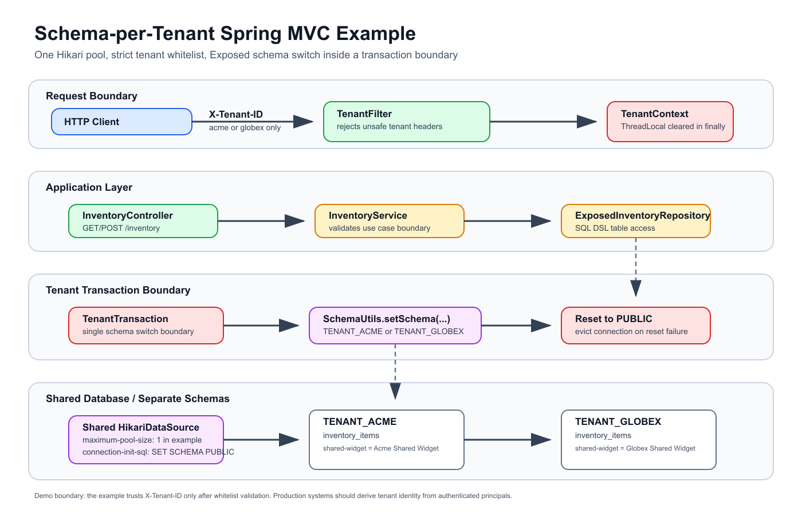
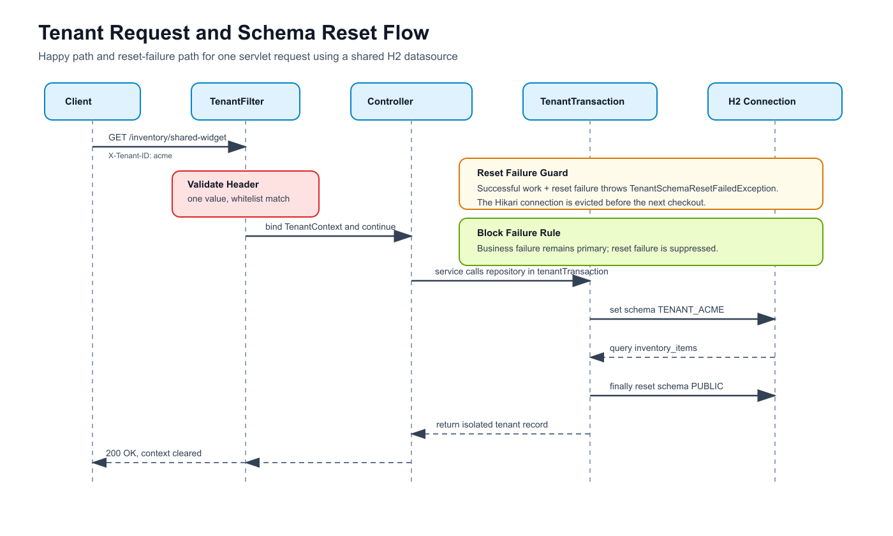

# Schema-per-Tenant Spring Web (04)

[English](./README.md) | 한국어

하나의 공유 데이터베이스 커넥션 풀을 유지하면서 테넌트 데이터를 별도 스키마로 격리하는 Spring MVC 예제입니다. 엄격한 `X-Tenant-ID` 헤더를 허용 목록으로 검증하고, 매핑된 스키마로 Exposed 트랜잭션을 전환한 뒤 커넥션이 풀로 반환되기 전에 `PUBLIC`으로 되돌립니다.

## 학습 목표

- routing datasource 없이 shared database / separate schema 테넌시를 구현한다.
- 스키마 전환을 명시적인 `TenantTransaction` 경계 안에만 둔다.
- 애플리케이션 코드 진입 전에 위험한 테넌트 헤더를 거부한다.
- 테넌트별 쓰기 격리, 커넥션 재사용, 스키마 reset, rollback, reset 실패 시 connection eviction을 검증한다.

## Architecture Diagram



## 요청 및 Reset 흐름



## 테넌트 모델

| 헤더 값   | 스키마           | Seed record |
|--------|---------------|-------------|
| `acme` | `TENANT_ACME` | `shared-widget = Acme Shared Widget` |
| `globex` | `TENANT_GLOBEX` | `shared-widget = Globex Shared Widget` |

`TenantId`는 닫힌 허용 목록입니다. 외부 헤더 값은 SQL identifier로 직접 사용하지 않습니다. 매핑된 스키마 이름은 스키마 생성 전에 `^[A-Z_][A-Z0-9_]{0,63}$` 정규식으로 검증합니다.

## 핵심 구현

### TenantFilter

`TenantFilter`는 servlet `OncePerRequestFilter`입니다. `X-Tenant-ID` 값을 정확히 하나만 허용하고, trim 후 blank, 길이 초과, comma-separated, unknown, path/SQL-like 값을 허용 목록 조회로 거부합니다. 요청 처리가 끝나면 `finally`에서 `TenantContext`를 지웁니다.

### TenantTransaction

`TenantTransaction.execute { }`가 유일한 스키마 전환 경계입니다. Exposed JDBC 트랜잭션을 열고, 테스트용 H2 session을 기록한 뒤 `SchemaUtils.setSchema(tenant.schema)`로 전환합니다. repository block 실행 후에는 `finally`에서 `PUBLIC`으로 reset합니다.

성공한 작업 이후 reset이 실패하면 먼저 rollback을 수행한 뒤 `TenantSchemaResetFailedException`을 던지고 빌린 Hikari connection을 evict합니다. business block이 이미 실패했다면 원래 예외를 primary로 유지하고 reset 실패를 `addSuppressed`로 붙입니다. rollback 또는 eviction 실패도 reset failure의 suppressed exception으로 보존합니다.

### InventoryRepository

repository는 하나의 `inventory_items` 테이블 정의를 사용합니다. 활성 스키마에 따라 쿼리는 `TENANT_ACME.inventory_items` 또는 `TENANT_GLOBEX.inventory_items`에 접근합니다.

## 운영 메모

- 이 예제의 trust boundary는 데모용입니다. 운영 시스템은 원시 클라이언트 헤더가 아니라 인증된 principal에서 tenant를 도출해야 합니다.
- reset 실패 정책은 가용성보다 격리를 우선합니다. reset 실패 시 성공한 작업도 먼저 rollback하고 connection을 evict해 schema leakage를 막습니다.
- 예제 설정은 Hikari `maximum-pool-size: 1`과 `connection-init-sql: SET SCHEMA PUBLIC`을 사용합니다. 테스트는 같은 H2 session을 재사용해도 매 트랜잭션이 안전하게 `PUBLIC`으로 reset됨을 증명합니다.

## 테스트 방법

```bash
./gradlew :04-schema-per-tenant-spring-web:test
```

## API 실습

```bash
./gradlew :04-schema-per-tenant-spring-web:bootRun

curl -H 'X-Tenant-ID: acme' http://localhost:8080/inventory/shared-widget
curl -H 'X-Tenant-ID: globex' http://localhost:8080/inventory/shared-widget

curl -X POST http://localhost:8080/inventory \
  -H 'Content-Type: application/json' \
  -H 'X-Tenant-ID: acme' \
  -d '{"sku":"acme-local","name":"Acme Local Item","quantity":3}'
```

## 테스트 포인트

- tenant header 누락, 중복, unknown, 길이 초과, comma-separated, path-like, SQL-like 값은 `400`을 반환한다.
- `acme`와 `globex`는 같은 SKU에 대해 서로 다른 row를 반환한다.
- 한 테넌트에 삽입한 row는 다른 테넌트에서 보이지 않는다.
- downstream failure 이후 tenant context가 지워진다.
- pool size `1`이어도 모든 트랜잭션이 `PUBLIC`으로 reset되므로 같은 H2 session을 안전하게 재사용한다.
- reset failure는 성공한 작업을 rollback하고 connection을 evict하며, HTTP에서는 `503`을 반환하고, business failure가 있으면 원래 예외를 primary로 유지한다.

## 관련 모듈

- [`01-multitenant-spring-web`](../01-multitenant-spring-web/README.ko.md): ThreadLocal context와 AOP schema switching을 사용하는 Spring MVC 예제.
- [`02-multitenant-spring-web-virtualthread`](../02-multitenant-spring-web-virtualthread/README.ko.md): `ScopedValue`를 사용하는 virtual-thread variant.
- [`03-multitenant-spring-webflux`](../03-multitenant-spring-webflux/README.ko.md): WebFlux + coroutine context propagation 예제.
