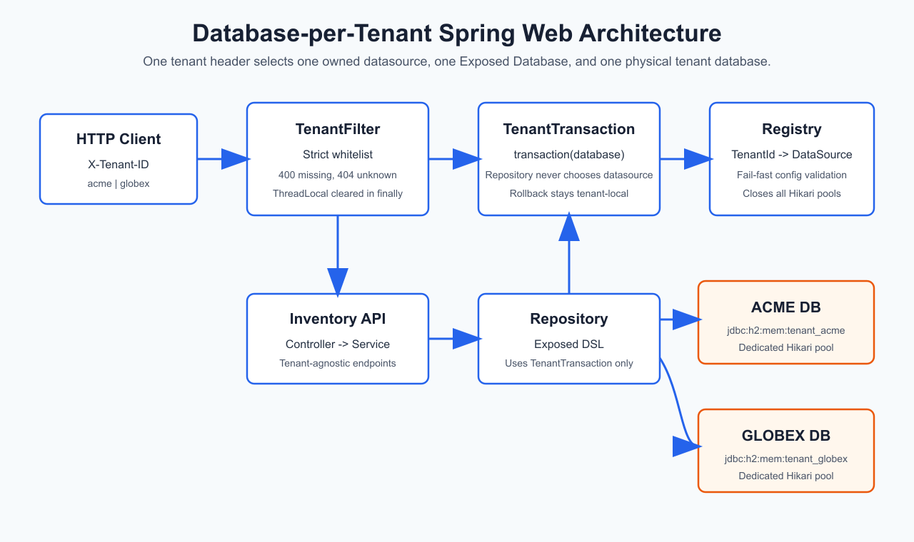
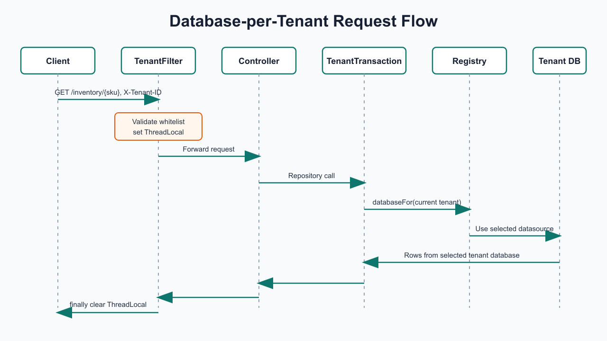

# Database-per-Tenant Spring Web (05)

English | [한국어](./README.ko.md)

This Spring MVC example routes each tenant to a separate datasource and
physical H2 database. It contrasts with the schema-per-tenant example: instead
of switching schemas on one shared connection pool, each accepted tenant owns a
dedicated Hikari pool and Exposed `Database`.

Use this strategy when tenant data must be isolated at backup, restore,
retention, migration, or operational ownership boundaries. Do not use a request
header as the final production trust source; this workshop keeps
`X-Tenant-ID` simple so the datasource routing boundary is visible. Production
systems should bind tenant identity to authenticated claims or server-side
session state.

## Architecture Diagram



## Request Flow



## Strategy

| Concern | Database-per-tenant behavior |
|---|---|
| Tenant resolution | `TenantFilter` reads one `X-Tenant-ID` header and accepts only `acme` or `globex` |
| Fallback | No default datasource; missing tenant returns 400 and unknown tenant returns 404 |
| Routing boundary | `TenantTransaction` resolves the current tenant and calls Exposed `transaction(database)` |
| Isolation | Every tenant has a different H2 JDBC URL and a different Hikari pool |
| Lifecycle | `TenantDatabaseRegistry` owns and closes all tenant datasources |
| Bootstrap | `InventorySeeder` creates `inventory_items` and seeds distinct rows per tenant database |

## Run

```bash
./gradlew :05-database-per-tenant-spring-web:bootRun
```

```bash
curl -H 'X-Tenant-ID: acme' \
  http://localhost:8080/inventory/ACME-ROUTER-001

curl -H 'X-Tenant-ID: globex' \
  http://localhost:8080/inventory/GLOBEX-DRONE-001
```

## Test

```bash
./gradlew :05-database-per-tenant-spring-web:test
```

The tests cover isolated reads and writes, missing and unknown tenants, no
fallback routing, parallel request `ThreadLocal` cleanup, rollback behavior,
per-tenant DDL bootstrap, and datasource close behavior.

## CI Coverage

The module uses H2-only tenant databases and is included in selected examples
CI. It does not need a separate Testcontainers shard.
