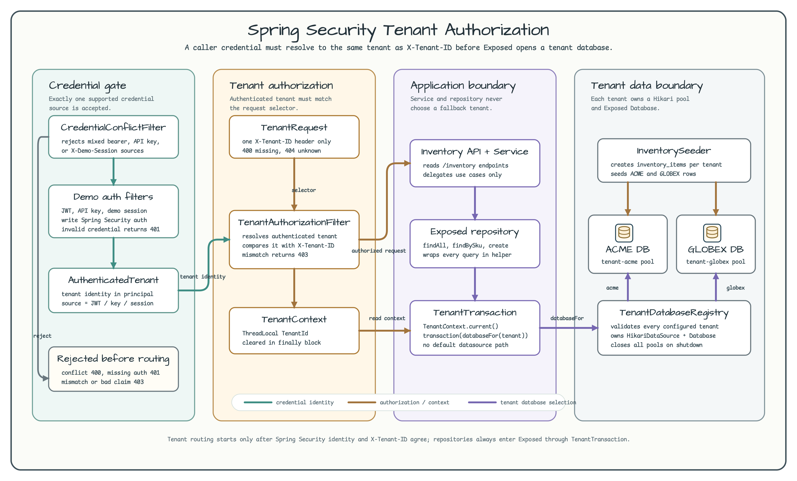
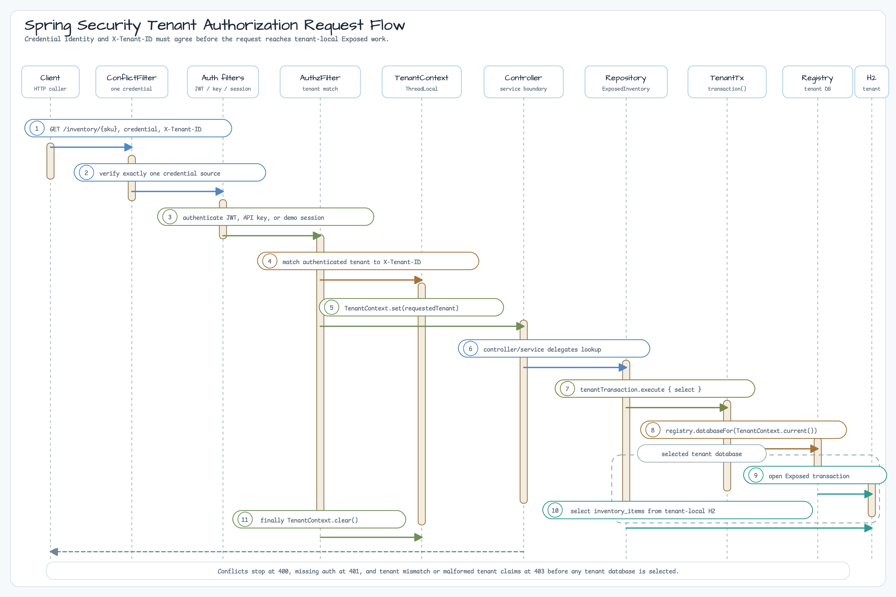

# Spring Security Tenant Authorization Spring Web (06)

[English](./README.md) | 한국어

이 Spring MVC 예제는 Exposed가 tenant database를 선택하기 전에 tenant
routing을 인증된 identity와 연결합니다. database-per-tenant 모듈처럼 각
tenant는 전용 Hikari pool과 Exposed `Database`를 갖지만, `X-Tenant-ID`
header만으로는 더 이상 신뢰하지 않습니다.

> 운영용 아님: `DemoJwtDecoder`, 고정 API key, `X-Demo-Session`은 워크숍
> fixture입니다. 운영 환경에서는 서명된 token, issuer/audience 검증, key
> rotation, 안전한 secret 저장소, 실제 session 관리가 필요합니다.

요청된 tenant가 인증 claim 또는 서버 측 identity와 일치해야 tenant 데이터로
라우팅할 수 있음을 보여줘야 할 때 이 전략을 선택합니다. 여기의 MVC
`ThreadLocal` 전파 방식은 coroutine, WebFlux, virtual-thread 모듈에 그대로
옮길 수 없습니다.

## 의존성

이 모듈은 `2.0.0-SNAPSHOT` 의존성 계열의 공통 `bluetape4k-tenant` carrier를
사용합니다. catalog alias에는 버전을 직접 쓰지 않으며
`bluetape4k-dependencies` BOM이 버전의 기준입니다.

```kotlin
implementation(libs.bluetape4k.tenant)
```

## Architecture Diagram



## Request Flow



## 전략

| 관심사 | 동작 |
|---|---|
| Credential sources | bearer JWT, `X-API-Key`, `X-Demo-Session` 중 하나만 허용 |
| Tenant authorization | 인증된 tenant와 하나의 `X-Tenant-ID` 값이 일치해야 함 |
| Conflict handling | 지원 credential source가 섞이면 `400 CONFLICTING_CREDENTIALS` |
| Missing auth | Spring Security가 `401 Unauthorized` 반환 |
| Missing/invalid tenant selector | `400 MISSING_TENANT`; 알 수 없는 selector는 `404 UNKNOWN_TENANT` |
| Routing boundary | `TenantAuthorizationFilter`가 `TenantContexts`를 통해 공통 `ThreadLocalTenantContext`를 바인딩; repository는 `TenantTransaction` 사용 |
| Fallback | 기본 datasource와 header-only tenant routing 없음 |
| Isolation | tenant마다 서로 다른 H2 JDBC URL과 Hikari pool 사용 |

## Demo Credentials

| Source | Header | Tenant |
|---|---|---|
| JWT | `Authorization: Bearer demo-acme-token` | `acme` |
| JWT | `Authorization: Bearer demo-globex-token` | `globex` |
| API key | `X-API-Key: demo-acme-key` | `acme` |
| API key | `X-API-Key: demo-globex-key` | `globex` |
| Demo session | `X-Demo-Session: acme-session` | `acme` |
| Demo session | `X-Demo-Session: globex-session` | `globex` |

## 실행

```bash
./gradlew :06-spring-security-tenant-authorization-spring-web:bootRun
```

```bash
curl -H 'Authorization: Bearer demo-acme-token' \
  -H 'X-Tenant-ID: acme' \
  http://localhost:8080/inventory/ACME-ROUTER-001

curl -H 'X-API-Key: demo-globex-key' \
  -H 'X-Tenant-ID: globex' \
  http://localhost:8080/inventory/GLOBEX-DRONE-001
```

## Error Contract

| Case | Status |
|---|---|
| credential 누락 또는 오류 | `401 Unauthorized` |
| 지원 credential source 여러 개 사용 | `400 CONFLICTING_CREDENTIALS` |
| JWT/API/session tenant 누락, malformed, unknown | `403 Forbidden` |
| 인증된 tenant와 `X-Tenant-ID` 불일치 | `403 Forbidden` |
| `X-Tenant-ID` 누락, blank, 중복, malformed | `400 MISSING_TENANT` |
| 알 수 없는 `X-Tenant-ID` | `404 UNKNOWN_TENANT` |

## 테스트

```bash
./gradlew :06-spring-security-tenant-authorization-spring-web:test
```

테스트는 JWT, API key, demo session 접근, invalid credentials, tenant mismatch,
claim 누락/오류, credential conflict, tenant selector 오류, cross-tenant 격리,
공통 `ThreadLocalTenantContext` cleanup(소비자 코드의 `set`/`clear` 호출 없음),
rollback, database bootstrap, datasource close, source-text architecture guard를
검증합니다.

## CI Coverage

이 모듈은 H2-only tenant database를 사용하므로 selected examples CI에
포함합니다. 별도 Testcontainers 또는 Nightly shard는 필요하지 않습니다.
