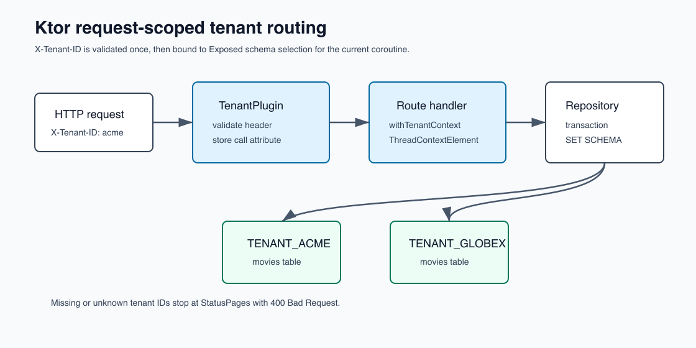

# 07 Multitenant Ktor

[English](./README.md) | 한국어

이 모듈은 Ktor와 Exposed JDBC로 schema-per-tenant 접근을 구현하는 예제입니다. Ktor 플러그인이 `X-Tenant-ID`를 검증하고, route handler가 coroutine `ThreadContextElement`로 tenant를 바인딩하며, repository transaction은 테이블 접근 전에 활성 schema를 전환합니다.

## 아키텍처 다이어그램



## 핵심 흐름

1. `TenantPlugin`이 `X-Tenant-ID`를 읽고 누락되거나 알 수 없는 tenant를 거부합니다.
2. Route는 `withTenantContext`를 호출해 검증된 tenant를 coroutine에 바인딩합니다.
3. `ExposedMovieRepository`는 `TenantContext.currentTenant()`를 읽고 `SET SCHEMA`를 실행합니다.
4. 각 tenant는 자기 schema에 생성된 row만 조회합니다.

## 실행

```bash
./gradlew :07-multitenant-ktor:test
./gradlew :07-multitenant-ktor:run
```

## 요청 예시

```bash
curl -H 'X-Tenant-ID: acme' http://localhost:8080/movies
curl -H 'X-Tenant-ID: globex' http://localhost:8080/movies
```

Spring MVC, WebFlux, Spring transaction 인프라 없이 Ktor 서비스에서 명시적인 request-level tenant resolution이 필요할 때 이 예제를 사용합니다.
