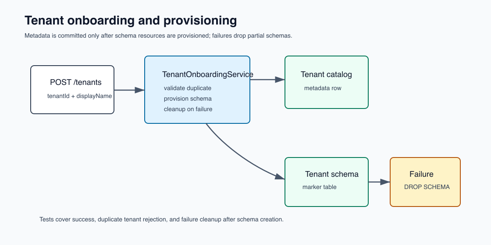

# 08 Tenant Onboarding Spring Web

[English](./README.md) | 한국어

이 모듈은 schema-per-tenant application에서 tenant onboarding과 provisioning을 구현하는 예제입니다. Service는 tenant metadata를 저장하고, tenant schema를 생성하며, marker table을 provisioning하고, duplicate tenant를 거부하며, provisioning 실패 시 부분 생성된 schema resource를 삭제합니다.

## 아키텍처 다이어그램



## Workflow

1. `tenantId`를 검증하고 정규화합니다.
2. Tenant catalog에서 중복 여부를 확인합니다.
3. Tenant schema와 marker table을 생성합니다.
4. Provisioning 성공 후에만 tenant catalog record를 저장합니다.
5. Catalog 저장 전 provisioning이 실패하면 tenant schema를 삭제합니다.

## 검증

```bash
./gradlew :08-tenant-onboarding-spring-web:test
```

Tenant 생성이 관찰 가능하고 감사 가능해야 하며, partial provisioning failure 후 복구 가능해야 할 때 이 패턴을 사용합니다.
