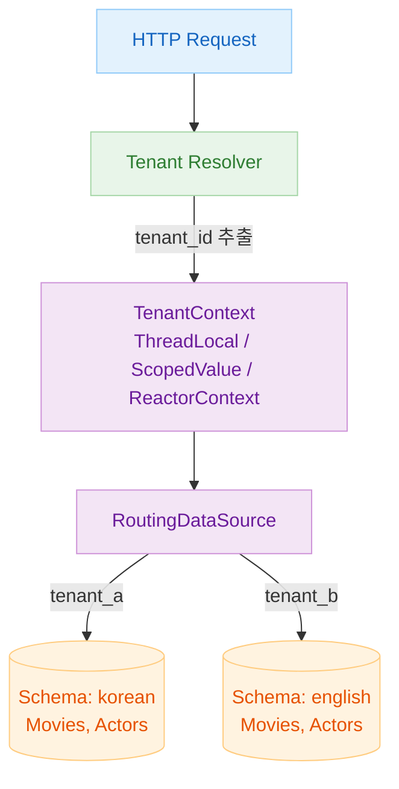
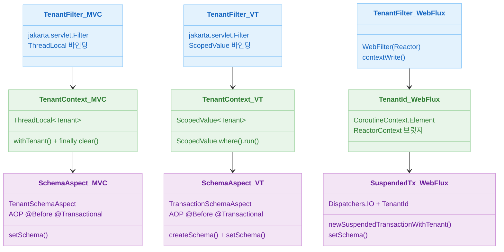
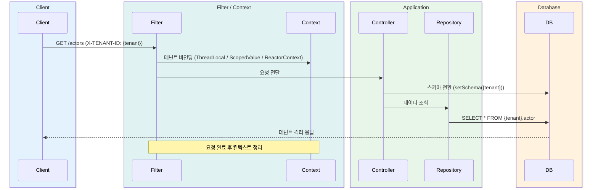

# 10 Multi-Tenant (실전)

[English](./README.md) | 한국어

실전 멀티테넌트 아키텍처를 Exposed + Spring으로 구현하며 Schema 기반 테넌트 분리, 동적 라우팅, 컨텍스트 전파 흐름을 학습하는 챕터입니다. Spring MVC, Virtual Thread, WebFlux 세 가지 환경에서 동일한 멀티테넌시 요구사항을 각각 어떻게 구현하는지 비교합니다.

## 챕터 목표

- 테넌트 식별/전파/격리 전체 흐름을 이해한다.
- Spring MVC, Virtual Thread, WebFlux 환경별 구현 차이를 비교한다.
- 운영 시 누수/격리 실패를 막는 검증 포인트를 확보한다.

## 선수 지식

- `09-spring` 내용
- 트랜잭션 및 DataSource 라우팅 기본 개념

---

## 멀티테넌시 전략 개요

이 챕터는 **Shared Database / Separate Schema** 전략을 기본으로 사용합니다. 하나의 DB 인스턴스에 테넌트별 스키마(`korean`, `english`)를 분리해 데이터를 격리합니다.

```
Single DB Instance
├── Schema: korean
│   ├── actor
│   ├── movie
│   └── actor_in_movie
└── Schema: english
    ├── actor
    ├── movie
    └── actor_in_movie
```

`TenantAwareDataSource`(`AbstractRoutingDataSource` 상속)를 제공해 **Database per Tenant** 방식으로도 전환할 수 있습니다.

### 테넌트별 스키마 분리 아키텍처



---

## 포함 모듈

| 모듈                                        | 설명                              | 컨텍스트 전파           |
|-------------------------------------------|---------------------------------|-------------------|
| `01-multitenant-spring-web`               | Spring MVC 기반 멀티테넌트             | `ThreadLocal`     |
| `02-multitenant-spring-web-virtualthread` | Java 21 Virtual Thread 기반 멀티테넌트 | `ScopedValue`     |
| `03-multitenant-spring-webflux`           | WebFlux + Coroutines 기반 멀티테넌트   | Reactor `Context` |

---

## 모듈 간 구현 비교



### 환경별 핵심 차이 요약

| 항목      |  01 Spring MVC   |     02 Virtual Threads     |             03 WebFlux              |
|---------|:----------------:|:--------------------------:|:-----------------------------------:|
| 서버      |      Tomcat      |        Tomcat + VT         |                Netty                |
| 스레드 모델  |     OS 스레드 풀     | Virtual Thread per request |               이벤트 루프                |
| 컨텍스트    |  `ThreadLocal`   |       `ScopedValue`        |          Reactor `Context`          |
| 스키마 전환  |  AOP `@Before`   |       AOP `@Before`        |    `newSuspendedTransaction` 내부     |
| 트랜잭션 선언 | `@Transactional` |      `@Transactional`      | `newSuspendedTransactionWithTenant` |
| 블로킹 허용  |        허용        |             허용             |          금지 (이벤트 루프 차단 불가)          |

---

## 공통 요청 흐름

모든 모듈은 다음 흐름을 따릅니다. 컨텍스트 전파 방식만 환경에 따라 달라집니다.



---

## 권장 학습 순서

1. [`01-multitenant-spring-web`](01-multitenant-spring-web/README.md) — ThreadLocal + AOP 기초 구조 파악
2. [
   `02-multitenant-spring-web-virtualthread`](02-multitenant-spring-web-virtualthread/README.md) — ScopedValue로 전환, Virtual Thread 설정 비교
3. [`03-multitenant-spring-webflux`](03-multitenant-spring-webflux/README.md) — Reactor Context + 코루틴 브릿지 패턴 이해

---

## 실행 방법

```bash
# 개별 모듈 테스트
./gradlew :10-multi-tenant:01-multitenant-spring-web:test
./gradlew :10-multi-tenant:02-multitenant-spring-web-virtualthread:test
./gradlew :10-multi-tenant:03-multitenant-spring-webflux:test

# 전체 챕터 빌드
./gradlew :10-multi-tenant:build
```

---

## 테스트 포인트

- `X-TENANT-ID` 누락/오입력 시 실패 동작을 검증한다.
- 테넌트 A 요청에서 테넌트 B 데이터가 노출되지 않는지 확인한다.
- 동시 요청 환경에서 컨텍스트 누수 여부를 검증한다.

## 성능·안정성 체크포인트

- 스키마 전환 비용과 커넥션 재사용 정책을 점검한다.
- ThreadLocal/Reactor Context 사용 시 컨텍스트 전파 누락을 방지한다.
- 운영 로그에 tenant 정보가 누락되지 않도록 추적성을 확보한다.

---

## 복잡한 시나리오

### 스키마 기반 테넌트 격리 + ThreadLocal 컨텍스트 전파 (Spring MVC)

`TenantFilter`가 `X-TENANT-ID` 헤더에서 테넌트를 추출해 `TenantContext`(ThreadLocal)에 저장하면, `TenantSchemaAspect`가
`@Transactional` 진입 전 `SchemaUtils.setSchema()`로 해당 스키마로 전환합니다.

- 관련 모듈: [`01-multitenant-spring-web`](01-multitenant-spring-web/)

### Virtual Thread 환경의 테넌트 컨텍스트 전파

Virtual Thread는 `ThreadLocal` 대신 `ScopedValue`로 컨텍스트를 전파합니다. `02-multitenant-spring-web-virtualthread`는
`TomcatVirtualThreadConfig`로 executor를 교체하고 `ScopedValue.where().run { }` 블록으로 테넌트를 바인딩합니다.

- 관련 모듈: [`02-multitenant-spring-web-virtualthread`](02-multitenant-spring-web-virtualthread/)

### WebFlux + Coroutines 환경의 Reactor Context 전파

WebFlux에서는 Reactor `Context`를 통해 코루틴 컨텍스트에 테넌트 정보를 전파합니다. `TenantId`가 `CoroutineContext.Element`를 구현해
`newSuspendedTransactionWithTenant` 내부에서 스키마를 전환합니다.

- 관련 모듈: [`03-multitenant-spring-webflux`](03-multitenant-spring-webflux/)

---

## 다음 챕터

- [11-high-performance](../11-high-performance/README.md): 고성능 캐시/라우팅 전략으로 확장합니다.
