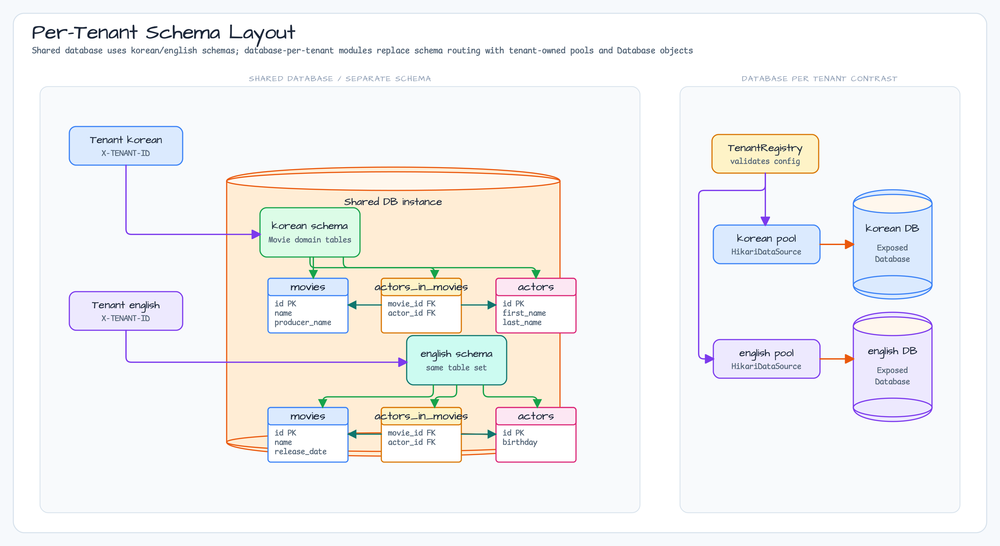
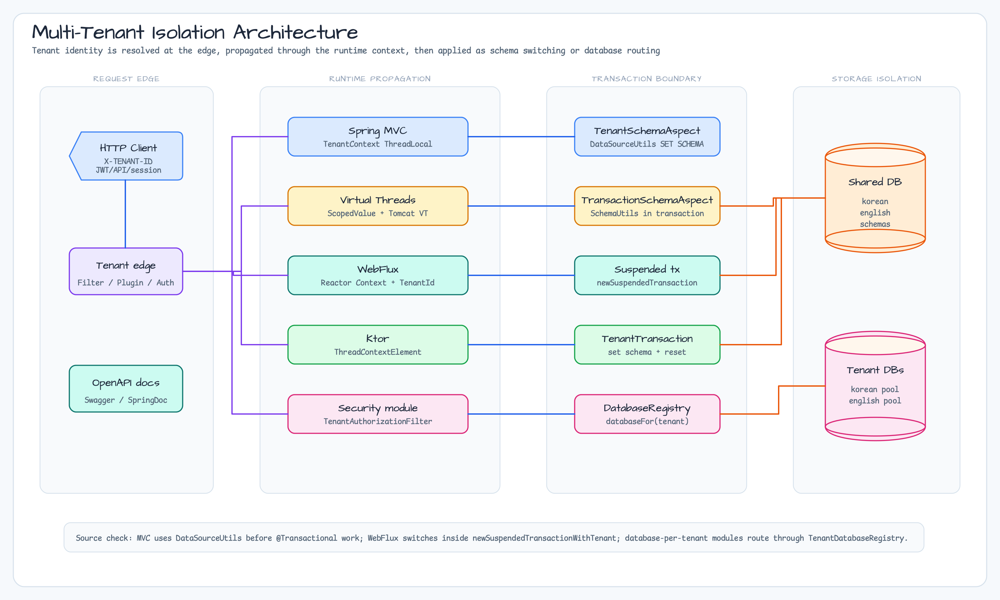
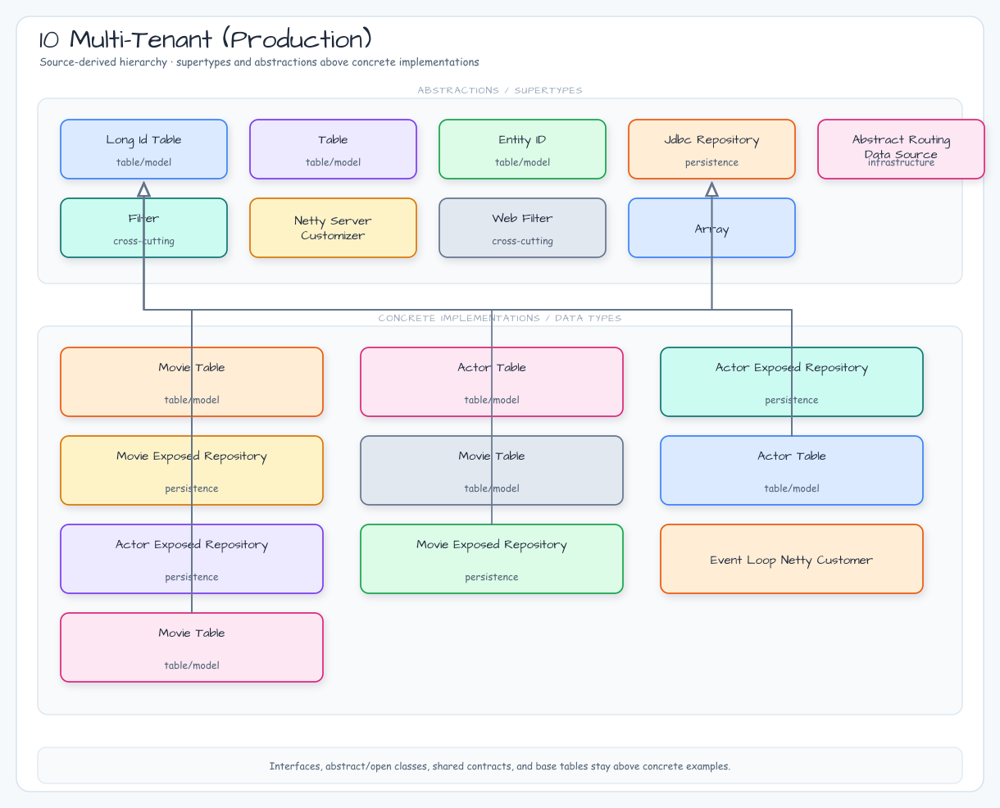
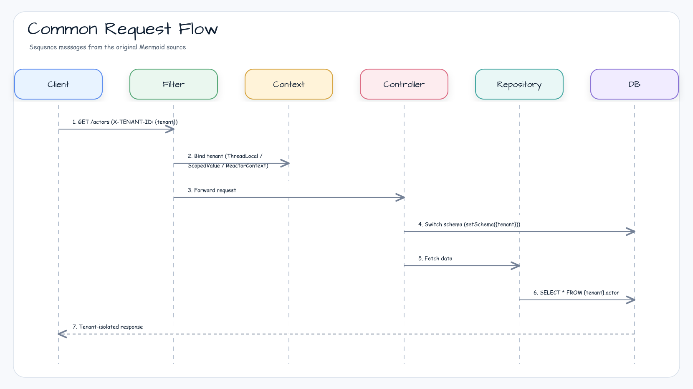

# 10 Multi-Tenant (실전)

[English](./README.md) | 한국어

이 챕터는 소스 트리에 있는 멀티테넌트 구현을 따라갑니다. Spring MVC schema routing, Tomcat Virtual Thread tenant propagation, WebFlux/Reactor context bridge, 명시적 schema-per-tenant/database-per-tenant transaction helper, Spring Security tenant authorization, Ktor 변형, tenant onboarding을 순서대로 다룹니다. 핵심은 tenant identity를 어디서 받아들이고, 어떻게 전파하며, 어느 지점에서 database isolation을 강제하는지 확인하는 것입니다.

## 챕터 목표

- 테넌트 식별/전파/격리 전체 흐름을 이해한다.
- Spring MVC, Virtual Thread, WebFlux 환경별 구현 차이를 비교한다.
- 운영 시 누수/격리 실패를 막는 검증 포인트를 확보한다.

## 선수 지식

- `09-spring` 내용
- 트랜잭션 및 DataSource 라우팅 기본 개념

---

## 멀티테넌시 전략 개요

이 챕터는 **Shared Database / Separate Schema** 전략에서 시작합니다. 하나의 DB 인스턴스에 테넌트별 스키마(`korean`, `english`)를 분리해 데이터를 격리합니다.



이후 각 허용 tenant가 전용 Hikari pool과 Exposed `Database`를 소유하는 **Database per Tenant** 전략과 비교합니다.

### 테넌트별 스키마 분리 아키텍처



---

## 포함 모듈

| 모듈                                        | 설명                              | 컨텍스트 전파           |
|-------------------------------------------|---------------------------------|-------------------|
| `01-multitenant-spring-web`               | Spring MVC 기반 멀티테넌트             | `ThreadLocal`     |
| `02-multitenant-spring-web-virtualthread` | Java 25 Virtual Thread 기반 멀티테넌트 | `ScopedValue`     |
| `03-multitenant-spring-webflux`           | WebFlux + Coroutines 기반 멀티테넌트   | Reactor `Context` |
| `04-schema-per-tenant-spring-web`         | 하나의 Hikari pool을 쓰는 schema-per-tenant 예제 | `ThreadLocal`     |
| `05-database-per-tenant-spring-web`       | tenant별 전용 Hikari pool을 쓰는 database-per-tenant 예제 | `ThreadLocal`     |
| `06-spring-security-tenant-authorization-spring-web` | database routing 전 Spring Security로 tenant authorization 수행 | `ThreadLocal` |
| `07-multitenant-ktor`                     | Ktor request plugin 기반 멀티테넌트 예제 | Coroutine `ThreadContextElement` |
| `08-tenant-onboarding-spring-web`         | Tenant catalog 저장과 schema provisioning 예제 | Service transaction |

`02`와 `06`은 공통 `TenantContext` 작업의 기존 reference consumer입니다.
자세한 전환은
[#255](https://github.com/bluetape4k/exposed-workshop/issues/255)에서 추적합니다.
기본 좌표 `io.github.bluetape4k:bluetape4k-dependencies:2.0.0-SNAPSHOT`의
metadata/POM은 공개되어 있지만, 공개 BOM에는 아직 tenant/context artifact나
versionless catalog alias가 없습니다. exact artifact POM/API가 공개될
때까지는 각 예제의 local context 구현을 유지하며, 이 migration에서는 새로운
모듈을 추가하지 않습니다.

---

## 모듈 간 구현 비교



### 환경별 핵심 차이 요약

| 항목      |  01 Spring MVC   |     02 Virtual Threads     |             03 WebFlux              |              04 Schema-per-Tenant              |          05 Database-per-Tenant           |       06 Spring Security Tenant Auth       |
|---------|:----------------:|:--------------------------:|:-----------------------------------:|:----------------------------------------------:|:-----------------------------------------:|:------------------------------------------:|
| 서버      |      Tomcat      |        Tomcat + VT         |                Netty                |                     Tomcat                     |                  Tomcat                   |                   Tomcat                   |
| 스레드 모델  |     OS 스레드 풀     | Virtual Thread per request |               이벤트 루프                |                   OS 스레드 풀                    |               OS 스레드 풀                |                OS 스레드 풀                |
| 컨텍스트    |  `ThreadLocal`   |       `ScopedValue`        |          Reactor `Context`          |                 `ThreadLocal`                  |               `ThreadLocal`               |                `ThreadLocal`               |
| 스키마 전환  |  AOP `@Before`   |       AOP `@Before`        |    `newSuspendedTransaction` 내부     |            `TenantTransaction` 내부              |                    없음                    |                    없음                    |
| 트랜잭션 선언 | `@Transactional` |      `@Transactional`      | `newSuspendedTransactionWithTenant` |       명시적 `tenantTransaction.execute { }`       |    명시적 `tenantTransaction.execute { }`    | 명시적 `tenantTransaction.execute { }` |
| 격리 가드   |      Schema      |           Schema           |                Schema               |    Header whitelist + reset 실패 시 eviction     | Header whitelist + 기본 datasource 없음 | 인증된 tenant match + 기본 datasource 없음 |
| 블로킹 허용  |        허용        |             허용             |          금지 (이벤트 루프 차단 불가)          |                       허용                       |                    허용                    |                    허용                    |

### Ktor 및 onboarding 확장

| 모듈 | 런타임 경계 | 격리 / 트랜잭션 초점 |
|---|---|---|
| `07-multitenant-ktor` | Ktor request plugin + coroutine `ThreadContextElement` | `X-Tenant-ID`를 검증하고 tenant를 바인딩한 뒤 JDBC repository transaction에서 schema를 전환합니다. |
| `08-tenant-onboarding-spring-web` | Spring service transaction | Schema provisioning 성공 후 tenant catalog을 저장하고, 실패하면 부분 리소스를 제거합니다. |

---

## 공통 요청 흐름

모든 모듈은 다음 흐름을 따릅니다. 컨텍스트 전파 방식만 환경에 따라 달라집니다.



---

## 권장 학습 순서

1. [`01-multitenant-spring-web`](01-multitenant-spring-web/README.ko.md) — ThreadLocal + AOP 기초 구조 파악
2. [`02-multitenant-spring-web-virtualthread`](02-multitenant-spring-web-virtualthread/README.ko.md) — ScopedValue로 전환, Virtual Thread 설정 비교
3. [`03-multitenant-spring-webflux`](03-multitenant-spring-webflux/README.ko.md) — Reactor Context + 코루틴 브릿지 패턴 이해
4. [`04-schema-per-tenant-spring-web`](04-schema-per-tenant-spring-web/README.ko.md) — 하나의 shared pool에서 명시적 schema switch, reset, connection eviction을 실습
5. [`05-database-per-tenant-spring-web`](05-database-per-tenant-spring-web/README.ko.md) — tenant마다 전용 datasource를 선택하고 fallback database가 없도록 구성
6. [`06-spring-security-tenant-authorization-spring-web`](06-spring-security-tenant-authorization-spring-web/README.ko.md) — 인증된 identity와 tenant routing을 연결한 뒤 database를 선택
7. [`07-multitenant-ktor`](07-multitenant-ktor/README.ko.md) — Ktor request plugin으로 검증된 tenant context를 전파
8. [`08-tenant-onboarding-spring-web`](08-tenant-onboarding-spring-web/README.ko.md) — Tenant metadata를 저장하고 cleanup 가능한 tenant schema를 provisioning

---

## 실행 방법

```bash
# 개별 모듈 테스트
./gradlew :01-multitenant-spring-web:test
./gradlew :02-multitenant-spring-web-virtualthread:test
./gradlew :03-multitenant-spring-webflux:test
./gradlew :04-schema-per-tenant-spring-web:test
./gradlew :05-database-per-tenant-spring-web:test
./gradlew :06-spring-security-tenant-authorization-spring-web:test
./gradlew :07-multitenant-ktor:test
./gradlew :08-tenant-onboarding-spring-web:test

# 전체 챕터 빌드
./gradlew :01-multitenant-spring-web:build :02-multitenant-spring-web-virtualthread:build :03-multitenant-spring-webflux:build :04-schema-per-tenant-spring-web:build :05-database-per-tenant-spring-web:build :06-spring-security-tenant-authorization-spring-web:build :07-multitenant-ktor:build :08-tenant-onboarding-spring-web:build --no-parallel
```

---

## 테스트 포인트

- `X-TENANT-ID` 누락/오입력 시 실패 동작을 검증한다.
- 테넌트 A 요청에서 테넌트 B 데이터가 노출되지 않는지 확인한다.
- 동시 요청 환경에서 컨텍스트 누수 여부를 검증한다.
- Tenant onboarding이 duplicate를 거부하고 실패 후 부분 provisioning schema를 제거하는지 확인한다.
- H2-only onboarding test는 일반 CI에 두고, container-heavy tenant module은 nightly coverage에 유지한다.

## 성능·안정성 체크포인트

- 스키마 전환 비용과 커넥션 재사용 정책을 점검한다.
- ThreadLocal/Reactor Context 사용 시 컨텍스트 전파 누락을 방지한다.
- 운영 로그에 tenant 정보가 누락되지 않도록 추적성을 확보한다.

---

## 복잡한 시나리오

### 스키마 기반 테넌트 격리 + ThreadLocal 컨텍스트 전파 (Spring MVC)

`TenantFilter`가 `X-TENANT-ID` 헤더에서 테넌트를 추출해 `TenantContext`(ThreadLocal)에 저장하면, `TenantSchemaAspect`가
`@Transactional` 진입 전 `SchemaUtils.setSchema()`로 해당 스키마로 전환합니다.

- 관련 모듈: [`01-multitenant-spring-web`](01-multitenant-spring-web/)

### Virtual Thread 환경의 테넌트 컨텍스트 전파

Virtual Thread는 `ThreadLocal` 대신 `ScopedValue`로 컨텍스트를 전파합니다. `02-multitenant-spring-web-virtualthread`는
`TomcatVirtualThreadConfig`로 executor를 교체하고 `ScopedValue.where().run { }` 블록으로 테넌트를 바인딩합니다.

- 관련 모듈: [`02-multitenant-spring-web-virtualthread`](02-multitenant-spring-web-virtualthread/)

### WebFlux + Coroutines 환경의 Reactor Context 전파

WebFlux에서는 Reactor `Context`를 통해 코루틴 컨텍스트에 테넌트 정보를 전파합니다. `TenantId`가 `CoroutineContext.Element`를 구현해
`newSuspendedTransactionWithTenant` 내부에서 스키마를 전환합니다.

- 관련 모듈: [`03-multitenant-spring-webflux`](03-multitenant-spring-webflux/)

### 하나의 Shared Pool에서 명시적 Schema Reset

`04-schema-per-tenant-spring-web`은 하나의 Hikari pool을 유지하고 `TenantTransaction` 내부에서만 스키마를 전환합니다. `X-Tenant-ID`는 닫힌 허용 목록으로 검증하고, 매 트랜잭션 후 `PUBLIC`으로 reset하며, reset 실패 시 connection을 evict해 tenant schema leakage를 막습니다.

- 관련 모듈: [`04-schema-per-tenant-spring-web`](04-schema-per-tenant-spring-web/)

### Tenant별 전용 Database 라우팅

`05-database-per-tenant-spring-web`은 허용된 tenant마다 하나의 Hikari pool과 Exposed `Database`를 생성합니다. `TenantTransaction`은 현재 `TenantContext`에서 database를 선택하므로 tenant가 없거나 알 수 없는 경우 기본 datasource로 fallback하지 않습니다.

- 관련 모듈: [`05-database-per-tenant-spring-web`](05-database-per-tenant-spring-web/)

### Spring Security Tenant Authorization

`06-spring-security-tenant-authorization-spring-web`은 demo JWT, API key,
demo session header로 caller를 인증하고, 요청된 `X-Tenant-ID`를 인가한 뒤에만
`TenantContext`를 설정합니다. database-per-tenant routing 경계는 유지하되
request path에서 raw header-only tenant trust를 제거합니다.

- 관련 모듈: [`06-spring-security-tenant-authorization-spring-web`](06-spring-security-tenant-authorization-spring-web/)

### Ktor tenant context

`07-multitenant-ktor`는 Ktor plugin에서 `X-Tenant-ID`를 검증하고 coroutine
`ThreadContextElement`로 값을 바인딩한 뒤 repository transaction에서 Exposed
schema를 전환합니다.

- 관련 모듈: [`07-multitenant-ktor`](07-multitenant-ktor/)

### Tenant onboarding과 provisioning

`08-tenant-onboarding-spring-web`은 schema와 marker table provisioning이
성공한 뒤에만 tenant catalog을 기록하고, catalog 저장 전에 실패하면 schema를
제거합니다.

- 관련 모듈: [`08-tenant-onboarding-spring-web`](08-tenant-onboarding-spring-web/)

---

## 다음 챕터

- [11-high-performance](../11-high-performance/README.md): 고성능 캐시/라우팅 전략으로 확장합니다.
