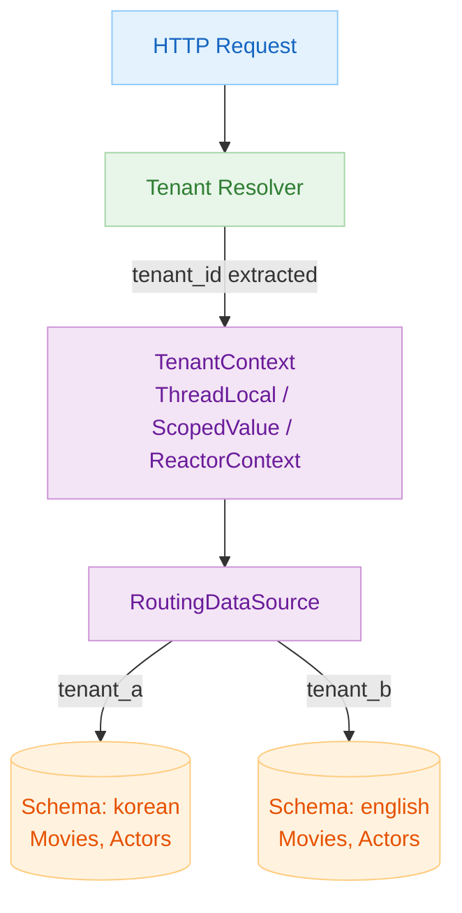
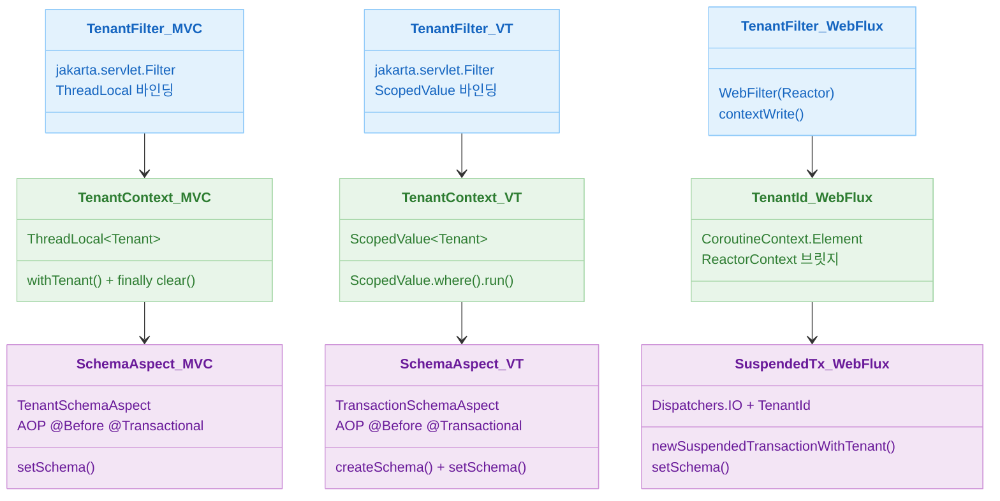
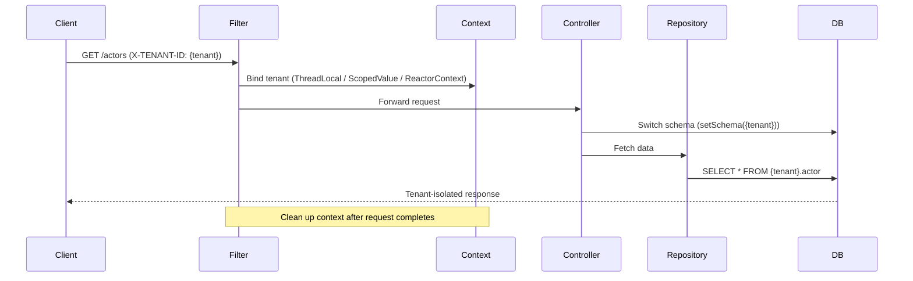

# 10 Multi-Tenant (Production)

English | [한국어](./README.ko.md)

A chapter for implementing production-grade multi-tenant architecture with Exposed + Spring, covering schema-based tenant isolation, dynamic routing, and context propagation flows. Compares how the same multi-tenancy requirements are implemented across three environments: Spring MVC, Virtual Thread, and WebFlux.

## Chapter Goals

- Understand the full flow of tenant identification, propagation, and isolation.
- Compare implementation differences across Spring MVC, Virtual Thread, and WebFlux environments.
- Establish validation points to prevent leakage and isolation failures in production.

## Prerequisites

- Contents of `09-spring`
- Basic concepts of transactions and DataSource routing

---

## Multi-Tenancy Strategy Overview

This chapter uses the **Shared Database / Separate Schema** strategy as its foundation. Data is isolated by separating per-tenant schemas (`korean`, `english`) within a single DB instance.

```
Single DB Instance
├── Schema: korean
│   ├── actor
│   ├── movie
│   └── actor_in_movie
└── Schema: english
    ├── actor
    ├── movie
    └── actor_in_movie
```

A `TenantAwareDataSource` (extending `AbstractRoutingDataSource`) is provided so you can also switch to a **Database per Tenant** approach.

### Per-Tenant Schema Isolation Architecture



---

## Included Modules

| Module                                    | Description                                        | Context Propagation   |
|-------------------------------------------|----------------------------------------------------|----------------------|
| `01-multitenant-spring-web`               | Multi-tenant with Spring MVC                       | `ThreadLocal`         |
| `02-multitenant-spring-web-virtualthread` | Multi-tenant with Java 21 Virtual Threads          | `ScopedValue`         |
| `03-multitenant-spring-webflux`           | Multi-tenant with WebFlux + Coroutines             | Reactor `Context`     |

---

## Module Implementation Comparison



### Key Differences by Environment

| Item             |  01 Spring MVC   |     02 Virtual Threads     |             03 WebFlux              |
|----------------|:----------------:|:--------------------------:|:-----------------------------------:|
| Server          |      Tomcat      |        Tomcat + VT         |                Netty                |
| Thread Model    |  OS thread pool  | Virtual Thread per request |             Event loop              |
| Context         |  `ThreadLocal`   |       `ScopedValue`        |          Reactor `Context`          |
| Schema Switch   |  AOP `@Before`   |       AOP `@Before`        |    Inside `newSuspendedTransaction` |
| Transaction Decl| `@Transactional` |      `@Transactional`      | `newSuspendedTransactionWithTenant` |
| Blocking Allowed|       Yes        |            Yes             |     No (event loop must not block)  |

---

## Common Request Flow

All modules follow the flow below. Only the context propagation mechanism differs by environment.



---

## Recommended Learning Order

1. [`01-multitenant-spring-web`](01-multitenant-spring-web/README.md) — Understand basic structure with ThreadLocal + AOP
2. [`02-multitenant-spring-web-virtualthread`](02-multitenant-spring-web-virtualthread/README.md) — Switch to ScopedValue, compare Virtual Thread configuration
3. [`03-multitenant-spring-webflux`](03-multitenant-spring-webflux/README.md) — Understand Reactor Context + coroutine bridge pattern

---

## How to Run

```bash
# Individual module tests
./gradlew :10-multi-tenant:01-multitenant-spring-web:test
./gradlew :10-multi-tenant:02-multitenant-spring-web-virtualthread:test
./gradlew :10-multi-tenant:03-multitenant-spring-webflux:test

# Full chapter build
./gradlew :10-multi-tenant:build
```

---

## Test Points

- Verify failure behavior when `X-TENANT-ID` is missing or invalid.
- Confirm that tenant B data is not exposed in tenant A requests.
- Verify no context leakage under concurrent request load.

## Performance & Stability Checkpoints

- Review schema switch cost and connection reuse policy.
- Prevent context propagation gaps when using ThreadLocal/Reactor Context.
- Ensure tenant information is not omitted from production logs for traceability.

---

## Complex Scenarios

### Schema-Based Tenant Isolation + ThreadLocal Context Propagation (Spring MVC)

`TenantFilter` extracts the tenant from the `X-TENANT-ID` header and stores it in `TenantContext` (ThreadLocal). Then `TenantSchemaAspect` switches to the corresponding schema via `SchemaUtils.setSchema()` before `@Transactional` entry.

- Related module: [`01-multitenant-spring-web`](01-multitenant-spring-web/)

### Tenant Context Propagation in Virtual Thread Environments

Virtual Threads use `ScopedValue` instead of `ThreadLocal` for context propagation. `02-multitenant-spring-web-virtualthread` replaces the executor with `TomcatVirtualThreadConfig` and binds the tenant using a `ScopedValue.where().run { }` block.

- Related module: [`02-multitenant-spring-web-virtualthread`](02-multitenant-spring-web-virtualthread/)

### Reactor Context Propagation in WebFlux + Coroutines

In WebFlux, tenant information is propagated to the coroutine context via Reactor `Context`. `TenantId` implements `CoroutineContext.Element` to switch the schema inside `newSuspendedTransactionWithTenant`.

- Related module: [`03-multitenant-spring-webflux`](03-multitenant-spring-webflux/)

---

## Next Chapter

- [11-high-performance](../11-high-performance/README.md): Extend to high-performance cache/routing strategies.
