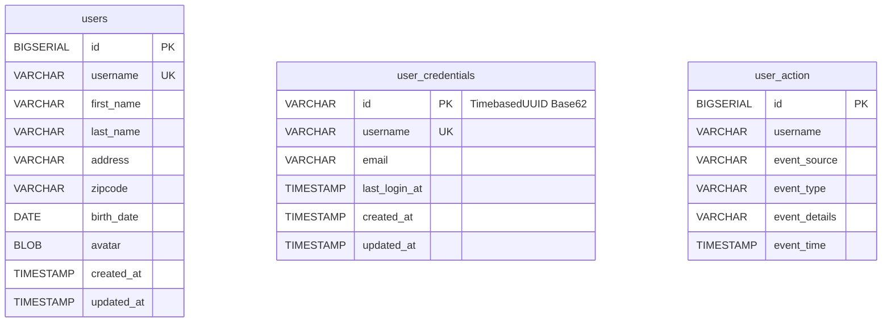
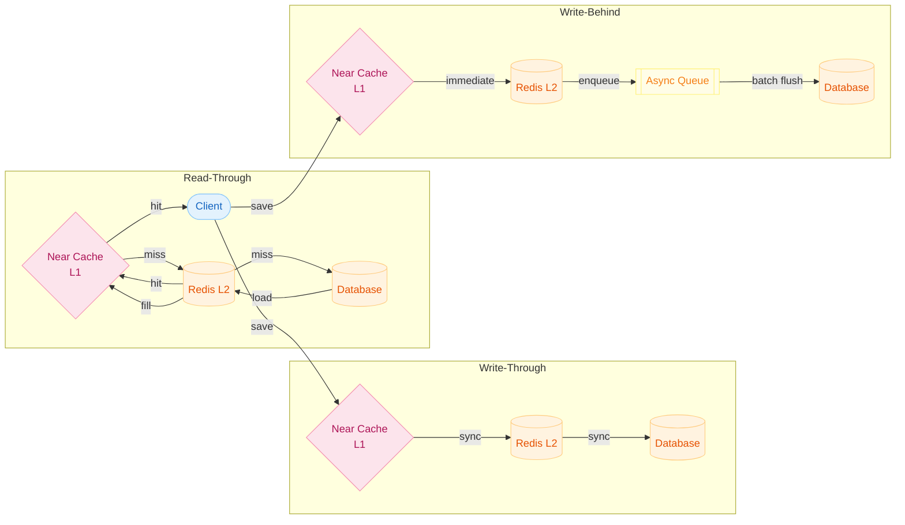
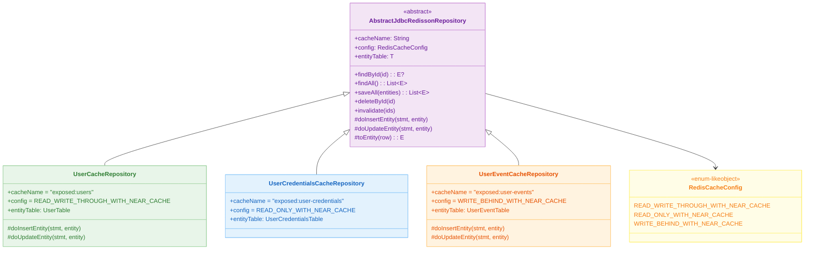
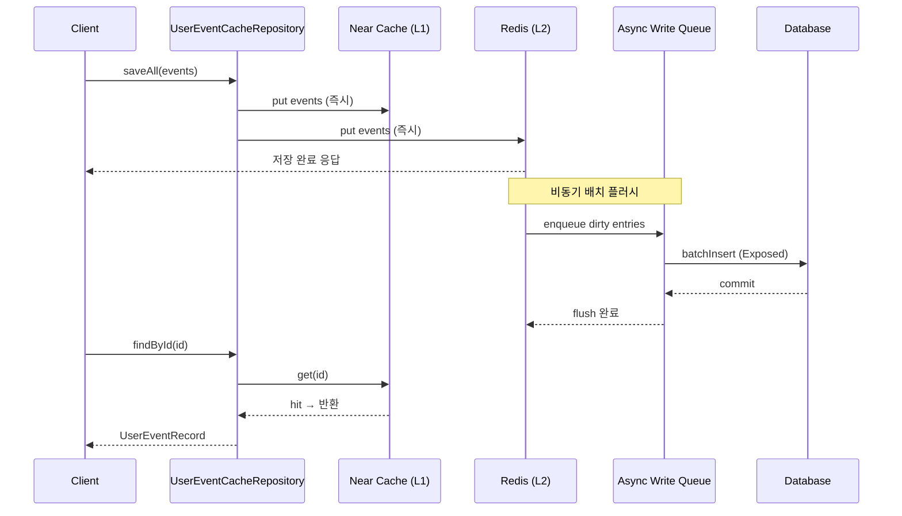
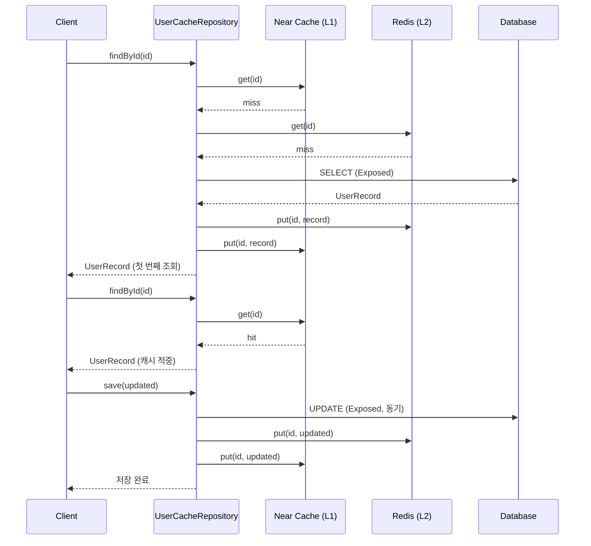

# 캐시 전략 (01-cache-strategies)

[English](./README.md) | 한국어

Spring MVC + Virtual Threads 환경에서 Redisson + Exposed로 캐시 전략을 실습하는 모듈입니다. Read Through, Write Through, Write Behind 전략의 일관성/성능 트레이드오프를 비교합니다.

## 학습 목표

- 캐시 전략별 동작과 트레이드오프를 구분한다.
- Redis + DB 동기화 시점에 따른 일관성 모델을 이해한다.
- 운영에서 필요한 무효화/복구 시나리오를 검증한다.

## 선수 지식

- [`../09-spring/README.md`](../09-spring/README.md)

---

## 개요

`AbstractJdbcRedissonRepository`를 상속하면 세 가지 캐시 전략을 설정값 하나로 선택할 수 있습니다. Redisson의 Near Cache가 L1(로컬 메모리), Redis가 L2(분산 캐시), Exposed가 DB 접근 계층 역할을 맡습니다. Tomcat은 Virtual Thread 기반 Executor로 교체되어 블로킹 I/O 비용을 낮춥니다.

---

## 도메인 ERD



---

## 캐시 전략 아키텍처



---

## 클래스 구조



---

## 요청 처리 흐름 — Write-Behind 비동기 이벤트 적재



---

## 요청 처리 흐름 — Read-Through + Write-Through (User)



---

## 주요 설정

### application.yml

```yaml
server:
    port: 8080
    compression:
        enabled: true
    tomcat:
        threads:
            max: 8000          # Virtual Thread 기반이므로 높은 값 허용
            min-spare: 20
    shutdown: graceful

spring:
    datasource:
        url: jdbc:h2:mem:cache-strategy;MODE=PostgreSQL;DB_CLOSE_DELAY=-1
        driver-class-name: org.h2.Driver
        hikari:
            maximum-pool-size: 80
            minimum-idle: 4
            idle-timeout: 30000
            connection-timeout: 30000
    exposed:
        generate-ddl: true
        show-sql: false
```

### RedissonConfig 주요 설정

| 항목                          | 값                     | 설명                |
|-----------------------------|-----------------------|-------------------|
| `connectionPoolSize`        | 256                   | 최대 Redis 연결 풀 크기  |
| `connectionMinimumIdleSize` | 32                    | 항상 유지할 최소 연결 수    |
| `timeout`                   | 5000ms                | 명령 응답 대기 시간       |
| `retryAttempts`             | 3                     | 실패 시 재시도 횟수       |
| `codec`                     | LZ4ForyComposite      | LZ4 압축 + Fury 직렬화 |
| `executor`                  | VirtualThreadExecutor | Redisson 내부 스레드 풀 |

---

## 주요 구성 요소

| 파일/영역                                                 | 설명                                |
|-------------------------------------------------------|-----------------------------------|
| `domain/repository/UserCacheRepository.kt`            | Read-Through + Write-Through      |
| `domain/repository/UserCredentialsCacheRepository.kt` | Read-Only Cache                   |
| `domain/repository/UserEventCacheRepository.kt`       | Write-Behind                      |
| `config/RedissonConfig.kt`                            | Redis/Redisson 연결 설정              |
| `config/TomcatVirtualThreadConfig.kt`                 | Tomcat Virtual Thread Executor 교체 |

---

## 테스트 방법

```bash
# 단위/통합 테스트 실행 (Testcontainers가 Redis를 자동 시작)
./gradlew :11-high-performance:01-cache-strategies:test

# 애플리케이션 실행
./gradlew :11-high-performance:01-cache-strategies:bootRun
```

### API 엔드포인트

```bash
# User (Read-Through / Write-Through)
GET  /users/{id}
POST /users

# UserCredentials (Read-Only Cache)
GET  /user-credentials/{username}
DELETE /user-credentials  # 캐시 무효화

# UserEvent (Write-Behind)
GET  /user-events/{id}
POST /user-events/bulk
```

---

## 실습 체크리스트

- 캐시 히트/미스 시 응답 시간 차이를 측정
- Write-Through 저장 후 DB 즉시 반영 여부 검증
- Write-Behind 대량 적재 후 Awaitility로 최종 DB 반영 수 검증
- Redis 장애 시 DB 폴백 경로 동작 확인

---

## 운영 체크포인트

- 캐시 무효화 정책(TTL/수동 무효화)과 데이터 신선도 SLA를 정렬
- Write-Behind는 유실 허용 데이터에만 적용
- Redis 장애 시 DB 폴백 경로를 필수 검증
- `connectionMinimumIdleSize`를 충분히 확보해 콜드 스타트 레이턴시 방지

---

## 복잡한 시나리오

### Read-Through + Write-Through 흐름 (User)

`UserCacheRepository`는 캐시 미스 시 DB를 조회해 캐시에 적재(Read-Through)하고, 엔티티 갱신 시 DB와 캐시에 동시 반영(Write-Through)합니다.

- 관련 파일: [`domain/repository/UserCacheRepository.kt`](src/main/kotlin/exposed/examples/cache/domain/repository/UserCacheRepository.kt)
- 검증 테스트: [
  `UserCacheRepositoryTest.kt`](src/test/kotlin/exposed/examples/cache/domain/repository/UserCacheRepositoryTest.kt)

### Write-Behind 대량 이벤트 비동기 반영 (UserEvent)

`UserEventCacheRepository`는 이벤트를 Redis에 선반영한 뒤 비동기로 DB에 일괄 저장합니다. 대량 적재 후 Awaitility로 최종 DB 반영 수를 검증합니다.

- 관련 파일: [`domain/repository/UserEventCacheRepository.kt`](src/main/kotlin/exposed/examples/cache/domain/repository/UserEventCacheRepository.kt)
- 검증 테스트: [
  `UserEventCacheRepositoryTest.kt`](src/test/kotlin/exposed/examples/cache/domain/repository/UserEventCacheRepositoryTest.kt)

### 캐시 무효화 (UserCredentials)

`UserCredentialsCacheRepository`는 Read-Only 캐시 전략을 적용하며, 특정 ID 목록의 캐시를 명시적으로 무효화하는 API를 제공합니다.

- 관련 파일: [`domain/repository/UserCredentialsCacheRepository.kt`](src/main/kotlin/exposed/examples/cache/domain/repository/UserCredentialsCacheRepository.kt)
- 검증 테스트: [
  `UserCredentialsCacheRepositoryTest.kt`](src/test/kotlin/exposed/examples/cache/domain/repository/UserCredentialsCacheRepositoryTest.kt)

---

## 다음 모듈

- [`../02-cache-strategies-coroutines/README.md`](../02-cache-strategies-coroutines/README.md)
