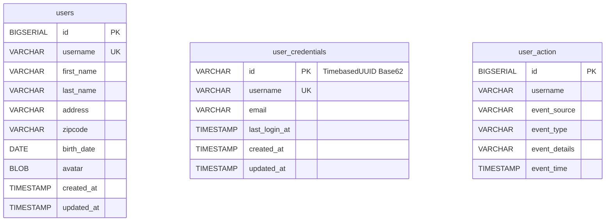
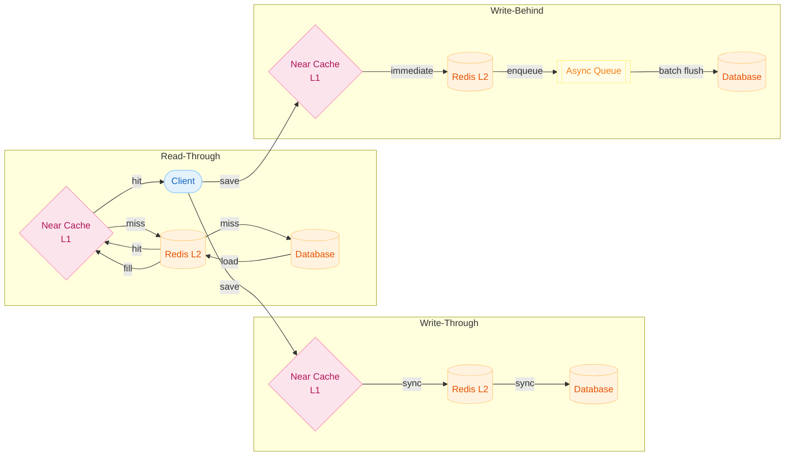
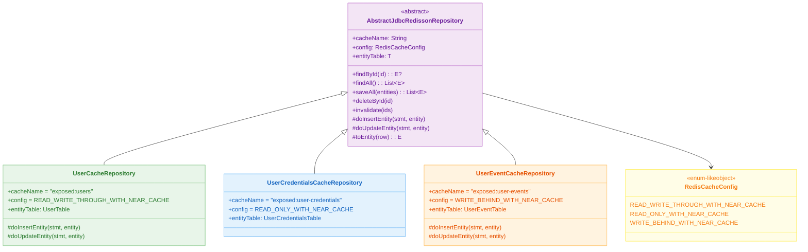
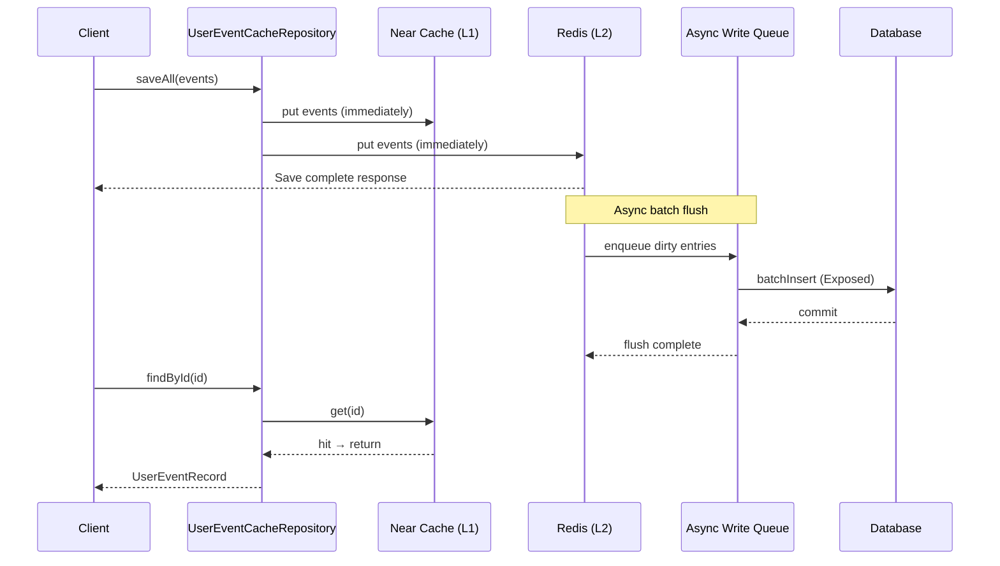
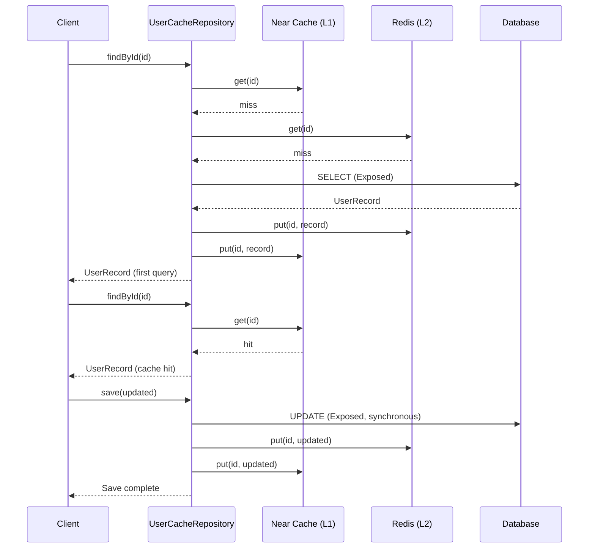

# Cache Strategies (01-cache-strategies)

English | [한국어](./README.ko.md)

A module for hands-on practice with cache strategies using Redisson + Exposed in a Spring MVC + Virtual Threads environment. Compares consistency/performance trade-offs for Read Through, Write Through, and Write Behind strategies.

## Learning Goals

- Distinguish behavior and trade-offs by cache strategy.
- Understand consistency models based on Redis + DB synchronization timing.
- Verify invalidation/recovery scenarios needed in production.

## Prerequisites

- [`../09-spring/README.md`](../09-spring/README.md)

---

## Overview

By extending `AbstractJdbcRedissonRepository`, you can select among three cache strategies with a single configuration value. Redisson's Near Cache acts as L1 (local memory), Redis as L2 (distributed cache), and Exposed as the DB access layer. Tomcat is replaced with a Virtual Thread-based Executor to reduce blocking I/O cost.

---

## Domain ERD



---

## Cache Strategy Architecture



---

## Class Structure



---

## Request Processing Flow — Write-Behind Async Event Loading



---

## Request Processing Flow — Read-Through + Write-Through (User)



---

## Key Configuration

### application.yml

```yaml
server:
    port: 8080
    compression:
        enabled: true
    tomcat:
        threads:
            max: 8000          # High value allowed since Virtual Thread-based
            min-spare: 20
    shutdown: graceful

spring:
    datasource:
        url: jdbc:h2:mem:cache-strategy;MODE=PostgreSQL;DB_CLOSE_DELAY=-1
        driver-class-name: org.h2.Driver
        hikari:
            maximum-pool-size: 80
            minimum-idle: 4
            idle-timeout: 30000
            connection-timeout: 30000
    exposed:
        generate-ddl: true
        show-sql: false
```

### RedissonConfig Key Settings

| Item                        | Value                 | Description                |
|-----------------------------|-----------------------|---------------------------|
| `connectionPoolSize`        | 256                   | Max Redis connection pool size |
| `connectionMinimumIdleSize` | 32                    | Min connections always maintained |
| `timeout`                   | 5000ms                | Command response wait time |
| `retryAttempts`             | 3                     | Retry count on failure     |
| `codec`                     | LZ4ForyComposite      | LZ4 compression + Fury serialization |
| `executor`                  | VirtualThreadExecutor | Redisson internal thread pool |

---

## Key Components

| File/Area                                                 | Description                           |
|-------------------------------------------------------|---------------------------------------|
| `domain/repository/UserCacheRepository.kt`            | Read-Through + Write-Through          |
| `domain/repository/UserCredentialsCacheRepository.kt` | Read-Only Cache                       |
| `domain/repository/UserEventCacheRepository.kt`       | Write-Behind                          |
| `config/RedissonConfig.kt`                            | Redis/Redisson connection config      |
| `config/TomcatVirtualThreadConfig.kt`                 | Replace Tomcat Virtual Thread Executor|

---

## How to Test

```bash
# Unit/integration tests (Testcontainers auto-starts Redis)
./gradlew :11-high-performance:01-cache-strategies:test

# Run application
./gradlew :11-high-performance:01-cache-strategies:bootRun
```

### API Endpoints

```bash
# User (Read-Through / Write-Through)
GET  /users/{id}
POST /users

# UserCredentials (Read-Only Cache)
GET  /user-credentials/{username}
DELETE /user-credentials  # Cache invalidation

# UserEvent (Write-Behind)
GET  /user-events/{id}
POST /user-events/bulk
```

---

## Practice Checklist

- Measure response time difference between cache hit and miss
- Verify DB is immediately updated after Write-Through save
- Verify final DB count with Awaitility after Write-Behind bulk load
- Confirm DB fallback path works on Redis failure

---

## Operations Checkpoints

- Align cache invalidation policy (TTL/manual) with data freshness SLA
- Apply Write-Behind only to loss-tolerant data
- Always verify DB fallback path on Redis failure
- Secure sufficient `connectionMinimumIdleSize` to prevent cold start latency

---

## Complex Scenarios

### Read-Through + Write-Through Flow (User)

`UserCacheRepository` queries the DB on cache miss and loads it into the cache (Read-Through), and simultaneously reflects entity updates in both the DB and cache (Write-Through).

- Related file: [`domain/repository/UserCacheRepository.kt`](src/main/kotlin/exposed/examples/cache/domain/repository/UserCacheRepository.kt)
- Verification test: [`UserCacheRepositoryTest.kt`](src/test/kotlin/exposed/examples/cache/domain/repository/UserCacheRepositoryTest.kt)

### Write-Behind Bulk Event Async Propagation (UserEvent)

`UserEventCacheRepository` pre-stores events in Redis and then batch-saves to DB asynchronously. Verifies the final DB count with Awaitility after bulk loading.

- Related file: [`domain/repository/UserEventCacheRepository.kt`](src/main/kotlin/exposed/examples/cache/domain/repository/UserEventCacheRepository.kt)
- Verification test: [`UserEventCacheRepositoryTest.kt`](src/test/kotlin/exposed/examples/cache/domain/repository/UserEventCacheRepositoryTest.kt)

### Cache Invalidation (UserCredentials)

`UserCredentialsCacheRepository` applies a Read-Only cache strategy and provides an API for explicitly invalidating cache for a specific list of IDs.

- Related file: [`domain/repository/UserCredentialsCacheRepository.kt`](src/main/kotlin/exposed/examples/cache/domain/repository/UserCredentialsCacheRepository.kt)
- Verification test: [`UserCredentialsCacheRepositoryTest.kt`](src/test/kotlin/exposed/examples/cache/domain/repository/UserCredentialsCacheRepositoryTest.kt)

---

## Next Module

- [`../02-cache-strategies-coroutines/README.md`](../02-cache-strategies-coroutines/README.md)
