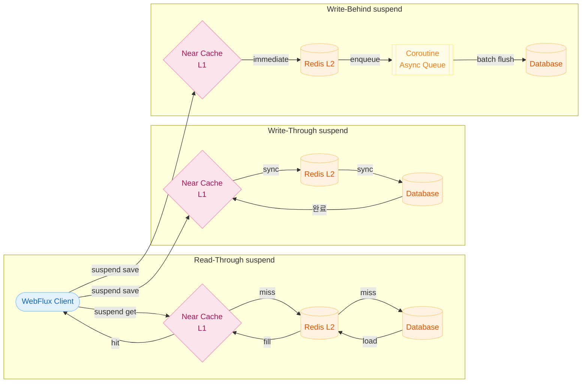
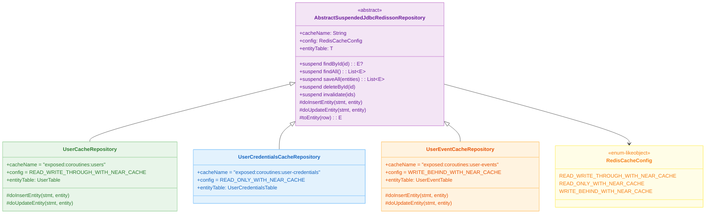
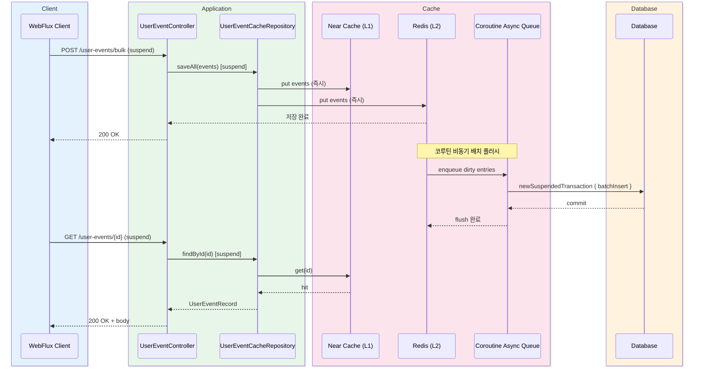
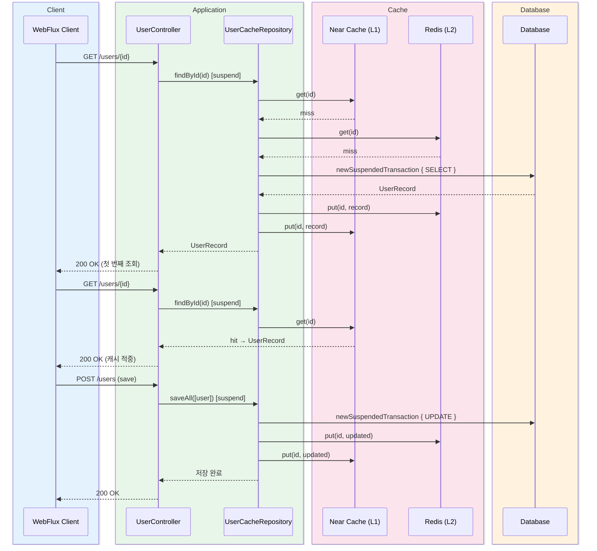

# 캐시 전략 - Coroutines (02-cache-strategies-coroutines)

[English](./README.md) | 한국어

`01-cache-strategies`의 코루틴/논블로킹 버전입니다. WebFlux + Netty + Coroutines 환경에서 `suspend` 기반 캐시 접근 패턴을 실습합니다.

## 학습 목표

- `suspend` 기반 캐시/DB 접근 패턴을 익힌다.
- 이벤트 루프 친화적인 캐시 처리 모델을 구현한다.
- 동시 연결이 많은 상황에서 안정성을 검증한다.

## 선수 지식

- [`../08-coroutines/README.md`](../08-coroutines/README.md)
- [`../01-cache-strategies/README.md`](../01-cache-strategies/README.md)

---

## 개요

`AbstractSuspendedJdbcRedissonRepository`를 상속하면 `suspend` 함수 형태로 캐시 전략을 적용할 수 있습니다. 내부적으로
`newSuspendedTransaction`을 사용해 Exposed DB 접근을 코루틴 컨텍스트에서 처리합니다. Netty 이벤트 루프를 블로킹하지 않으므로 고동시성 환경에서도 스레드 풀 고갈이 발생하지 않습니다.

---

## 캐시 전략 아키텍처



---

## 클래스 구조



---

## 요청 처리 흐름 — Write-Behind 비동기 이벤트 적재 (코루틴)



---

## 요청 처리 흐름 — Read-Through + Write-Through (코루틴 User)



---

## 주요 설정

### application.yml

```yaml
server:
    port: 8080
    compression:
        enabled: true
    shutdown: graceful

spring:
    datasource:
        url: jdbc:h2:mem:cache-strategy;MODE=PostgreSQL;DB_CLOSE_DELAY=-1
        driver-class-name: org.h2.Driver
        hikari:
            maximum-pool-size: 80
            minimum-idle: 4
            idle-timeout: 30000
            connection-timeout: 30000
    exposed:
        generate-ddl: true
        show-sql: false
```

### NettyConfig 주요 설정

| 항목                    | 값                                 | 설명                         |
|-----------------------|-----------------------------------|----------------------------|
| `SO_BACKLOG`          | 8,000                             | 대기 연결 큐 크기                 |
| `SO_KEEPALIVE`        | true                              | TCP keepalive 활성화          |
| `ReadTimeoutHandler`  | 10s                               | 읽기 타임아웃                    |
| `WriteTimeoutHandler` | 10s                               | 쓰기 타임아웃                    |
| `maxConnections`      | 8,000                             | ConnectionProvider 최대 연결 수 |
| `maxIdleTime`         | 30s                               | 유휴 연결 유지 시간                |
| `loopResources`       | `availableProcessors * 8` (최소 64) | 이벤트 루프 스레드 수               |

---

## 주요 구성 요소

| 파일/영역                                                 | 설명                                     |
|-------------------------------------------------------|----------------------------------------|
| `domain/repository/UserCacheRepository.kt`            | Suspended Read-Through + Write-Through |
| `domain/repository/UserCredentialsCacheRepository.kt` | Suspended Read-Only Cache              |
| `domain/repository/UserEventCacheRepository.kt`       | Suspended Write-Behind                 |
| `config/NettyConfig.kt`                               | Netty 이벤트 루프 및 연결 풀 튜닝                 |
| `config/RedissonConfig.kt`                            | Redisson 클라이언트 설정                      |
| `controller/*Controller.kt`                           | `suspend` 엔드포인트                        |

---

## 테스트 방법

```bash
# 단위/통합 테스트 실행 (Testcontainers가 Redis를 자동 시작)
./gradlew :11-high-performance:02-cache-strategies-coroutines:test

# 애플리케이션 실행
./gradlew :11-high-performance:02-cache-strategies-coroutines:bootRun
```

### API 엔드포인트 (WebFlux / suspend)

```bash
# User (Suspended Read-Through / Write-Through)
GET  /users/{id}
POST /users

# UserCredentials (Suspended Read-Only Cache)
GET  /user-credentials/{username}
DELETE /user-credentials

# UserEvent (Suspended Write-Behind)
GET  /user-events/{id}
POST /user-events/bulk
```

---

## 실습 체크리스트

- `suspend` 경로에서 캐시 적중/미스 동작 검증
- `flatMapMerge`로 100개 병렬 조회 후 두 번째 조회 시간이 더 짧음을 `measureTimeMillis`로 측정
- 대량 이벤트 적재 시 비동기 반영 지연을 `untilSuspending`으로 관측
- WebTestClient 기반 통합 테스트로 회귀 방지

---

## 운영 체크포인트

- 이벤트 루프 블로킹 호출 금지 (`runBlocking` 사용 금지)
- 비동기 반영 지연이 허용 가능한 도메인인지 사전 합의
- 코루틴 취소/타임아웃 시 데이터 정합성 검증
- `ReactorResourceFactory`를 글로벌 리소스에서 분리해 테스트 간 간섭 방지

---

## 복잡한 시나리오

### 코루틴 Read-Through + Write-Through 흐름 (User)

`UserCacheRepository`(suspend 버전)는 `newSuspendedTransaction` 안에서 캐시 미스 시 DB를 조회하고 Redis에 적재합니다.

- 관련 파일: [`domain/repository/UserCacheRepository.kt`](src/main/kotlin/exposed/examples/cache/coroutines/domain/repository/UserCacheRepository.kt)
- 검증 테스트: [
  `UserCacheRepositoryTest.kt`](src/test/kotlin/exposed/examples/cache/coroutines/domain/repository/UserCacheRepositoryTest.kt)

### 코루틴 Write-Behind 대량 이벤트 비동기 반영 (UserEvent)

`UserEventCacheRepository`(suspend 버전)는 이벤트를 Redis에 선반영 후 코루틴 기반으로 DB에 일괄 저장합니다. 500개 bulk insert 후 Awaitility +
`untilSuspending`으로 비동기 DB 반영 완료를 대기합니다.

- 관련 파일: [`domain/repository/UserEventCacheRepository.kt`](src/main/kotlin/exposed/examples/cache/coroutines/domain/repository/UserEventCacheRepository.kt)
- 검증 테스트: [
  `UserEventCacheRepositoryTest.kt`](src/test/kotlin/exposed/examples/cache/coroutines/domain/repository/UserEventCacheRepositoryTest.kt)

### 코루틴 캐시 무효화 (UserCredentials)

`UserCredentialsCacheRepository`(suspend 버전)는 Read-Only 캐시와 ID 기반 명시적 무효화를 코루틴 환경에서 제공합니다.

- 관련 파일: [`domain/repository/UserCredentialsCacheRepository.kt`](src/main/kotlin/exposed/examples/cache/coroutines/domain/repository/UserCredentialsCacheRepository.kt)
- 검증 테스트: [
  `UserCredentialsCacheRepositoryTest.kt`](src/test/kotlin/exposed/examples/cache/coroutines/domain/repository/UserCredentialsCacheRepositoryTest.kt)

---

## 다음 모듈

- [`../03-routing-datasource/README.md`](../03-routing-datasource/README.md)
