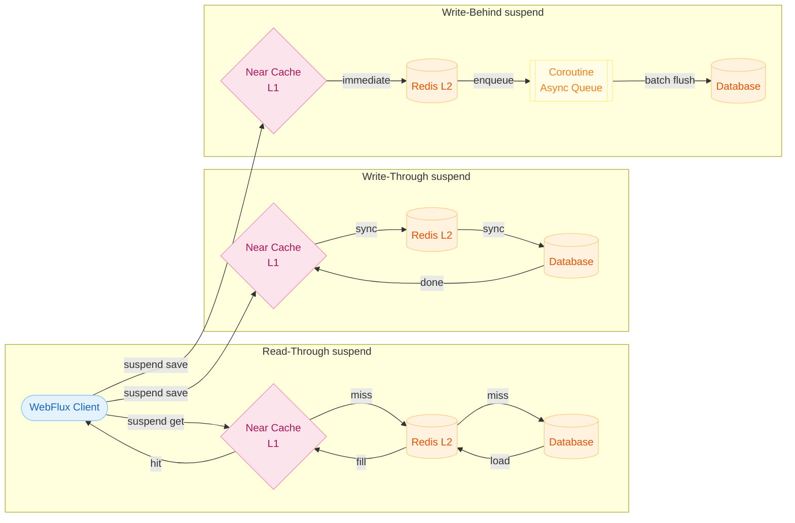
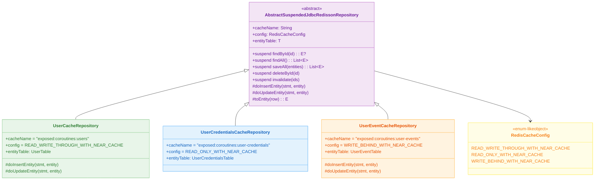
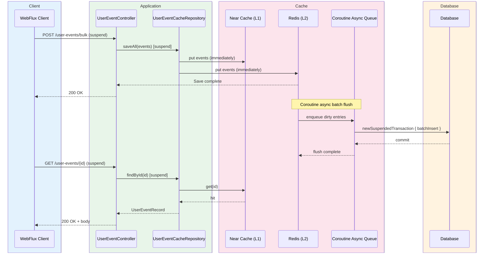
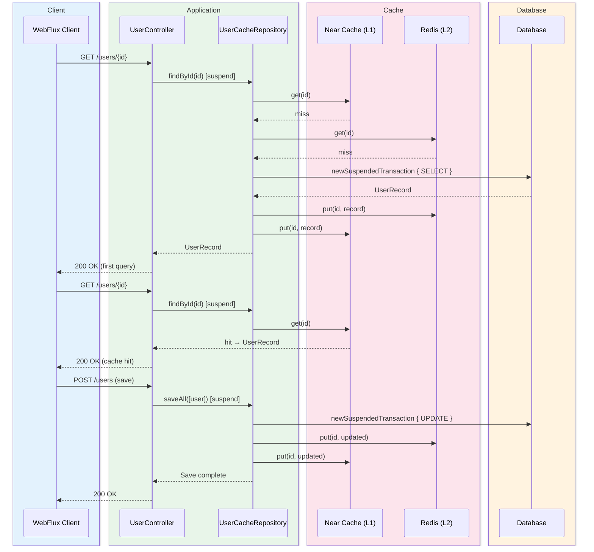

# Cache Strategies - Coroutines (02-cache-strategies-coroutines)

English | [한국어](./README.ko.md)

The coroutines/non-blocking version of `01-cache-strategies`. Practises `suspend`-based cache access patterns in a WebFlux + Netty + Coroutines environment.

## Learning Goals

- Learn `suspend`-based cache/DB access patterns.
- Implement an event-loop-friendly cache processing model.
- Verify stability under high-concurrency conditions.

## Prerequisites

- [`../08-coroutines/README.md`](../08-coroutines/README.md)
- [`../01-cache-strategies/README.md`](../01-cache-strategies/README.md)

---

## Overview

By extending `AbstractSuspendedJdbcRedissonRepository`, you can apply cache strategies as `suspend` functions. Internally, `newSuspendedTransaction` is used to handle Exposed DB access within a coroutine context. Because the Netty event loop is never blocked, thread pool exhaustion does not occur even in high-concurrency environments.

---

## Cache Strategy Architecture



---

## Class Structure



---

## Request Processing Flow — Write-Behind Async Event Loading (Coroutines)



---

## Request Processing Flow — Read-Through + Write-Through (Coroutines User)



---

## Key Configuration

### application.yml

```yaml
server:
    port: 8080
    compression:
        enabled: true
    shutdown: graceful

spring:
    datasource:
        url: jdbc:h2:mem:cache-strategy;MODE=PostgreSQL;DB_CLOSE_DELAY=-1
        driver-class-name: org.h2.Driver
        hikari:
            maximum-pool-size: 80
            minimum-idle: 4
            idle-timeout: 30000
            connection-timeout: 30000
    exposed:
        generate-ddl: true
        show-sql: false
```

### NettyConfig Key Settings

| Item                    | Value                              | Description                         |
|-----------------------|------------------------------------|-------------------------------------|
| `SO_BACKLOG`          | 8,000                              | Pending connection queue size        |
| `SO_KEEPALIVE`        | true                               | TCP keepalive enabled                |
| `ReadTimeoutHandler`  | 10s                                | Read timeout                         |
| `WriteTimeoutHandler` | 10s                                | Write timeout                        |
| `maxConnections`      | 8,000                              | ConnectionProvider max connections   |
| `maxIdleTime`         | 30s                                | Idle connection retention time       |
| `loopResources`       | `availableProcessors * 8` (min 64) | Event loop thread count              |

---

## Key Components

| File/Area                                                 | Description                            |
|-------------------------------------------------------|----------------------------------------|
| `domain/repository/UserCacheRepository.kt`            | Suspended Read-Through + Write-Through |
| `domain/repository/UserCredentialsCacheRepository.kt` | Suspended Read-Only Cache              |
| `domain/repository/UserEventCacheRepository.kt`       | Suspended Write-Behind                 |
| `config/NettyConfig.kt`                               | Netty event loop and connection pool tuning |
| `config/RedissonConfig.kt`                            | Redisson client configuration          |
| `controller/*Controller.kt`                           | `suspend` endpoints                    |

---

## How to Test

```bash
# Unit/integration tests (Testcontainers auto-starts Redis)
./gradlew :11-high-performance:02-cache-strategies-coroutines:test

# Run application
./gradlew :11-high-performance:02-cache-strategies-coroutines:bootRun
```

### API Endpoints (WebFlux / suspend)

```bash
# User (Suspended Read-Through / Write-Through)
GET  /users/{id}
POST /users

# UserCredentials (Suspended Read-Only Cache)
GET  /user-credentials/{username}
DELETE /user-credentials

# UserEvent (Suspended Write-Behind)
GET  /user-events/{id}
POST /user-events/bulk
```

---

## Practice Checklist

- Verify cache hit/miss behavior on the `suspend` path
- Use `flatMapMerge` to run 100 parallel queries and measure shorter second-query time with `measureTimeMillis`
- Observe async propagation delay during bulk event loading with `untilSuspending`
- Prevent regression with WebTestClient-based integration tests

---

## Operations Checkpoints

- Never block the event loop (no `runBlocking`)
- Confirm that async propagation delay is acceptable for the domain before adoption
- Verify data consistency on coroutine cancellation/timeout
- Isolate `ReactorResourceFactory` from global resources to prevent test interference

---

## Complex Scenarios

### Coroutine Read-Through + Write-Through Flow (User)

`UserCacheRepository` (suspend version) queries the DB on cache miss inside `newSuspendedTransaction` and loads it into Redis.

- Related file: [`domain/repository/UserCacheRepository.kt`](src/main/kotlin/exposed/examples/cache/coroutines/domain/repository/UserCacheRepository.kt)
- Verification test: [`UserCacheRepositoryTest.kt`](src/test/kotlin/exposed/examples/cache/coroutines/domain/repository/UserCacheRepositoryTest.kt)

### Coroutine Write-Behind Bulk Event Async Propagation (UserEvent)

`UserEventCacheRepository` (suspend version) pre-stores events in Redis and then batch-saves to DB via coroutines. After a 500-item bulk insert, Awaitility + `untilSuspending` waits for async DB propagation to complete.

- Related file: [`domain/repository/UserEventCacheRepository.kt`](src/main/kotlin/exposed/examples/cache/coroutines/domain/repository/UserEventCacheRepository.kt)
- Verification test: [`UserEventCacheRepositoryTest.kt`](src/test/kotlin/exposed/examples/cache/coroutines/domain/repository/UserEventCacheRepositoryTest.kt)

### Coroutine Cache Invalidation (UserCredentials)

`UserCredentialsCacheRepository` (suspend version) provides a Read-Only cache with explicit ID-based invalidation in the coroutine environment.

- Related file: [`domain/repository/UserCredentialsCacheRepository.kt`](src/main/kotlin/exposed/examples/cache/coroutines/domain/repository/UserCredentialsCacheRepository.kt)
- Verification test: [`UserCredentialsCacheRepositoryTest.kt`](src/test/kotlin/exposed/examples/cache/coroutines/domain/repository/UserCredentialsCacheRepositoryTest.kt)

---

## Next Module

- [`../03-routing-datasource/README.md`](../03-routing-datasource/README.md)
