# RoutingDataSource 예제 (03-routing-datasource)

멀티테넌트와 read/write 분리를 함께 다루는 동적 `DataSource` 라우팅 예제입니다.
`tenant + transaction readOnly` 정보를 조합해 `<tenant>:<rw|ro>` 키를 만들고,
`DataSourceRegistry`에 등록된 `DataSource`로 위임합니다.

## 학습 목표

- 정적 `targetDataSources` 맵 대신 Registry 기반 라우팅 구조를 구성한다.
- `TenantContext`와 `@Transactional(readOnly = true)`를 하나의 라우팅 규칙으로 통합한다.
- 미등록 키, 기본 tenant fallback, 동시 등록 같은 운영성 이슈를 테스트로 검증한다.

## 선수 지식

- [`../10-multi-tenant/README.md`](../10-multi-tenant/README.md)

---

## 개요

Spring의 `AbstractRoutingDataSource` 대신 직접 구현한 `DynamicRoutingDataSource`를 사용합니다.
`RoutingKeyResolver`가 현재 스레드의 tenant 컨텍스트와 트랜잭션 read-only 여부를 조합해 라우팅 키를 계산하고,
`DataSourceRegistry`에서 해당 키에 등록된 `DataSource`를 선택합니다. HTTP 요청의 `X-Tenant-Id` 헤더는 `TenantHeaderFilter`가
`TenantContext`(ThreadLocal)에 바인딩합니다.

---

## 라우팅 키 결정 흐름

```mermaid
flowchart LR
    Req([HTTP Request])
    Filter[TenantHeaderFilter]
    TC[TenantContext\nThreadLocal]
    Resolver[ContextAwareRoutingKeyResolver]
    TSM[TransactionSynchronizationManager\n.isCurrentTransactionReadOnly]
    KeyFmt{키 포맷\ntenant:rw or ro}
    Registry[DataSourceRegistry\nConcurrentHashMap]
    DS[(DataSource)]
    Fallback{ro 없음?}
    RW_DS[(rw DataSource\n재사용)]
    Req --> Filter
    Filter -->|X - Tenant - Id 헤더| TC
    TC --> Resolver
    TSM --> Resolver
    Resolver --> KeyFmt
    KeyFmt -->|tenant:ro| Registry
    KeyFmt -->|tenant:rw| Registry
    Registry -->|키 존재| DS
    Registry -->|ro 미등록| Fallback
    Fallback -->|rw fallback| RW_DS

    classDef blue fill:#E3F2FD,stroke:#90CAF9,color:#1565C0
    classDef green fill:#E8F5E9,stroke:#A5D6A7,color:#2E7D32
    classDef purple fill:#F3E5F5,stroke:#CE93D8,color:#6A1B9A
    classDef orange fill:#FFF3E0,stroke:#FFCC80,color:#E65100
    classDef yellow fill:#FFFDE7,stroke:#FFF176,color:#F57F17

    class Req blue
    class Filter green
    class TC green
    class Resolver purple
    class TSM purple
    class KeyFmt yellow
    class Registry orange
    class DS,RW_DS orange
    class Fallback yellow
```



---

## 클래스 구조


---

## 요청 처리 흐름 — 멀티테넌트 read/write 분리 라우팅


---

## 주요 설정

### application.yml

```yaml
routing:
    datasource:
        default-tenant: default          # 헤더 없을 때 사용할 tenant
        tenants:
            default:
                rw:
                    url: jdbc:h2:mem:routing_default_rw;DB_CLOSE_DELAY=-1
                ro:
                    url: jdbc:h2:mem:routing_default_ro;DB_CLOSE_DELAY=-1
            acme:
                rw:
                    url: jdbc:h2:mem:routing_acme_rw;DB_CLOSE_DELAY=-1
                ro:
                    url: jdbc:h2:mem:routing_acme_ro;DB_CLOSE_DELAY=-1
```

`ro` 항목을 생략하면 `RoutingDataSourceConfig`가 `rw` DataSource를 `<tenant>:ro` 키에도 등록합니다.

### RoutingDataSourceConfig Bean 구성

| Bean                             | 타입                               | 역할                |
|----------------------------------|----------------------------------|-------------------|
| `dataSourceRegistry`             | `InMemoryDataSourceRegistry`     | 키별 DataSource 등록소 |
| `routingKeyResolver`             | `ContextAwareRoutingKeyResolver` | 라우팅 키 계산기         |
| `routingDataSource` (`@Primary`) | `DynamicRoutingDataSource`       | 실제 연결 위임자         |
| `exposedDatabase`                | `Database`                       | Exposed DB 연결     |

### HikariCP 기본값 (DataSourceNodeProperties → HikariDataSource)

| 항목                | 값 |
|-------------------|---|
| `maximumPoolSize` | 4 |
| `minimumIdle`     | 1 |

---

## 라우팅 규칙

| 조건                          | 라우팅 키                   |
|-----------------------------|-------------------------|
| tenant=acme, readOnly=false | `acme:rw`               |
| tenant=acme, readOnly=true  | `acme:ro`               |
| 헤더 없음 또는 공백, readOnly=false | `default:rw`            |
| 헤더 없음 또는 공백, readOnly=true  | `default:ro`            |
| ro 설정 없음                    | rw DataSource 재사용       |
| 미등록 키                       | `IllegalStateException` |

---

## API 엔드포인트

```bash
# read-write 라우팅 결과 조회
curl -H 'X-Tenant-Id: acme' http://localhost:8080/routing/marker

# read-only 라우팅 결과 조회
curl -H 'X-Tenant-Id: acme' http://localhost:8080/routing/marker/readonly

# 현재 tenant의 read-write 마커 갱신
curl -X PATCH \
  -H 'X-Tenant-Id: acme' \
  -H 'Content-Type: application/json' \
  -d '{"marker":"acme-rw-updated"}' \
  http://localhost:8080/routing/marker
```

---

## 테스트 방법

```bash
# 단위/통합 테스트 실행
./gradlew :11-high-performance:03-routing-datasource:test

# 애플리케이션 실행
./gradlew :11-high-performance:03-routing-datasource:bootRun
```

---

## 테스트 범위

| 파일                                                                                                                                   | 설명                           |
|--------------------------------------------------------------------------------------------------------------------------------------|------------------------------|
| [`ContextAwareRoutingKeyResolverTest.kt`](src/test/kotlin/exposed/examples/routing/datasource/ContextAwareRoutingKeyResolverTest.kt) | 테넌트·readOnly 조합별 라우팅 키 반환 검증 |
| [`DynamicRoutingDataSourceTest.kt`](src/test/kotlin/exposed/examples/routing/datasource/DynamicRoutingDataSourceTest.kt)             | 컨텍스트별 DataSource 라우팅 통합 검증   |
| [`InMemoryDataSourceRegistryTest.kt`](src/test/kotlin/exposed/examples/routing/datasource/InMemoryDataSourceRegistryTest.kt)         | 동시 등록·조회 스레드 안전성 검증          |
| [`RoutingMarkerControllerTest.kt`](src/test/kotlin/exposed/examples/routing/web/RoutingMarkerControllerTest.kt)                      | 테넌트별 REST API 라우팅 결과 검증      |

---

## 복잡한 시나리오

### 멀티테넌트 + 읽기/쓰기 분리 라우팅

`ContextAwareRoutingKeyResolver`는 `TenantContext`와
`TransactionSynchronizationManager.isCurrentTransactionReadOnly()`를 조합해 `<tenant>:<rw|ro>` 형태의 라우팅 키를 결정합니다.
`DynamicRoutingDataSource`는 이 키로 `DataSourceRegistry`에서 실제 DataSource를 선택합니다.

- 관련 파일: [`ContextAwareRoutingKeyResolver.kt`](src/main/kotlin/exposed/examples/routing/datasource/ContextAwareRoutingKeyResolver.kt), [`DynamicRoutingDataSource.kt`](src/main/kotlin/exposed/examples/routing/datasource/DynamicRoutingDataSource.kt)
- 검증 테스트: [`ContextAwareRoutingKeyResolverTest.kt`](src/test/kotlin/exposed/examples/routing/datasource/ContextAwareRoutingKeyResolverTest.kt), [`DynamicRoutingDataSourceTest.kt`](src/test/kotlin/exposed/examples/routing/datasource/DynamicRoutingDataSourceTest.kt)

### Registry 동시성 안전성

`InMemoryDataSourceRegistry`는 `ConcurrentHashMap` 기반으로 구현돼 다수의 스레드가 동시에 DataSource를 등록/조회해도 레이스 컨디션 없이 동작합니다.

- 관련 파일: [`InMemoryDataSourceRegistry.kt`](src/main/kotlin/exposed/examples/routing/datasource/InMemoryDataSourceRegistry.kt)
- 검증 테스트: [`InMemoryDataSourceRegistryTest.kt`](src/test/kotlin/exposed/examples/routing/datasource/InMemoryDataSourceRegistryTest.kt)

---

## 테스트 전략

| 구분       | 검증 항목                         | 기대 결과                       |
|----------|-------------------------------|-----------------------------|
| 라우팅 정합성  | `tenant=acme, readOnly=true`  | `acme:ro` DataSource 선택     |
| 라우팅 정합성  | `tenant=acme, readOnly=false` | `acme:rw` DataSource 선택     |
| Fallback | `ro` 미설정 tenant               | `rw` DataSource 재사용         |
| 예외 처리    | 미등록 키 조회                      | `IllegalStateException`     |
| 동시성      | 등록/조회 병행                      | 레이스 없이 항상 유효한 DataSource 반환 |
| 헤더 처리    | 공백 헤더                         | `defaultTenant` 적용          |

---

## 운영 체크포인트

- `determineCurrentLookupKey()` 경로에서 불필요한 객체 생성/문자열 연산을 줄입니다.
- 컨텍스트 누락, 미등록 키, DataSource close 상태를 명시적으로 처리합니다.
- 라우팅 로그에는 최소한 `tenant`, `readOnly`, `routingKey`, `selectedDataSource`를 포함합니다.
- 장애 감지와 라우팅 우회를 독립 컴포넌트로 분리합니다.
- Registry 갱신 이벤트를 로깅/메트릭으로 남겨 변경 추적성을 확보합니다.

---

## 다음 모듈

- 마지막 모듈입니다. 전체 고성능 예제 요약은 [`../README.md`](../README.md)에서 확인할 수 있습니다.
