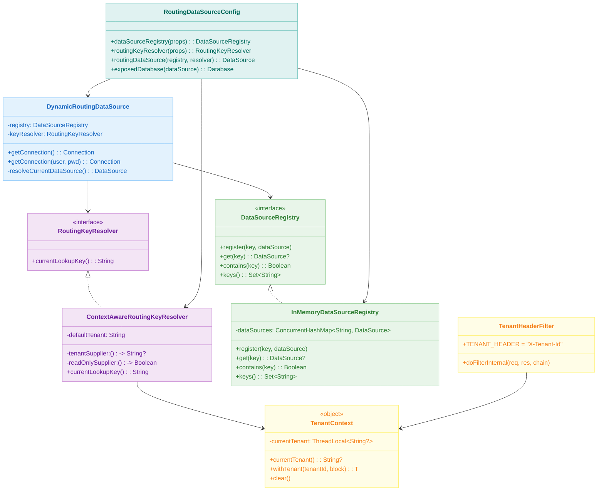
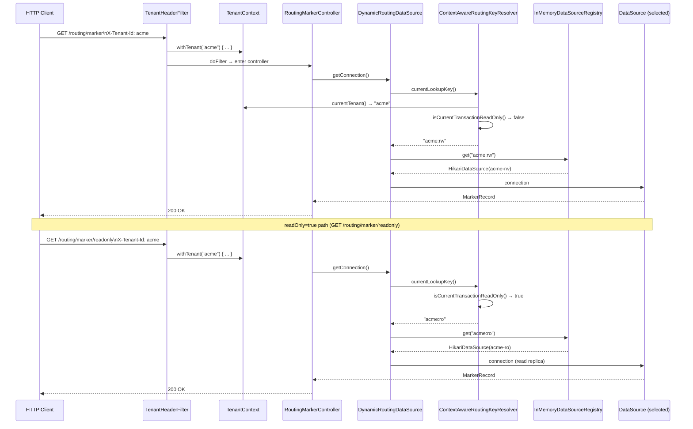

# RoutingDataSource Example (03-routing-datasource)

English | [한국어](./README.ko.md)

A dynamic `DataSource` routing example that handles multi-tenancy and read/write separation together.
Combines `tenant + transaction readOnly` information to form a `<tenant>:<rw|ro>` key and delegates to the `DataSource` registered in `DataSourceRegistry`.

## Learning Goals

- Build a Registry-based routing structure instead of a static `targetDataSources` map.
- Combine `TenantContext` and `@Transactional(readOnly = true)` into a single routing rule.
- Verify operational concerns such as unregistered keys, default tenant fallback, and concurrent registration through tests.

## Prerequisites

- [`../10-multi-tenant/README.md`](../10-multi-tenant/README.md)

---

## Overview

Uses a custom `DynamicRoutingDataSource` instead of Spring's `AbstractRoutingDataSource`.
`RoutingKeyResolver` computes the routing key by combining the current thread's tenant context with the transaction read-only flag, and selects the corresponding `DataSource` from `DataSourceRegistry`. The `TenantHeaderFilter` binds the `X-Tenant-Id` HTTP header into `TenantContext` (ThreadLocal).

---

## Routing Key Resolution Flow

```mermaid
flowchart LR
    Req([HTTP Request])
    Filter[TenantHeaderFilter]
    TC[TenantContext\nThreadLocal]
    Resolver[ContextAwareRoutingKeyResolver]
    TSM[TransactionSynchronizationManager\n.isCurrentTransactionReadOnly]
    KeyFmt{Key format\ntenant:rw or ro}
    Registry[DataSourceRegistry\nConcurrentHashMap]
    DS[(DataSource)]
    Fallback{No ro?}
    RW_DS[(rw DataSource\nreused)]
    Req --> Filter
    Filter -->|X - Tenant - Id header| TC
    TC --> Resolver
    TSM --> Resolver
    Resolver --> KeyFmt
    KeyFmt -->|tenant:ro| Registry
    KeyFmt -->|tenant:rw| Registry
    Registry -->|key exists| DS
    Registry -->|ro not registered| Fallback
    Fallback -->|rw fallback| RW_DS

    classDef blue fill:#E3F2FD,stroke:#90CAF9,color:#1565C0
    classDef green fill:#E8F5E9,stroke:#A5D6A7,color:#2E7D32
    classDef purple fill:#F3E5F5,stroke:#CE93D8,color:#6A1B9A
    classDef orange fill:#FFF3E0,stroke:#FFCC80,color:#E65100
    classDef yellow fill:#FFFDE7,stroke:#FFF176,color:#F57F17

    class Req blue
    class Filter green
    class TC green
    class Resolver purple
    class TSM purple
    class KeyFmt yellow
    class Registry orange
    class DS,RW_DS orange
    class Fallback yellow
```



---

## Class Structure



---

## Request Processing Flow — Multi-Tenant Read/Write Separation Routing



---

## Key Configuration

### application.yml

```yaml
routing:
    datasource:
        default-tenant: default          # tenant to use when no header is present
        tenants:
            default:
                rw:
                    url: jdbc:h2:mem:routing_default_rw;DB_CLOSE_DELAY=-1
                ro:
                    url: jdbc:h2:mem:routing_default_ro;DB_CLOSE_DELAY=-1
            acme:
                rw:
                    url: jdbc:h2:mem:routing_acme_rw;DB_CLOSE_DELAY=-1
                ro:
                    url: jdbc:h2:mem:routing_acme_ro;DB_CLOSE_DELAY=-1
```

If the `ro` entry is omitted, `RoutingDataSourceConfig` registers the `rw` DataSource under the `<tenant>:ro` key as well.

### RoutingDataSourceConfig Bean Configuration

| Bean                             | Type                             | Role                          |
|----------------------------------|----------------------------------|-------------------------------|
| `dataSourceRegistry`             | `InMemoryDataSourceRegistry`     | Per-key DataSource registry   |
| `routingKeyResolver`             | `ContextAwareRoutingKeyResolver` | Routing key calculator        |
| `routingDataSource` (`@Primary`) | `DynamicRoutingDataSource`       | Actual connection delegator   |
| `exposedDatabase`                | `Database`                       | Exposed DB connection         |

### HikariCP Defaults (DataSourceNodeProperties → HikariDataSource)

| Item              | Value |
|-------------------|-------|
| `maximumPoolSize` | 4     |
| `minimumIdle`     | 1     |

---

## Routing Rules

| Condition                             | Routing Key             |
|---------------------------------------|-------------------------|
| tenant=acme, readOnly=false           | `acme:rw`               |
| tenant=acme, readOnly=true            | `acme:ro`               |
| No header or blank, readOnly=false    | `default:rw`            |
| No header or blank, readOnly=true     | `default:ro`            |
| No ro configuration                   | Reuse rw DataSource     |
| Unregistered key                      | `IllegalStateException` |

---

## API Endpoints

```bash
# Query read-write routing result
curl -H 'X-Tenant-Id: acme' http://localhost:8080/routing/marker

# Query read-only routing result
curl -H 'X-Tenant-Id: acme' http://localhost:8080/routing/marker/readonly

# Update read-write marker for current tenant
curl -X PATCH \
  -H 'X-Tenant-Id: acme' \
  -H 'Content-Type: application/json' \
  -d '{"marker":"acme-rw-updated"}' \
  http://localhost:8080/routing/marker
```

---

## How to Test

```bash
# Unit/integration tests
./gradlew :11-high-performance:03-routing-datasource:test

# Run application
./gradlew :11-high-performance:03-routing-datasource:bootRun
```

---

## Test Coverage

| File                                                                                                                                   | Description                                         |
|--------------------------------------------------------------------------------------------------------------------------------------|-----------------------------------------------------|
| [`ContextAwareRoutingKeyResolverTest.kt`](src/test/kotlin/exposed/examples/routing/datasource/ContextAwareRoutingKeyResolverTest.kt) | Verify routing key returned for tenant/readOnly combinations |
| [`DynamicRoutingDataSourceTest.kt`](src/test/kotlin/exposed/examples/routing/datasource/DynamicRoutingDataSourceTest.kt)             | Integration test for context-based DataSource routing |
| [`InMemoryDataSourceRegistryTest.kt`](src/test/kotlin/exposed/examples/routing/datasource/InMemoryDataSourceRegistryTest.kt)         | Thread-safety test for concurrent registration and lookup |
| [`RoutingMarkerControllerTest.kt`](src/test/kotlin/exposed/examples/routing/web/RoutingMarkerControllerTest.kt)                      | Verify REST API routing results per tenant          |

---

## Complex Scenarios

### Multi-Tenant + Read/Write Separation Routing

`ContextAwareRoutingKeyResolver` combines `TenantContext` and `TransactionSynchronizationManager.isCurrentTransactionReadOnly()` to determine a `<tenant>:<rw|ro>` routing key. `DynamicRoutingDataSource` uses this key to select the actual DataSource from `DataSourceRegistry`.

- Related files: [`ContextAwareRoutingKeyResolver.kt`](src/main/kotlin/exposed/examples/routing/datasource/ContextAwareRoutingKeyResolver.kt), [`DynamicRoutingDataSource.kt`](src/main/kotlin/exposed/examples/routing/datasource/DynamicRoutingDataSource.kt)
- Verification tests: [`ContextAwareRoutingKeyResolverTest.kt`](src/test/kotlin/exposed/examples/routing/datasource/ContextAwareRoutingKeyResolverTest.kt), [`DynamicRoutingDataSourceTest.kt`](src/test/kotlin/exposed/examples/routing/datasource/DynamicRoutingDataSourceTest.kt)

### Registry Concurrency Safety

`InMemoryDataSourceRegistry` is implemented on top of `ConcurrentHashMap`, so multiple threads can concurrently register and look up DataSources without race conditions.

- Related file: [`InMemoryDataSourceRegistry.kt`](src/main/kotlin/exposed/examples/routing/datasource/InMemoryDataSourceRegistry.kt)
- Verification test: [`InMemoryDataSourceRegistryTest.kt`](src/test/kotlin/exposed/examples/routing/datasource/InMemoryDataSourceRegistryTest.kt)

---

## Test Strategy

| Category       | Verification Item                 | Expected Result                          |
|----------------|-----------------------------------|------------------------------------------|
| Routing correctness | `tenant=acme, readOnly=true`  | `acme:ro` DataSource selected            |
| Routing correctness | `tenant=acme, readOnly=false` | `acme:rw` DataSource selected            |
| Fallback       | tenant with no `ro` configured    | Reuse `rw` DataSource                    |
| Error handling | Lookup of unregistered key        | `IllegalStateException`                  |
| Concurrency    | Concurrent registration/lookup    | Always returns valid DataSource, no race |
| Header handling | Blank header                     | Apply `defaultTenant`                    |

---

## Operations Checkpoints

- Minimize unnecessary object creation and string operations in the `determineCurrentLookupKey()` path.
- Handle missing context, unregistered keys, and closed DataSource states explicitly.
- Include at minimum `tenant`, `readOnly`, `routingKey`, and `selectedDataSource` in routing logs.
- Separate failure detection and routing bypass into independent components.
- Log/metric Registry update events to maintain change traceability.

---

## Next Module

- This is the last module. See [`../README.md`](../README.md) for the full high-performance chapter summary.
