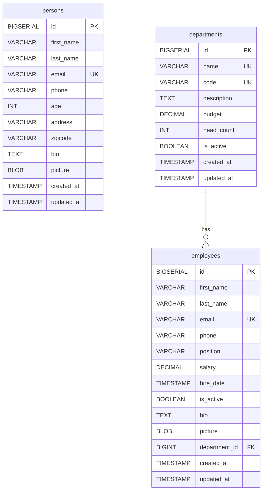
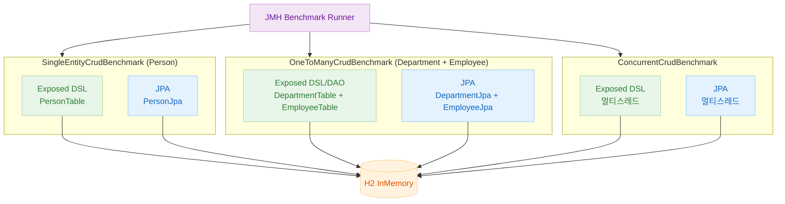
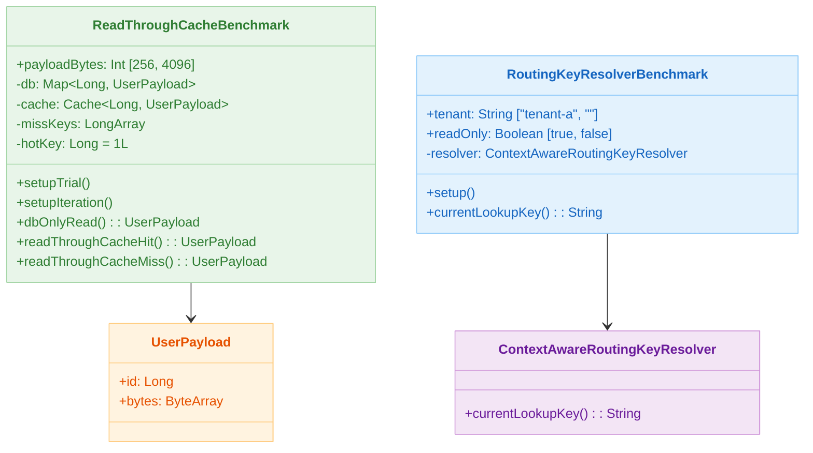
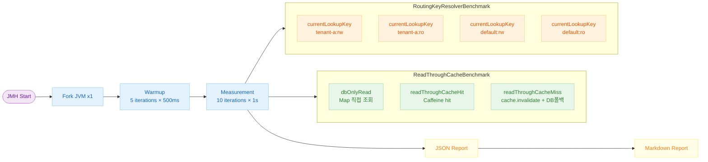

# 벤치마크 (04-benchmark)

[English](./README.md) | 한국어

11장의 캐시/라우팅 예제를 대상으로
`kotlinx-benchmark` 기반 마이크로벤치마크를 수행하는 모듈입니다. 빠른 smoke 프로파일과 정밀 main 프로파일을 제공하며, 실행 결과를 Markdown 표로 저장할 수 있습니다.

---

## 개요

실제 Redis/DB I/O 대신 Caffeine near-cache + 인메모리 저장소를 사용해 캐시 계층 자체의 오버헤드를 안정적으로 비교합니다. JMH 기반이므로 JVM 워밍업 후 측정 결과를 신뢰할 수 있습니다.

---

## 도메인 ERD



---

## Exposed vs JPA 벤치마크 구조



---

## 측정 대상

| 벤치마크 클래스                      | 측정 항목                                | 단위               |
|-------------------------------|--------------------------------------|------------------|
| `ReadThroughCacheBenchmark`   | DB 직접 조회 / cache hit / cache miss 비용 | µs (AverageTime) |
| `RoutingKeyResolverBenchmark` | `currentLookupKey()` 문자열 생성 비용       | ns (AverageTime) |

---

## 클래스 구조



---

## 벤치마크 파라미터

### ReadThroughCacheBenchmark

| 파라미터           | 값         | 설명                 |
|----------------|-----------|--------------------|
| `payloadBytes` | 256, 4096 | UserPayload 바이트 크기 |
| DB 크기          | 2,048 항목  | 인메모리 Map           |
| Caffeine 최대 크기 | 4,096     | near-cache 한도      |
| miss 키 수       | 256       | 순환 miss 시나리오       |

측정 메서드:

- `dbOnlyRead` — Caffeine 없이 Map에서 직접 조회
- `readThroughCacheHit` — hotKey(1L)가 항상 캐시에 존재하는 경로
- `readThroughCacheMiss` — 매 반복 캐시 무효화 후 DB 폴백 경로

### RoutingKeyResolverBenchmark

| 파라미터       | 값                  | 설명                                      |
|------------|--------------------|-----------------------------------------|
| `tenant`   | `"tenant-a"`, `""` | 실제 tenant / 빈 값(defaultTenant fallback) |
| `readOnly` | `true`, `false`    | `:ro` / `:rw` 분기                        |

---

## JMH 공통 설정

| 항목               | 값                   |
|------------------|---------------------|
| `@Fork`          | 1                   |
| `@Warmup`        | 5 iterations, 500ms |
| `@Measurement`   | 10 iterations, 1s   |
| `@BenchmarkMode` | `Mode.AverageTime`  |

---

## 벤치마크 흐름



---

## 실행 방법

```bash
# 빠른 smoke 실행 (CI/빠른 추세 확인)
./gradlew :11-high-performance:04-benchmark:smokeBenchmark

# 기본 프로파일 실행 (정밀 측정)
./gradlew :11-high-performance:04-benchmark:benchmark

# Markdown 리포트 생성 (main 프로파일)
./gradlew :11-high-performance:04-benchmark:benchmarkMarkdown

# smoke 결과를 Markdown으로 저장
./gradlew :11-high-performance:04-benchmark:benchmarkMarkdown -PbenchmarkProfile=smoke
```

---

## 결과 파일 위치

| 형식       | 경로                                                       |
|----------|----------------------------------------------------------|
| JSON     | `build/reports/benchmarks/<profile>/.../jvm.json`        |
| Markdown | `build/reports/benchmarks/<profile>/benchmark-report.md` |

---

## 최신 벤치마크 결과

> 아래 결과는 **smoke 프로파일** (`2026-03-18` 기준)로 측정한 참고값입니다.
> 정밀 측정은 `./gradlew :04-benchmark:benchmark` 후 `build/reports/benchmarks/main/` 의 `benchmark-report.md` 를 확인하세요.

### ReadThroughCacheBenchmark

| 메서드                    | payloadBytes | Score (µs/op) | Error (±) | 해석                                      |
|------------------------|--------------|---------------|-----------|-----------------------------------------|
| `dbOnlyRead`           | 256          | 0.001         | 0.000     | HashMap 직접 조회 — 베이스라인                   |
| `dbOnlyRead`           | 4096         | 0.001         | 0.000     | 대용량 payload도 Map 조회 비용은 동일              |
| `readThroughCacheHit`  | 256          | 0.003         | 0.000     | Caffeine hit — Map 대비 약 3× (래퍼 비용)      |
| `readThroughCacheHit`  | 4096         | 0.003         | 0.000     | payload 크기 무관 — 참조만 반환                  |
| `readThroughCacheMiss` | 256          | 0.119         | 0.282     | cache invalidate + DB 폴백 — hit 대비 약 40× |
| `readThroughCacheMiss` | 4096         | 0.085         | 0.155     | miss 비용이 payload 크기보다 캐시 무효화 비용에 종속     |

### RoutingKeyResolverBenchmark

| tenant     | readOnly | Score (µs/op) | Error (±) | 해석                          |
|------------|----------|---------------|-----------|-----------------------------|
| `tenant-a` | `true`   | 0.004         | 0.001     | 실제 테넌트 + read-only 키        |
| `tenant-a` | `false`  | 0.004         | 0.002     | 실제 테넌트 + read-write 키       |
| `` (빈 값)   | `true`   | 0.004         | 0.004     | defaultTenant 폴백 분기 (오차 증가) |
| `` (빈 값)   | `false`  | 0.004         | 0.002     | defaultTenant 폴백 분기         |

> **요약**: 라우팅 키 계산 비용(~4 ns)은 실질적으로 무시 가능합니다. 캐시 miss 비용은 hit 대비 최대 40×로, **miss 빈도를 낮추는 것이 핵심 최적화 포인트**입니다.

---

## 해석 포인트

- `RoutingKeyResolverBenchmark`: 테넌트 유무와 read-only 여부가 라우팅 키 계산에 미치는 오버헤드를 비교합니다. 빈 tenant일 때
  `defaultTenant` 폴백 분기가 추가되므로 미세한 차이가 발생할 수 있습니다.
- `ReadThroughCacheBenchmark`: 동일 payload 크기에서 `dbOnlyRead` < `readThroughCacheHit` <
  `readThroughCacheMiss` 순서가 일반적입니다. 256B와 4096B 비교로 직렬화 비용 영향도 확인합니다.
- 마이크로벤치마크 결과는 절대값보다 상대 비교와 추세 확인에 활용합니다.
- smoke 프로파일로 빠르게 추세를 보고, main 프로파일로 정밀 측정합니다.
