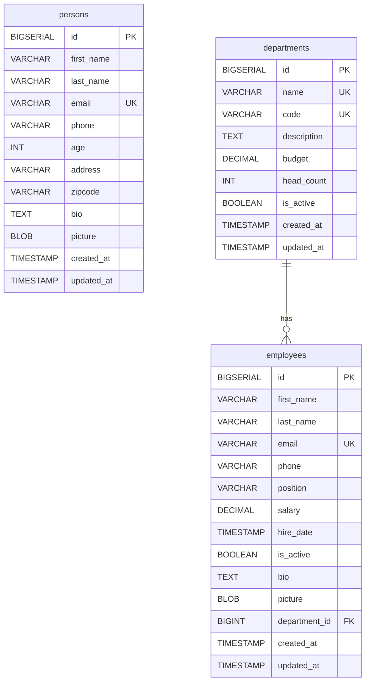
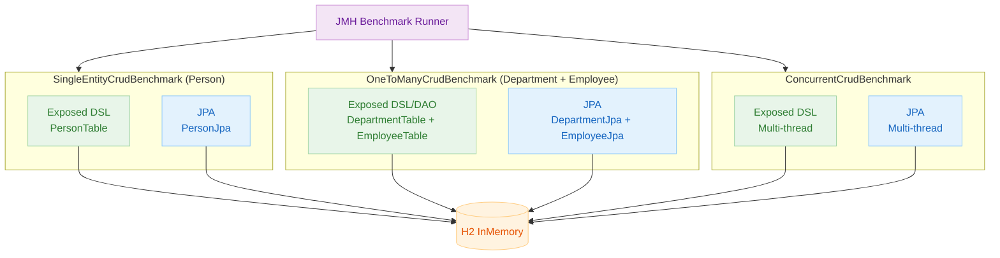
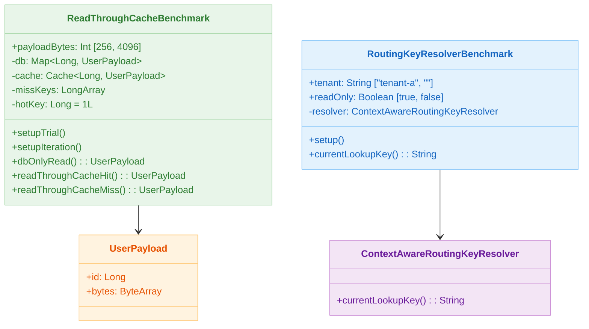
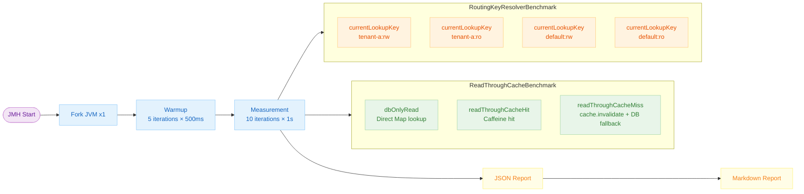

# Benchmark (04-benchmark)

English | [한국어](./README.ko.md)

A module that runs `kotlinx-benchmark`-based microbenchmarks against the cache/routing examples from Chapter 11. Provides a fast smoke profile and a precise main profile, with results saveable as a Markdown table.

---

## Overview

Uses Caffeine near-cache + in-memory storage instead of real Redis/DB I/O to reliably compare the overhead of the cache layer itself. Because it is JMH-based, measurement results after JVM warm-up are trustworthy.

---

## Domain ERD



---

## Exposed vs JPA Benchmark Structure



---

## Benchmarks

| Benchmark Class               | Measured Items                              | Unit             |
|-------------------------------|---------------------------------------------|------------------|
| `ReadThroughCacheBenchmark`   | DB direct read / cache hit / cache miss cost | µs (AverageTime) |
| `RoutingKeyResolverBenchmark` | `currentLookupKey()` string construction cost | ns (AverageTime) |

---

## Class Structure



---

## Benchmark Parameters

### ReadThroughCacheBenchmark

| Parameter      | Value     | Description               |
|----------------|-----------|---------------------------|
| `payloadBytes` | 256, 4096 | UserPayload byte size      |
| DB size        | 2,048 entries | In-memory Map          |
| Caffeine max size | 4,096  | Near-cache limit           |
| Miss key count | 256       | Cyclic miss scenario       |

Measured methods:

- `dbOnlyRead` — Direct lookup from Map without Caffeine
- `readThroughCacheHit` — Path where hotKey(1L) is always present in cache
- `readThroughCacheMiss` — DB fallback path after cache invalidation each iteration

### RoutingKeyResolverBenchmark

| Parameter  | Value              | Description                               |
|------------|--------------------|-------------------------------------------|
| `tenant`   | `"tenant-a"`, `""` | Real tenant / empty (defaultTenant fallback) |
| `readOnly` | `true`, `false`    | `:ro` / `:rw` branch                      |

---

## JMH Common Configuration

| Item             | Value               |
|------------------|---------------------|
| `@Fork`          | 1                   |
| `@Warmup`        | 5 iterations, 500ms |
| `@Measurement`   | 10 iterations, 1s   |
| `@BenchmarkMode` | `Mode.AverageTime`  |

---

## Benchmark Flow



---

## How to Run

```bash
# Fast smoke run (CI / quick trend check)
./gradlew :11-high-performance:04-benchmark:smokeBenchmark

# Default profile run (precise measurement)
./gradlew :11-high-performance:04-benchmark:benchmark

# Generate Markdown report (main profile)
./gradlew :11-high-performance:04-benchmark:benchmarkMarkdown

# Save smoke results as Markdown
./gradlew :11-high-performance:04-benchmark:benchmarkMarkdown -PbenchmarkProfile=smoke
```

---

## Result File Locations

| Format   | Path                                                     |
|----------|----------------------------------------------------------|
| JSON     | `build/reports/benchmarks/<profile>/.../jvm.json`        |
| Markdown | `build/reports/benchmarks/<profile>/benchmark-report.md` |

---

## Latest Benchmark Results

> The results below are reference values measured with the **smoke profile** (as of `2026-03-18`).
> For precise measurements, run `./gradlew :04-benchmark:benchmark` and check `benchmark-report.md` in `build/reports/benchmarks/main/`.

### ReadThroughCacheBenchmark

| Method                 | payloadBytes | Score (µs/op) | Error (±) | Interpretation                                         |
|------------------------|--------------|---------------|-----------|--------------------------------------------------------|
| `dbOnlyRead`           | 256          | 0.001         | 0.000     | HashMap direct lookup — baseline                       |
| `dbOnlyRead`           | 4096         | 0.001         | 0.000     | Large payload has same Map lookup cost                 |
| `readThroughCacheHit`  | 256          | 0.003         | 0.000     | Caffeine hit — ~3× vs Map (wrapper overhead)           |
| `readThroughCacheHit`  | 4096         | 0.003         | 0.000     | Payload size irrelevant — reference only returned      |
| `readThroughCacheMiss` | 256          | 0.119         | 0.282     | cache invalidate + DB fallback — ~40× vs hit           |
| `readThroughCacheMiss` | 4096         | 0.085         | 0.155     | Miss cost depends on cache invalidation, not payload   |

### RoutingKeyResolverBenchmark

| tenant     | readOnly | Score (µs/op) | Error (±) | Interpretation                         |
|------------|----------|---------------|-----------|----------------------------------------|
| `tenant-a` | `true`   | 0.004         | 0.001     | Real tenant + read-only key            |
| `tenant-a` | `false`  | 0.004         | 0.002     | Real tenant + read-write key           |
| `` (empty) | `true`   | 0.004         | 0.004     | defaultTenant fallback branch (higher error) |
| `` (empty) | `false`  | 0.004         | 0.002     | defaultTenant fallback branch          |

> **Summary**: Routing key computation cost (~4 ns) is practically negligible. Cache miss cost is up to 40× higher than a hit, making **reducing miss frequency the key optimization target**.

---

## Interpretation Notes

- `RoutingKeyResolverBenchmark`: Compares the overhead of tenant presence and read-only flag on routing key computation. An empty tenant adds a `defaultTenant` fallback branch, which may cause minor differences.
- `ReadThroughCacheBenchmark`: The order `dbOnlyRead` < `readThroughCacheHit` < `readThroughCacheMiss` is typical for the same payload size. The 256B vs 4096B comparison also reveals the impact of serialization cost.
- Use microbenchmark results for relative comparisons and trend analysis rather than absolute values.
- Use the smoke profile for quick trend checks, and the main profile for precise measurement.
