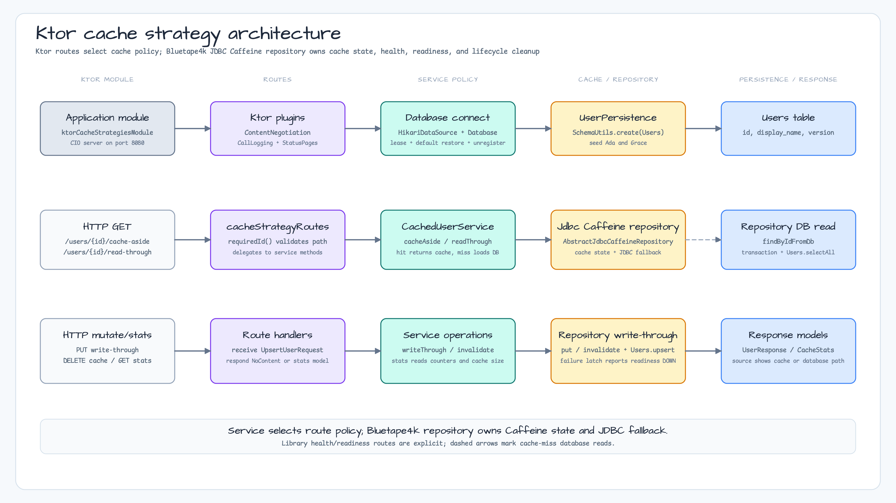

# 05 Cache Strategies Ktor

English | [한국어](./README.ko.md)

This module demonstrates cache-aside, read-through, write-through, and explicit invalidation flows with Ktor routes, Exposed JDBC persistence, and Bluetape4k's `AbstractJdbcCaffeineRepository`. `CachedUserService` selects the route-level policy while the repository owns the Caffeine cache and JDBC mapping. Hit, miss, database-read, and cache-size counters remain visible for tests without relying on Spring Cache abstractions.

## Architecture Diagram



## Routes

| Route | Strategy | Behavior |
|---|---|---|
| `GET /users/{id}/cache-aside` | Cache-aside | Check cache, then load from database and populate cache on miss. |
| `GET /users/{id}/read-through` | Read-through | Service owns database fallback and returns the cached value on later reads. |
| `PUT /users/{id}/write-through` | Write-through | Update database and cache in the same application operation. |
| `DELETE /users/{id}/cache` | Invalidation | Remove the cache entry so the next read falls back to database. |
| `GET /cache/stats` | Observability | Return database read, hit, miss, and cache size counters. |
| `GET /healthz/exposed` | Bluetape4k health | Library-provided Exposed health response. |
| `GET /ready` | Bluetape4k readiness | Reports JDBC repository consistency and the write-through failure latch. |
| `GET /health` | Legacy compatibility | Keeps the workshop's `{\"status\":\"UP\"}` response for existing callers. |

## Verification

```bash
./gradlew :05-cache-strategies-ktor:test
```

The tests cover first-read database fallback, cache reuse, write-through updates, invalidation (204 for a present entry and 404 for an absent entry), library health/readiness routes, and `/cache/stats` observability. The JSON test client is shared through `:exposed-shared-tests`. Use this example when a Ktor service needs explicit, testable cache behavior without Spring Cache abstractions.
