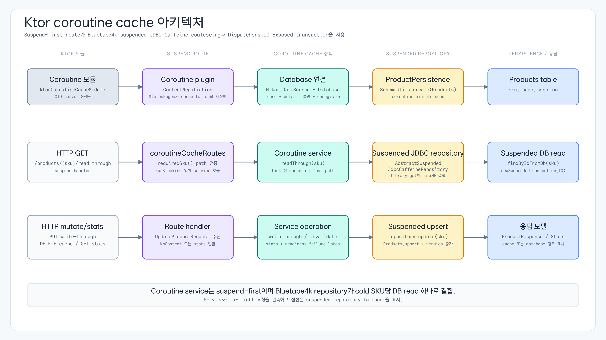

# 06 Cache Strategies Coroutines Ktor

[English](./README.md) | 한국어

이 모듈은 suspending route handler, `Dispatchers.IO`로 격리한 Exposed JDBC transaction, Bluetape4k `AbstractSuspendedJdbcCaffeineRepository`, library가 소유한 key별 load coalescing, write-through update, 명시적 invalidation으로 coroutine-safe Ktor cache access를 보여줍니다. `CoroutineCachedProductService`는 SKU별 `Mutex`를 직접 소유하지 않고 repository의 read-through `get`에 동시 miss 결합을 맡기며, route counter와 failure-latch 관측만 유지합니다.

## 아키텍처 다이어그램



## Coroutine 동작

- Route handler는 suspend-first 방식이며 production path에서 `runBlocking`을 사용하지 않습니다.
- Database access는 `newSuspendedTransaction(Dispatchers.IO, ...)`를 사용합니다.
- 같은 SKU에 대한 concurrent read-through 요청은 repository loader 하나로 합쳐지며, acceptance test는 `databaseReads == 1`을 확인합니다. Service의 hit/miss counter는 요청 시점 관측 값이며 정확한 loader 수로 사용하지 않습니다.
- `GET /healthz/exposed`와 `GET /ready`는 Bluetape4k Ktor health/readiness route이고, 기존 caller를 위해 `GET /health` 응답을 유지합니다.
- `StatusPages`는 `CancellationException`을 일반 error response로 변환하지 않고 다시 던집니다.

## 검증

```bash
./gradlew :06-cache-strategies-coroutines-ktor:test
```

테스트는 두 번째 조회의 cache hit, concurrent load coalescing, write-through cache refresh, invalidation(204/404), library health/readiness route, cancellation-friendly error handling을 검증합니다. JSON test client는 `:exposed-shared-tests`에서 공유합니다. Concurrent suspending request handler에서도 안전한 cache behavior가 필요한 Ktor 서비스 예제로 사용합니다.
