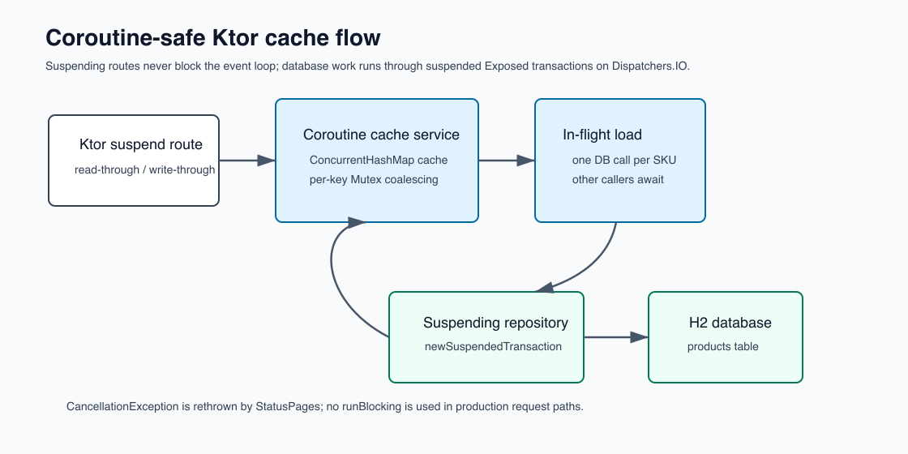

# 06 Cache Strategies Coroutines Ktor

English | [한국어](./README.ko.md)

This module demonstrates coroutine-safe Ktor cache access with suspending route handlers, Exposed JDBC transactions isolated on `Dispatchers.IO`, per-key load coalescing, write-through updates, and explicit invalidation.

## Architecture Diagram



## Coroutine Behavior

- Route handlers stay suspend-first and do not use `runBlocking`.
- Database access uses `newSuspendedTransaction(Dispatchers.IO, ...)`.
- Concurrent read-through requests for the same SKU share one per-key `Mutex`.
- `CancellationException` is rethrown by `StatusPages` instead of being converted to a generic error response.

## Verification

```bash
./gradlew :06-cache-strategies-coroutines-ktor:test
```

Use this example when a Ktor service needs cache behavior that remains safe under concurrent suspending request handlers.
