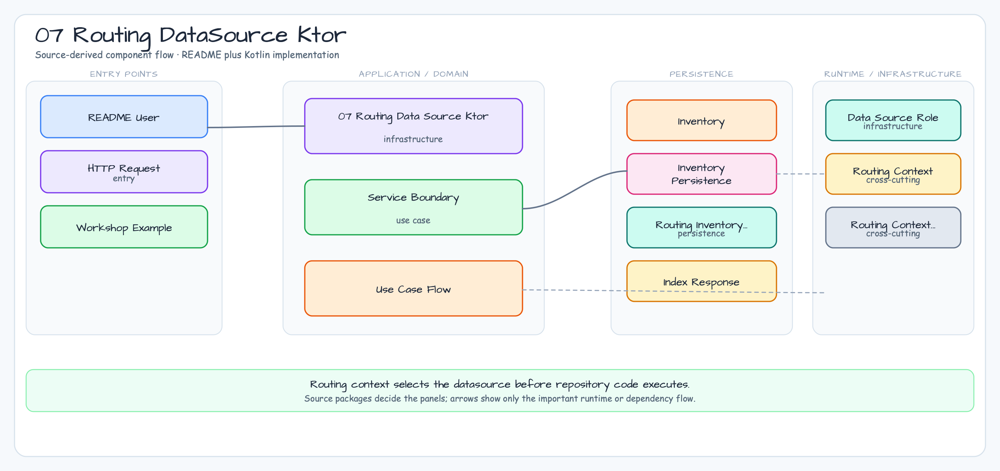

# 07 Routing DataSource Ktor

[English](./README.md) | 한국어

이 모듈은 Ktor request handling과 Exposed JDBC로 명시적인 read/write datasource routing을 구현하는 예제입니다. `RoutingDataSourcePlugin`은 `GET` 요청을 `READ`, 변경 요청을 `WRITE`로 선택하고, 테스트와 진단을 위해 `X-Data-Source` header로 대표 요청을 override할 수 있습니다. 선택된 role은 `RoutingContextElement`를 통해 coroutine 실행 흐름에 전달되고, `RoutingInventoryRepository`가 그 role에 맞는 `Database`를 선택합니다.

## 아키텍처 다이어그램



## Route

| Route | 기본 datasource | 동작 |
|---|---|---|
| `GET /inventory/{sku}` | `READ` | Replica에 해당하는 datasource에서 읽습니다. |
| `PUT /inventory/{sku}` | `WRITE` | Primary에 해당하는 datasource에 씁니다. |
| `GET /routing/stats` | Public | Read/write 선택 counter를 노출합니다. |

Routing behavior를 검증할 때 `X-Data-Source: write`로 read route를 write datasource에 강제할 수 있습니다.

## 검증

```bash
./gradlew :07-routing-datasource-ktor:test
```

테스트는 GET/PUT 기본 routing, header override, 잘못된 header 거부, `/routing/stats` counter를 검증합니다. Spring transaction routing 없이 datasource selection이 필요한 Ktor 서비스 예제로 사용합니다.
