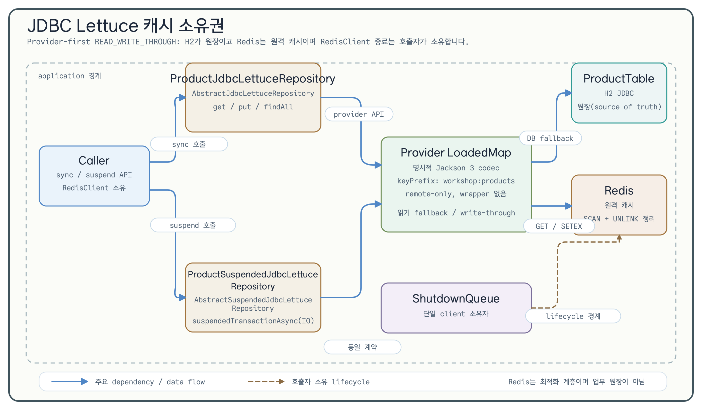
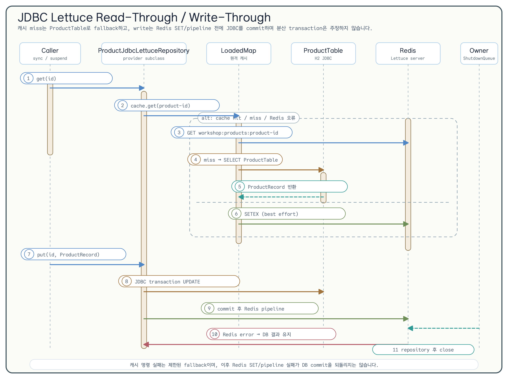

# JDBC Lettuce 캐시 전략 (08-cache-strategies-lettuce)

[English](./README.md) | 한국어

이 모듈은 Exposed JDBC repository를 Redis Lettuce 원격 캐시에 직접 연결하는 작은 provider 우선 예제입니다. 동기 repository와 서스펜드 repository는 하나의 테이블, 하나의 record, 하나의 key namespace, 하나의 명시적 Jackson 3 codec을 공유합니다.

## 학습 목표

- cache manager나 service endpoint를 추가하지 않고 `ProductTable`을 `AbstractJdbcLettuceRepository`와 `AbstractSuspendedJdbcLettuceRepository`에 연결한다.
- `READ_WRITE_THROUGH`의 read-through, write-through, batch, warm, 무효화 동작을 관찰한다.
- 기본 경로에서는 H2 테스트를 실행하고 `-PincludeRedisIntegration=true`로 Redis/Testcontainers 검사를 명시적으로 활성화한다.
- Redis 명령 fallback과 데이터베이스 쓰기 실패를 분리하고 repository/client 종료 경계를 이해한다.

## 아키텍처





provider를 직접 사용합니다.

```kotlin
val config = LettuceCacheConfig.READ_WRITE_THROUGH.copy(
    nearCacheEnabled = false,
    keyPrefix = "workshop:products",
)
val repository = ProductJdbcLettuceRepository(
    client = redisClient,
    config = config,
    valueCodec = ExposedLettuceCodecs.jackson3(ProductRecord::class.java),
)
```

`ProductSuspendedJdbcLettuceRepository`도 같은 constructor 순서와 기본값을 제공합니다. 데이터베이스 경계는 provider의 `suspendedTransactionAsync(Dispatchers.IO)` 경로입니다. 두 클래스는 provider를 직접 상속하고 `ResultRow`, update, insert, ID mapping hook을 구현합니다.

## 캐시·데이터베이스 계약

| 연산 | 관찰 가능한 동작 |
| --- | --- |
| `get` / `getAll` | Redis hit이면 decode한 record를 반환하고, miss 또는 GET/MGET 오류이면 H2에서 읽은 뒤 best-effort로 캐시를 채운다. 없는 행은 `getAll`에서 누락한다. |
| `findAll` | JDBC에서 정렬된 결과를 읽고 best-effort로 Redis를 warm한다. warm 실패가 데이터베이스 결과를 폐기하지 않는다. |
| `put` / `putAll` | `READ_WRITE_THROUGH`는 데이터베이스를 먼저 쓰고 Redis를 쓴다. `putAll` 각 chunk는 독립적인 데이터베이스 transaction과 pipeline 경계를 가지므로 뒤의 실패가 앞선 진행을 되돌리지 않는다. |
| `invalidate` / `invalidateAll` | Redis entry만 제거하고 데이터베이스 행은 유지한다. |
| `invalidateByPattern` / `clear` | 이 repository의 `workshop:products` namespace 하위만 대상으로 한다. 예제는 `product-*` suffix만 허용한다. |

`LongIdTable` writer는 seed한 행을 갱신하도록 사용합니다. provider는 auto-increment table에 client가 지정한 신규 insert를 건너뛰므로 테스트가 먼저 ID를 seed한 뒤 write-through update를 검증합니다. `batchSize`는 양수여야 합니다.

## Codec, namespace, 신뢰 경계

value codec은 `ExposedLettuceCodecs.jackson3(ProductRecord::class.java)`로 명시합니다. key는 `${keyPrefix}:product-<id>`이고 production prefix는 `workshop:products`입니다. fixture는 이 namespace 아래에 고유 suffix를 만들고 `SCAN` + `UNLINK`로 그 literal prefix만 정리하며 `FLUSHDB`나 `FLUSHALL`을 사용하지 않습니다.

Redis는 read optimization일 뿐 authorization data나 업무 원장이 아닙니다. provider가 decode하지 못하는 malformed payload는 데이터베이스 fallback으로 처리됩니다. 문법상 유효하지만 변조된 payload는 cache hit로 반환될 수 있으므로 authorization이나 업무 원장 경계로 사용하면 안 됩니다. ACL/TLS/secret manager 설정은 이 workshop 밖의 운영 책임입니다.

near-cache는 의도적으로 비활성화합니다(`nearCacheEnabled = false`). provider wrapper, 추가 retry loop, 숨겨진 `RedisClient` lifecycle을 만들지 않습니다. 호출자가 client를 소유하고 repository는 자신이 만든 connection만 닫습니다. 테스트는 shared client를 `ShutdownQueue`에 한 번 등록하고 repository를 먼저 닫은 뒤 queue의 최종 client 종료에 맡깁니다.

## Redisson 비교

| 관심사 | 기존 Redisson 예제 | 이 Lettuce 예제 |
| --- | --- | --- |
| 로컬 캐시 | Near Cache로 L1 front를 둘 수 있음 | remote-only profile이며 local front를 추가하지 않음 |
| 만료/retry | Redisson 설정에서 pool, retry, TTL을 노출 | provider `LettuceCacheConfig`를 그대로 사용하고 이 모듈은 retry loop를 추가하지 않음 |
| transaction 경계 | Spring/Ktor 예제가 framework transaction 연동을 설명 | Exposed JDBC writer transaction이 Redis SET/pipeline 전에 commit되며 2PC나 exactly-once를 주장하지 않음 |
| 통합 범위 | application/service 예제 | Plain Kotlin/Exposed repository와 제한된 테스트 |

## 실행 방법

기본 task는 H2-only 테스트를 실행하고 `@Tag("redis")`를 제외합니다.

```bash
./gradlew :08-cache-strategies-lettuce:test
./gradlew :08-cache-strategies-lettuce:build
./gradlew :08-cache-strategies-lettuce:detekt
```

Docker가 준비된 경우에만 Redis/Testcontainers 통합 검사를 실행합니다.

```bash
./gradlew :08-cache-strategies-lettuce:test \
  -PincludeRedisIntegration=true
```

opt-in suite는 sync/suspend parity, hit/miss와 namespace 격리, malformed 및 변조 payload, 같은 client의 transport interruption 재연결, 두 번째 chunk의 partial batch failure, 무효화, close idempotence를 검증합니다. 기본 H2 suite는 suspend 취소가 pending Redis future까지 전파되는지도 확인합니다. Docker가 없으면 opt-in prerequisite 실패이지 skip 성공이 아닙니다.

## 범위 경계

이 모듈은 JDBC만 다룹니다. R2DBC 예제는 별도 `exposed-r2dbc-workshop` 저장소(이슈 `#235`)에서 추적합니다. custom schema migration, Fory codec, provider 수정, cache manager, endpoint, production Redis secret은 이 예제에 포함하지 않습니다.

## 소스 맵

- [`ProductLettuceCacheModels.kt`](src/main/kotlin/exposed/examples/cache/lettuce/ProductLettuceCacheModels.kt) — table과 serializable record
- [`ProductJdbcLettuceRepository.kt`](src/main/kotlin/exposed/examples/cache/lettuce/ProductJdbcLettuceRepository.kt) — 동기 provider subclass
- [`ProductSuspendedJdbcLettuceRepository.kt`](src/main/kotlin/exposed/examples/cache/lettuce/ProductSuspendedJdbcLettuceRepository.kt) — 서스펜드 provider subclass
- [`ProductJdbcLettuceRepositoryIntegrationTest.kt`](src/test/kotlin/exposed/examples/cache/lettuce/ProductJdbcLettuceRepositoryIntegrationTest.kt) — Redis opt-in sync 계약
- [`ProductSuspendedJdbcLettuceRepositoryIntegrationTest.kt`](src/test/kotlin/exposed/examples/cache/lettuce/ProductSuspendedJdbcLettuceRepositoryIntegrationTest.kt) — Redis opt-in suspend parity
- [`RedisLettuceCacheFailureIntegrationTest.kt`](src/test/kotlin/exposed/examples/cache/lettuce/RedisLettuceCacheFailureIntegrationTest.kt) — fallback, 재연결, partial batch failure
