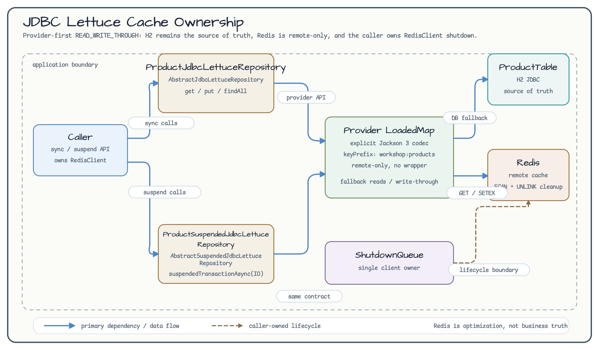
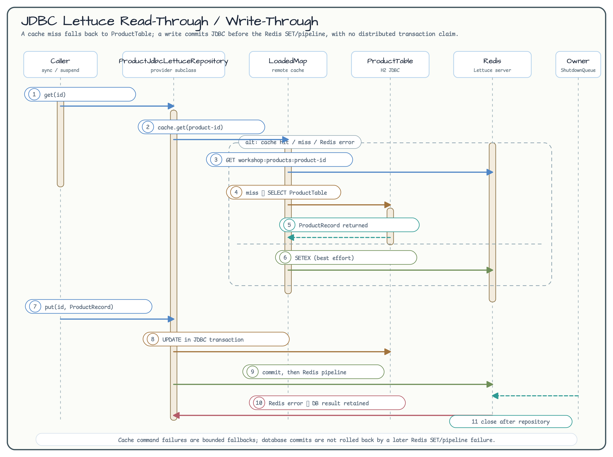

# JDBC Lettuce Cache Strategies (08-cache-strategies-lettuce)

English | [한국어](./README.ko.md)

This module is a small, provider-first example of Exposed JDBC repositories backed by a Redis Lettuce remote cache. The synchronous and suspended repositories share one table, one record, one key namespace, and one explicit Jackson 3 codec.

## Learning goals

- Connect `ProductTable` to `AbstractJdbcLettuceRepository` and `AbstractSuspendedJdbcLettuceRepository` without adding a cache manager or service endpoint.
- Observe `READ_WRITE_THROUGH` read-through, write-through, batch, warm, and invalidation behavior.
- Keep H2 tests on the default path and make Redis/Testcontainers checks explicit with `-PincludeRedisIntegration=true`.
- Separate Redis command fallback from database write failure and understand the repository/client shutdown boundary.

## Architecture





The provider is used directly:

```kotlin
val config = LettuceCacheConfig.READ_WRITE_THROUGH.copy(
    nearCacheEnabled = false,
    keyPrefix = "workshop:products",
)
val repository = ProductJdbcLettuceRepository(
    client = redisClient,
    config = config,
    valueCodec = ExposedLettuceCodecs.jackson3(ProductRecord::class.java),
)
```

`ProductSuspendedJdbcLettuceRepository` has the same constructor order and defaults. Its database boundary is the provider's `suspendedTransactionAsync(Dispatchers.IO)` path. Both classes subclass the provider directly and implement the `ResultRow`, update, insert, and ID mapping hooks.

## Cache and database contract

| Operation | Observable behavior |
| --- | --- |
| `get` / `getAll` | Redis hit returns the decoded record; miss or GET/MGET error loads from H2 and makes a best-effort cache fill. Missing rows are omitted from `getAll`. |
| `findAll` | Reads the ordered result from JDBC and best-effort warms Redis; a warm failure does not discard the database result. |
| `put` / `putAll` | `READ_WRITE_THROUGH` writes the database first and then Redis. Each `putAll` chunk has its own database transaction and pipeline boundary; later failures can leave partial progress. |
| `invalidate` / `invalidateAll` | Removes only Redis entries and keeps database rows unchanged. |
| `invalidateByPattern` / `clear` | Operates below this repository's `workshop:products` namespace. Only the suffix `product-*` is accepted by the example. |

The `LongIdTable` writer intentionally updates seeded rows. The provider skips client-supplied inserts for auto-increment tables, so the tests seed IDs first and then verify write-through updates. `batchSize` must be positive.

## Codec, namespace, and trust boundary

The value codec is explicit: `ExposedLettuceCodecs.jackson3(ProductRecord::class.java)`. Keys are `${keyPrefix}:product-<id>`, with the production prefix `workshop:products`. The fixture uses a unique suffix below that namespace and cleans only that literal prefix with `SCAN` + `UNLINK`; it never uses `FLUSHDB` or `FLUSHALL`.

Redis is a read optimization, not authorization data or the business source of truth. A malformed payload falls back to the database when the provider cannot decode it. A syntactically valid but altered payload can be returned as a cache hit, so applications must not use this cache as an authorization or business-truth boundary. ACL/TLS/secret-manager configuration is an operational concern outside this workshop.

Near-cache is deliberately disabled (`nearCacheEnabled = false`). The example does not wrap the provider, add retries, or hide `RedisClient` ownership. The caller owns the client; the repository closes only its own connections. Tests register the shared client once with `ShutdownQueue`, close repositories first, and rely on the queue for final client shutdown.

## Redisson comparison

| Concern | Existing Redisson examples | This Lettuce example |
| --- | --- | --- |
| Local cache | Near Cache can provide an L1 front | Remote-only profile; no local front is introduced |
| Expiration/retry | Redisson settings expose pool, retry, and TTL knobs | Provider `LettuceCacheConfig` is used as-is; this module adds no retry loop |
| Transaction boundary | Spring/Ktor examples show framework transaction integration | Exposed JDBC writer transaction commits before Redis SET/pipeline; no 2PC or exactly-once claim |
| Integration scope | Application/service examples | Plain Kotlin/Exposed repository and bounded tests |

## How to run

The default task runs H2-only tests and excludes `@Tag("redis")`:

```bash
./gradlew :08-cache-strategies-lettuce:test
./gradlew :08-cache-strategies-lettuce:build
./gradlew :08-cache-strategies-lettuce:detekt
```

Run Redis/Testcontainers integration checks only when Docker is available:

```bash
./gradlew :08-cache-strategies-lettuce:test \
  -PincludeRedisIntegration=true
```

The opt-in suite covers sync/suspend parity, hit/miss and namespace isolation, malformed and altered payloads, transport interruption with same-client reconnect, second-chunk partial batch failure, invalidation, and close idempotence. The default H2 suite also proves suspend cancellation propagates to the pending Redis future. Docker absence is a failed opt-in prerequisite, not a skipped success.

## Scope boundary

This module is JDBC-only. R2DBC examples are intentionally tracked in the separate `exposed-r2dbc-workshop` repository (issue `#235`). No custom schema migration, Fory codec, provider change, cache manager, endpoint, or production Redis secret is part of this example.

## Source map

- [`ProductLettuceCacheModels.kt`](src/main/kotlin/exposed/examples/cache/lettuce/ProductLettuceCacheModels.kt) — table and serializable record
- [`ProductJdbcLettuceRepository.kt`](src/main/kotlin/exposed/examples/cache/lettuce/ProductJdbcLettuceRepository.kt) — synchronous provider subclass
- [`ProductSuspendedJdbcLettuceRepository.kt`](src/main/kotlin/exposed/examples/cache/lettuce/ProductSuspendedJdbcLettuceRepository.kt) — suspended provider subclass
- [`ProductJdbcLettuceRepositoryIntegrationTest.kt`](src/test/kotlin/exposed/examples/cache/lettuce/ProductJdbcLettuceRepositoryIntegrationTest.kt) — Redis opt-in sync contract
- [`ProductSuspendedJdbcLettuceRepositoryIntegrationTest.kt`](src/test/kotlin/exposed/examples/cache/lettuce/ProductSuspendedJdbcLettuceRepositoryIntegrationTest.kt) — Redis opt-in suspend parity
- [`RedisLettuceCacheFailureIntegrationTest.kt`](src/test/kotlin/exposed/examples/cache/lettuce/RedisLettuceCacheFailureIntegrationTest.kt) — fallback, reconnect, and partial batch failure
