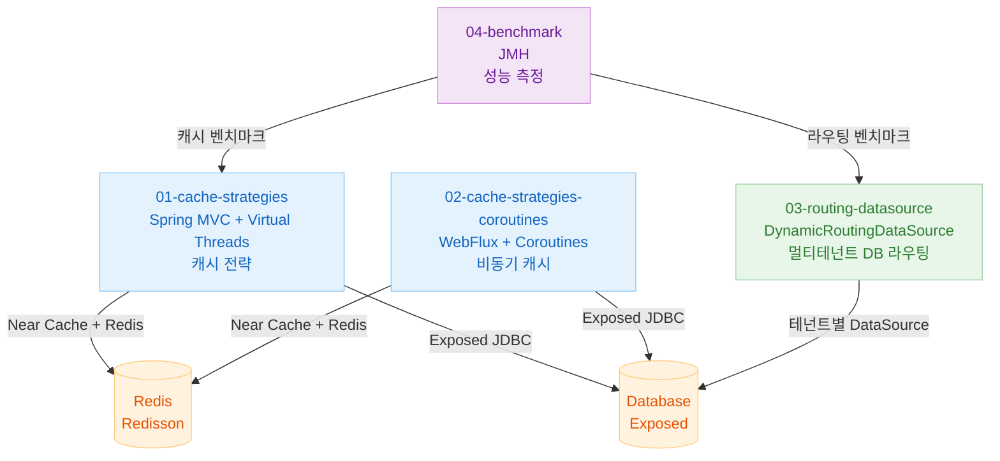
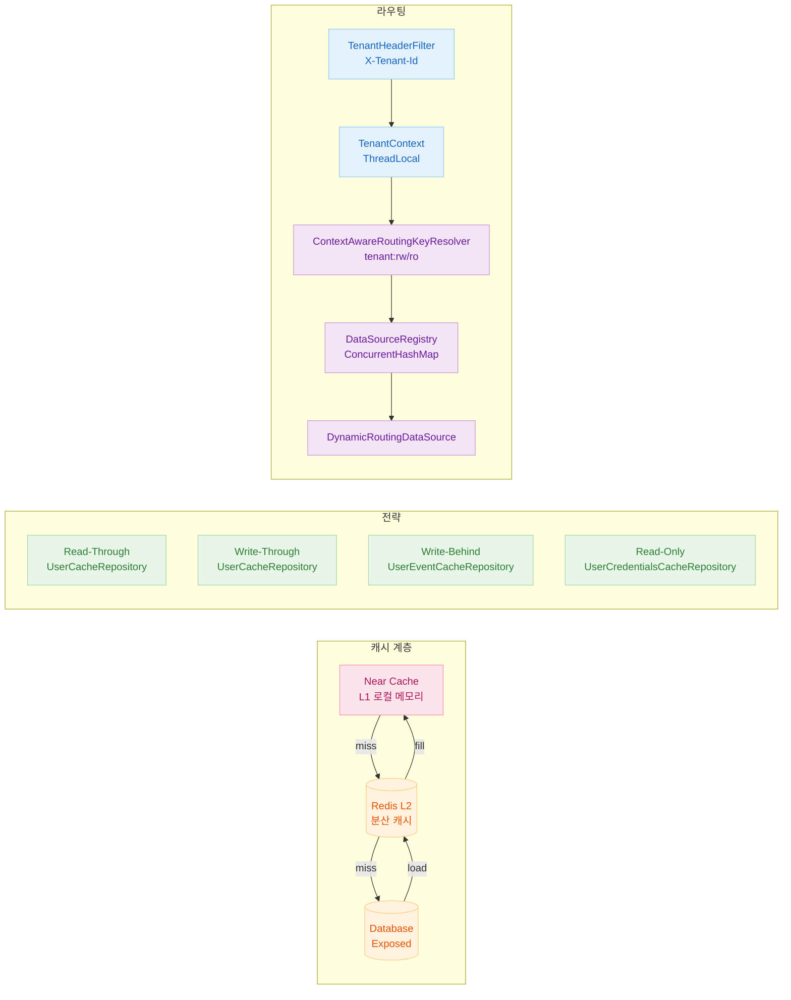

# 11 High Performance (실전)

[English](./README.md) | 한국어

고부하/실전 환경에서 Exposed 기반 애플리케이션의 처리량과 응답성을 높이기 위한 캐시·라우팅 전략을 정리합니다.

## 챕터 목표

- Read Through/Write Through/Write Behind 캐시 전략을 비교한다.
- Coroutines/WebFlux/Virtual Thread 환경의 비동기 캐시 패턴을 적용한다.
- 확장 가능한 DataSource 라우팅 구조를 설계한다.

## 선수 지식

- `10-multi-tenant` 내용
- 캐시 이론과 트랜잭션 일관성 개념

---

## 포함 모듈

| 모듈                                                                           | 설명                                   |
|------------------------------------------------------------------------------|--------------------------------------|
| [`01-cache-strategies`](01-cache-strategies/README.md)                       | Spring MVC + Virtual Thread 기반 캐시 전략 |
| [`02-cache-strategies-coroutines`](02-cache-strategies-coroutines/README.md) | WebFlux + Coroutines 기반 캐시 전략        |
| [`03-routing-datasource`](03-routing-datasource/README.md)                   | DataSource 라우팅 설계 가이드                |
| [`04-benchmark`](04-benchmark/README.md)                                     | `kotlinx-benchmark` 기반 성능 측정         |

---

## 모듈 관계



---

## 전체 아키텍처



---

## 캐시 전략 비교

| 전략                           | Repository                       | 쓰기 시점          | 읽기 시점      | 적합 데이터             |
|------------------------------|----------------------------------|----------------|------------|--------------------|
| Read-Through + Write-Through | `UserCacheRepository`            | 캐시+DB 동시       | 미스 시 DB 폴백 | 수정이 있는 엔티티         |
| Read-Only                    | `UserCredentialsCacheRepository` | 없음 (읽기 전용)     | 미스 시 DB 폴백 | 인증 정보 등 변경 없는 데이터  |
| Write-Behind                 | `UserEventCacheRepository`       | 캐시 즉시 + DB 비동기 | 캐시 우선      | 이벤트/로그 등 유실 허용 데이터 |

---

## 기술 스택 비교

| 모듈                               | 런타임        | 스레드 모델                    | HTTP 서버 |
|----------------------------------|------------|---------------------------|---------|
| `01-cache-strategies`            | Spring MVC | Virtual Threads           | Tomcat  |
| `02-cache-strategies-coroutines` | WebFlux    | Coroutines + Netty 이벤트 루프 | Netty   |
| `03-routing-datasource`          | Spring MVC | 스레드 기반                    | Tomcat  |
| `04-benchmark`                   | JMH        | JMH 스레드                   | N/A     |

---

## 권장 학습 순서

1. [`01-cache-strategies`](01-cache-strategies/README.md) — 캐시 전략 기본 개념
2. [`02-cache-strategies-coroutines`](02-cache-strategies-coroutines/README.md) — 코루틴 비동기 캐시
3. [`03-routing-datasource`](03-routing-datasource/README.md) — 동적 DataSource 라우팅
4. [`04-benchmark`](04-benchmark/README.md) — 성능 측정 및 비교

---

## 실행 방법

```bash
# 개별 모듈 테스트
./gradlew :11-high-performance:01-cache-strategies:test
./gradlew :11-high-performance:02-cache-strategies-coroutines:test
./gradlew :11-high-performance:03-routing-datasource:test

# 벤치마크 (smoke: 빠른 추세, main: 정밀 측정)
./gradlew :11-high-performance:04-benchmark:smokeBenchmark
./gradlew :11-high-performance:04-benchmark:benchmarkMarkdown -PbenchmarkProfile=smoke
```

---

## 테스트 포인트

- 캐시 적중률/지연시간/DB 부하 감소 효과를 검증한다.
- Write-Behind 지연 반영 시 정합성 보장 시나리오를 점검한다.
- 장애 시 폴백 경로(캐시 실패 → DB)가 정상 동작하는지 확인한다.

---

## 성능·안정성 체크포인트

- 캐시 무효화 정책과 데이터 신선도(SLA)를 정렬한다.
- 이벤트 폭주 시 백프레셔/배치 크기 튜닝을 수행한다.
- 라우팅 키 결정 로직의 오탐/누락을 방지한다.
- 벤치마크는 smoke 프로파일로 빠르게 추세를 보고, main 프로파일로 정밀 측정한다.

---

## 복잡한 시나리오

### Write-Behind 비동기 반영 검증

`UserEventCacheRepository`는 이벤트를 Redis에 선반영한 뒤 비동기로 DB에 일괄 저장합니다. 대량 적재 후 Awaitility로 최종 반영 수를 검증하는 시나리오입니다.

- MVC 버전: [`01-cache-strategies/src/test/kotlin/.../UserEventCacheRepositoryTest.kt`](01-cache-strategies/src/test/kotlin/exposed/examples/cache/domain/repository/UserEventCacheRepositoryTest.kt)
- Coroutines 버전: [`02-cache-strategies-coroutines/src/test/kotlin/.../UserEventCacheRepositoryTest.kt`](02-cache-strategies-coroutines/src/test/kotlin/exposed/examples/cache/coroutines/domain/repository/UserEventCacheRepositoryTest.kt)

### 멀티테넌트 동적 DataSource 라우팅

`DynamicRoutingDataSource`는
`TenantContext`와 트랜잭션 읽기 전용 여부를 조합해 적절한 DataSource를 선택합니다. 테넌트별 read/write 분리 시나리오를 통합 테스트로 검증합니다.

- 관련 파일: [`03-routing-datasource/src/main/kotlin/.../DynamicRoutingDataSource.kt`](03-routing-datasource/src/main/kotlin/exposed/examples/routing/datasource/DynamicRoutingDataSource.kt)
- 검증 테스트: [
  `DynamicRoutingDataSourceTest.kt`](03-routing-datasource/src/test/kotlin/exposed/examples/routing/datasource/DynamicRoutingDataSourceTest.kt), [
  `RoutingMarkerControllerTest.kt`](03-routing-datasource/src/test/kotlin/exposed/examples/routing/web/RoutingMarkerControllerTest.kt)

---

## 참고

- Redisson 기반 캐시 전략은 Redis 서버가 필요합니다. Testcontainers가 자동으로 Redis 컨테이너를 실행합니다.
- RoutingDataSource 예제는 Read Replica 또는 멀티테넌트 구조에서 활용 가능합니다.
