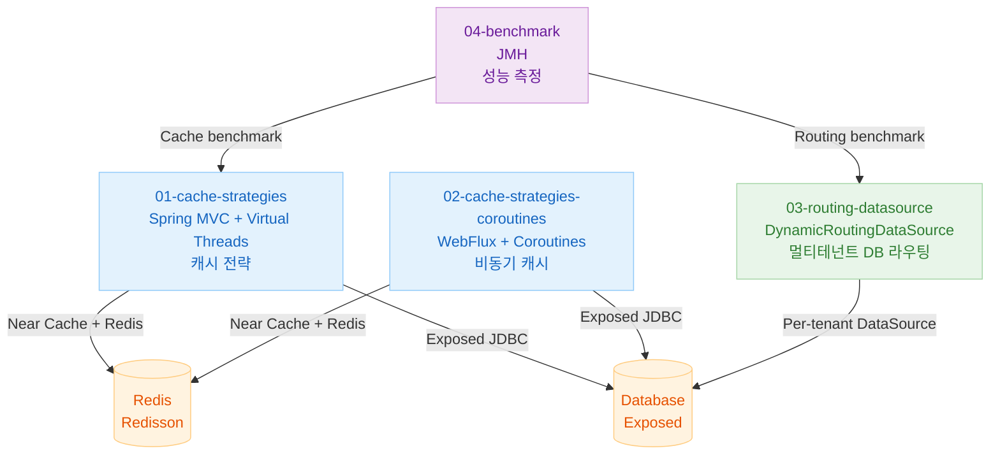
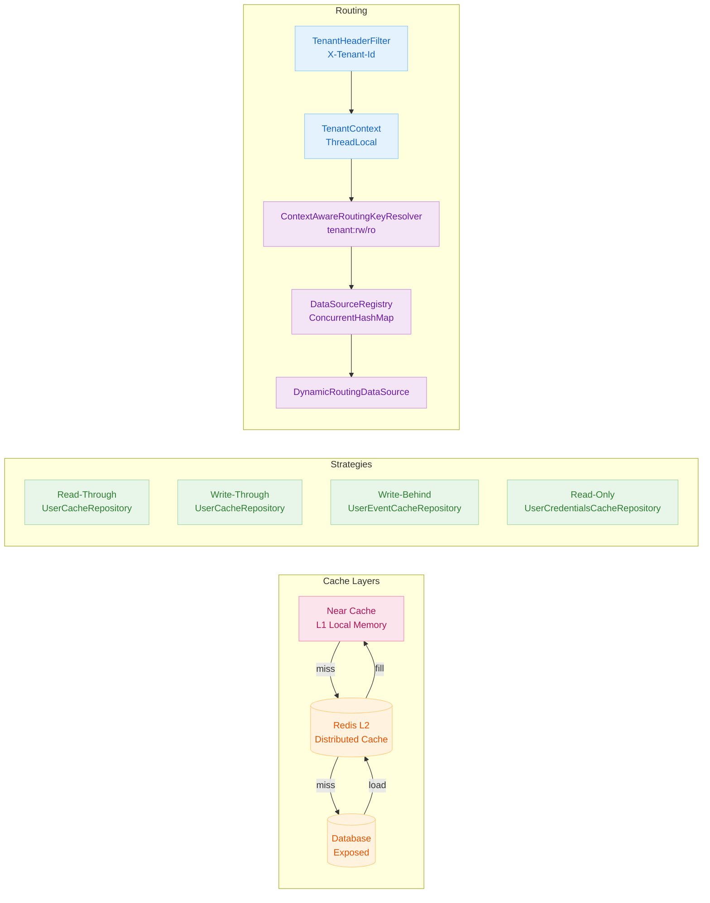

# 11 High Performance (Production)

English | [한국어](./README.ko.md)

Covers cache and routing strategies for improving throughput and responsiveness of Exposed-based applications under high load and production environments.

## Chapter Goals

- Compare Read Through/Write Through/Write Behind cache strategies.
- Apply asynchronous cache patterns in Coroutines/WebFlux/Virtual Thread environments.
- Design a scalable DataSource routing structure.

## Prerequisites

- Contents of `10-multi-tenant`
- Cache theory and transaction consistency concepts

---

## Included Modules

| Module                                                                         | Description                                               |
|------------------------------------------------------------------------------|----------------------------------------------------------|
| [`01-cache-strategies`](01-cache-strategies/README.md)                       | Cache strategies with Spring MVC + Virtual Threads        |
| [`02-cache-strategies-coroutines`](02-cache-strategies-coroutines/README.md) | Cache strategies with WebFlux + Coroutines                |
| [`03-routing-datasource`](03-routing-datasource/README.md)                   | DataSource routing design guide                           |
| [`04-benchmark`](04-benchmark/README.md)                                     | Performance measurement with `kotlinx-benchmark`          |

---

## Module Relationships



---

## Overall Architecture



---

## Cache Strategy Comparison

| Strategy                     | Repository                       | Write Time             | Read Time        | Suitable Data              |
|------------------------------|----------------------------------|------------------------|------------------|---------------------------|
| Read-Through + Write-Through | `UserCacheRepository`            | Cache + DB simultaneously | DB fallback on miss | Entities with updates    |
| Read-Only                    | `UserCredentialsCacheRepository` | None (read-only)       | DB fallback on miss | Immutable data like auth info |
| Write-Behind                 | `UserEventCacheRepository`       | Cache immediately + DB async | Cache first  | Loss-tolerant data like events/logs |

---

## Technology Stack Comparison

| Module                           | Runtime    | Thread Model                         | HTTP Server |
|----------------------------------|------------|--------------------------------------|-------------|
| `01-cache-strategies`            | Spring MVC | Virtual Threads                      | Tomcat      |
| `02-cache-strategies-coroutines` | WebFlux    | Coroutines + Netty event loop         | Netty       |
| `03-routing-datasource`          | Spring MVC | Thread-based                         | Tomcat      |
| `04-benchmark`                   | JMH        | JMH threads                          | N/A         |

---

## Recommended Learning Order

1. [`01-cache-strategies`](01-cache-strategies/README.md) — Basic cache strategy concepts
2. [`02-cache-strategies-coroutines`](02-cache-strategies-coroutines/README.md) — Coroutine async cache
3. [`03-routing-datasource`](03-routing-datasource/README.md) — Dynamic DataSource routing
4. [`04-benchmark`](04-benchmark/README.md) — Performance measurement and comparison

---

## How to Run

```bash
# Individual module tests
./gradlew :11-high-performance:01-cache-strategies:test
./gradlew :11-high-performance:02-cache-strategies-coroutines:test
./gradlew :11-high-performance:03-routing-datasource:test

# Benchmark (smoke: fast trend check, main: precise measurement)
./gradlew :11-high-performance:04-benchmark:smokeBenchmark
./gradlew :11-high-performance:04-benchmark:benchmarkMarkdown -PbenchmarkProfile=smoke
```

---

## Test Points

- Verify cache hit rate/latency/DB load reduction effects.
- Check consistency guarantee scenarios during Write-Behind delayed propagation.
- Confirm fallback path (cache failure → DB) operates correctly on failure.

---

## Performance & Stability Checkpoints

- Align cache invalidation policy with data freshness SLA.
- Tune backpressure/batch size during event floods.
- Prevent false positives/misses in routing key resolution logic.
- Use smoke profile for quick trend checks, main profile for precise measurement.

---

## Complex Scenarios

### Write-Behind Async Propagation Verification

`UserEventCacheRepository` pre-stores events in Redis and then batch-saves to DB asynchronously. A scenario verifying the final persisted count with Awaitility after bulk loading.

- MVC version: [`01-cache-strategies/src/test/kotlin/.../UserEventCacheRepositoryTest.kt`](01-cache-strategies/src/test/kotlin/exposed/examples/cache/domain/repository/UserEventCacheRepositoryTest.kt)
- Coroutines version: [`02-cache-strategies-coroutines/src/test/kotlin/.../UserEventCacheRepositoryTest.kt`](02-cache-strategies-coroutines/src/test/kotlin/exposed/examples/cache/coroutines/domain/repository/UserEventCacheRepositoryTest.kt)

### Multi-Tenant Dynamic DataSource Routing

`DynamicRoutingDataSource` selects the appropriate DataSource by combining `TenantContext` with transaction read-only status. Verifies per-tenant read/write separation scenarios through integration tests.

- Related file: [`03-routing-datasource/src/main/kotlin/.../DynamicRoutingDataSource.kt`](03-routing-datasource/src/main/kotlin/exposed/examples/routing/datasource/DynamicRoutingDataSource.kt)
- Verification tests: [`DynamicRoutingDataSourceTest.kt`](03-routing-datasource/src/test/kotlin/exposed/examples/routing/datasource/DynamicRoutingDataSourceTest.kt), [`RoutingMarkerControllerTest.kt`](03-routing-datasource/src/test/kotlin/exposed/examples/routing/web/RoutingMarkerControllerTest.kt)

---

## Notes

- Redisson-based cache strategies require a Redis server. Testcontainers automatically starts a Redis container.
- The RoutingDataSource example can be used with Read Replica or multi-tenant structures.
