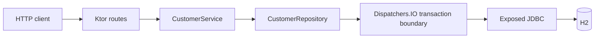

# Ktor 애플리케이션 아키텍처

[English](./README.md) | 한국어

이 모듈은 12장의 첫 Ktor 예제입니다. 범위는 작게 유지합니다. Ktor route,
JSON, 오류 매핑, service 경계, H2 기반 Exposed JDBC repository만 다룹니다.

## 아키텍처



## 학습 목표

- Spring 인프라 없이 Ktor 애플리케이션을 조립합니다.
- Ktor codebase를 application, route, service, repository, persistence, model
  package 경계로 읽습니다.
- route는 얇게 유지하고 validation은 service 계층으로 둡니다.
- blocking Exposed JDBC 작업은 repository가 소유한 `Dispatchers.IO` 경계 안에 둡니다.
- validation, not-found, malformed JSON, oversized body, fallback 오류를 Ktor
  `StatusPages`로 매핑합니다.
- Ktor `testApplication`으로 route를 검증합니다.

## Package Layout

```text
exposed.examples.ktor.architecture
├── config       # Ktor plugin, JSON, HTTP error mapping
├── model        # Request/response DTO, command, record, validation error
├── persistence  # Hikari와 Exposed Database lifecycle
├── repository   # Exposed JDBC repository boundary
├── routes       # HTTP route와 request body limit 처리
└── service      # Use case와 caller input validation
```

테스트도 같은 계층을 따릅니다. application wiring, route behavior, service
validation/mapping, repository persistence/concurrency를 각각 검증합니다.

## 실행

```bash
./gradlew :01-ktor-application-architecture:run
```

```bash
curl -X POST http://localhost:8080/customers \
  -H 'Content-Type: application/json' \
  -d '{"name":"Alice","email":"alice@example.com"}'
```

## 테스트

```bash
./gradlew :01-ktor-application-architecture:test
```

## 경계

이 모듈은 blocking `exposed-workshop` 축과 맞추기 위해 Exposed JDBC를 사용합니다.
blocking transaction은 `Dispatchers.IO`로 감쌉니다. non-blocking persistence는
대응되는 R2DBC workshop 예제를 사용합니다.

이 예제는 전체 production service가 아니라 architecture baseline입니다. 인증,
인가, migration tooling, 외부 observability sink는 포함하지 않습니다. 서버 JSON
응답은 compact JSON을 사용하고, fallback 500 응답은 sanitize하며, 예상하지 못한
실패는 응답 전에 로그로 남깁니다.
