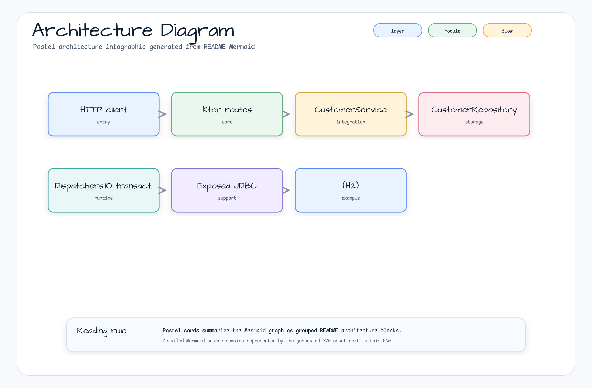

# Ktor Application Architecture

English | [한국어](./README.ko.md)

This module is the first Ktor example for chapter 12. It keeps the surface small:
Ktor routes, JSON, error mapping, a service boundary, and an Exposed JDBC
repository backed by H2.

## Architecture



## Learning Goals

- Compose a Ktor application without Spring infrastructure.
- Keep routes thin and move validation into the service layer.
- Keep blocking Exposed JDBC work behind a repository-owned `Dispatchers.IO`
  boundary.
- Map validation, not-found, malformed JSON, oversized body, and fallback errors
  through Ktor `StatusPages`.
- Verify routes with Ktor `testApplication`.

## Run

```bash
./gradlew :01-ktor-application-architecture:run
```

```bash
curl -X POST http://localhost:8080/customers \
  -H 'Content-Type: application/json' \
  -d '{"name":"Alice","email":"alice@example.com"}'
```

## Test

```bash
./gradlew :01-ktor-application-architecture:test
```

## Boundary Note

This module intentionally uses Exposed JDBC so it can mirror the blocking
`exposed-workshop` stack. Blocking transactions are wrapped in `Dispatchers.IO`.
For non-blocking persistence, use the matching R2DBC workshop examples.

This is an architecture baseline, not a complete production service. It does
not include authentication, authorization, migration tooling, or external
observability sinks. Server JSON responses use compact JSON, fallback 500
responses are sanitized, and unexpected failures are logged before the response
is returned.
